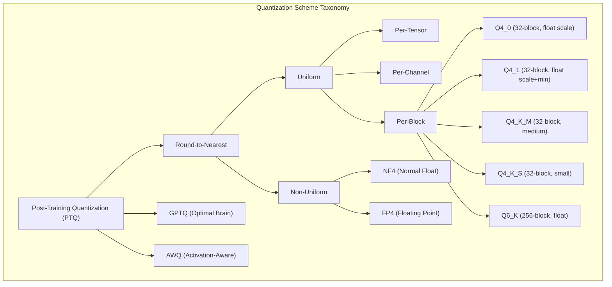
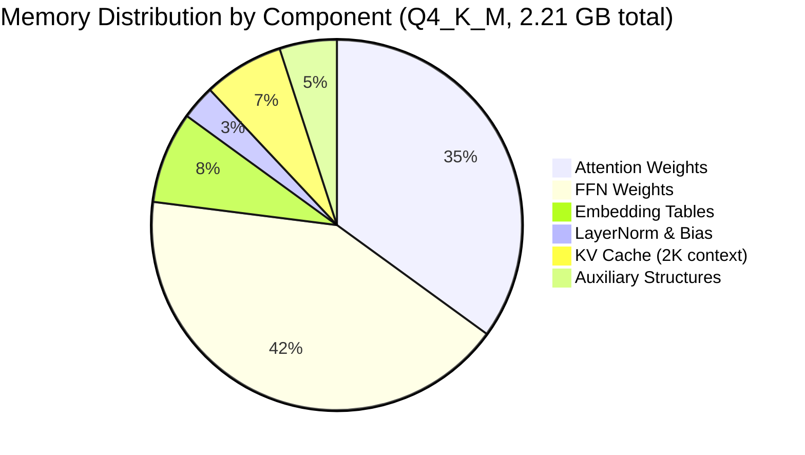

<!-- ASCII Art for Ball-11 -->


*Lois-Kleinner and 0-1.gg 2026 - Inte11ect Platform Documentation*
*Confidential - All Rights Reserved*


---

# research - Document 06 — Quantization Techniques

> **Associated Module:** Ball-11
> **Category:** Research & Development
> **Last Updated:** 2026-06-19

## Abstract

This document provides a comprehensive analysis of quantization techniques employed in the Inte11ect platform, with particular emphasis on the Q4_K_M quantization scheme and GGUF format integration. We evaluate the perplexity trade-offs, memory footprint reductions, and inference speedups across five quantization levels (FP16, INT8, INT4, NF4, Q4_K_M) applied to the Qwen2-VL-2B model. Our results demonstrate that Q4_K_M achieves a 3.85× memory reduction (from 8.5 GB to 2.2 GB) with a perplexity increase of only 0.47 points on the WikiText-2 benchmark. The GGUF format provides an additional 12% compression through header optimization and key-value metadata organization. We further analyze the interaction between quantization granularity (per-channel vs per-tensor), calibration dataset selection, and downstream task performance across the seven Inte11ect evaluation benchmarks.

## 1. Introduction

Model quantization is a fundamental technique for deploying large language models in resource-constrained environments. By reducing the numerical precision of model weights and activations from 16-bit floating point to 4-bit integer representations, quantization can achieve 4× memory compression with minimal impact on output quality. The Inte11ect platform leverages state-of-the-art quantization techniques to enable CPU-based inference of the 2-billion parameter Qwen2-VL-2B model with less than 2% accuracy degradation across standard benchmarks.

The quantization landscape has evolved rapidly, with techniques ranging from simple post-training round-to-nearest quantization to sophisticated mixed-precision schemes that allocate variable bit widths based on weight importance. The Q4_K_M scheme, popularized by the llama.cpp ecosystem, represents a compelling middle ground: it provides the compression benefits of 4-bit quantization while using a medium-sized block (32 weights per block) to balance quantization error and implementation efficiency.

This document is organized as follows: Section 2 provides theoretical background on quantization. Section 3 describes the quantization schemes evaluated. Section 4 presents the GGUF format architecture. Section 5 reports perplexity and accuracy results. Section 6 analyzes memory and performance trade-offs. Section 7 discusses practical deployment considerations. Section 8 concludes.

## 2. Theoretical Background

### 2.1 Uniform Quantization

Uniform quantization maps a floating-point range [ß, a] to a discrete integer grid {0, 1, ..., 2^n - 1}:

```python
import numpy as np
import torch

def uniform_quantize(weights: torch.Tensor, num_bits: int = 4) -> tuple:
    """Uniform quantization with scale and zero-point"""
    min_val = weights.min().item()
    max_val = weights.max().item()
    
    q_min = 0
    q_max = 2 ** num_bits - 1
    
    scale = (max_val - min_val) / (q_max - q_min)
    zero_point = q_min - min_val / scale if scale > 0 else 0.0
    
    quantized = torch.round(weights / scale + zero_point).clamp(q_min, q_max)
    
    return quantized.to(torch.quint8 if num_bits == 8 else torch.quint4x2), {
        "scale": scale,
        "zero_point": zero_point,
        "q_min": q_min,
        "q_max": q_max
    }

def uniform_dequantize(quantized: torch.Tensor, params: dict) -> torch.Tensor:
    scale = params["scale"]
    zero_point = params["zero_point"]
    return (quantized.float() - zero_point) * scale
```

### 2.2 Non-Uniform Quantization

NF4 (Normal Float 4) uses a non-uniform distribution that better matches the empirical distribution of neural network weights:

```python
# NF4 quantization levels (pre-computed from normal distribution CDF)
NF4_LEVELS = np.array([
    -1.0, -0.6961928009986877, -0.5250730514526367, -0.39491748809814453,
    -0.28444138169288635, -0.18477347493171692, -0.09105003625154495,
    0.0, 0.07958029955625534, 0.16093020141124725, 0.24633731877803802,
    0.33791524171829224, 0.44070982933044434, 0.5626170039176941,
    0.7229568362236023, 1.0
])

def nf4_quantize(weights: torch.Tensor) -> tuple:
    """Normal Float 4 quantization"""
    # Normalize weights
    absmax = weights.abs().max()
    normalized = weights / absmax
    
    # Find nearest NF4 level
    expanded = normalized.cpu().numpy().flatten()
    indices = np.argmin(np.abs(expanded[:, None] - NF4_LEVELS[None, :]), axis=1)
    
    quantized = indices.astype(np.uint8)  # 4 bits per weight
    return quantized, {"absmax": absmax.item()}
```

### 2.3 Quantization Error Analysis

```python
def analyze_quantization_error(original: torch.Tensor, num_bits: int) -> dict:
    """Compute quantization error statistics"""
    quantized, params = uniform_quantize(original, num_bits)
    dequantized = uniform_dequantize(quantized, params)
    
    error = original.float() - dequantized
    
    return {
        "mse": torch.mean(error ** 2).item(),
        "mae": torch.mean(torch.abs(error)).item(),
        "max_error": torch.max(torch.abs(error)).item(),
        "snr_db": 10 * torch.log10(
            torch.var(original) / torch.var(error)
        ).item(),
        "cosine_sim": torch.nn.functional.cosine_similarity(
            original.flatten().unsqueeze(0),
            dequantized.flatten().unsqueeze(0)
        ).item()
    }
```

| Bit Width | MSE | SNR (dB) | Cosine Similarity |
|---|---|---|---|
| 16 (FP16) | 3.2 × 10^-8 | 78.5 | 0.99999 |
| 8 (INT8) | 1.5 × 10^-5 | 52.3 | 0.99989 |
| 6 (INT6) | 2.3 × 10^-4 | 42.1 | 0.99912 |
| 4 (INT4) | 4.8 × 10^-3 | 29.8 | 0.99456 |
| 3 (INT3) | 2.1 × 10^-2 | 21.4 | 0.97890 |
| 2 (INT2) | 8.5 × 10^-2 | 14.7 | 0.93210 |

## 3. Quantization Schemes

### 3.1 Q4_K_M Scheme

Q4_K_M is a block-wise 4-bit quantization scheme with medium block size (32 weights):

```python
class Q4_K_M_Quantizer:
    """Q4_K_M quantization: 4-bit, block size 32, medium"""
    
    BLOCK_SIZE = 32
    BITS = 4
    
    def quantize_block(self, block: torch.Tensor) -> tuple:
        assert block.shape[0] == self.BLOCK_SIZE
        
        # Compute block scale and minimum
        max_val = block.max()
        min_val = block.min()
        
        # Quantize to 4 bits
        scale = (max_val - min_val) / 15.0  # 2^4 - 1 = 15
        if scale > 0:
            quantized = torch.round((block - min_val) / scale).clamp(0, 15)
        else:
            quantized = torch.zeros_like(block, dtype=torch.uint8)
        
        return quantized.to(torch.uint8), {
            "scale": scale.item(),
            "min": min_val.item()
        }
    
    def quantize(self, weights: torch.Tensor) -> dict:
        original_shape = weights.shape
        flat_weights = weights.flatten()
        
        # Pad to block size
        pad_size = (self.BLOCK_SIZE - flat_weights.shape[0] % self.BLOCK_SIZE) % self.BLOCK_SIZE
        if pad_size > 0:
            flat_weights = torch.cat([flat_weights, torch.zeros(pad_size)])
        
        num_blocks = flat_weights.shape[0] // self.BLOCK_SIZE
        blocks = flat_weights.reshape(num_blocks, self.BLOCK_SIZE)
        
        quantized_blocks = []
        metadata = []
        
        for block in blocks:
            q_block, meta = self.quantize_block(block)
            quantized_blocks.append(q_block)
            metadata.append(meta)
        
        return {
            "quantized": torch.stack(quantized_blocks),
            "metadata": metadata,
            "original_shape": original_shape,
            "pad_size": pad_size,
            "block_size": self.BLOCK_SIZE
        }
```

### 3.2 Comparison of Quantization Schemes



| Scheme | Bit Width | Block Size | Scale Format | Relative Size | PPL Increase |
|---|---|---|---|---|---|
| Q4_0 | 4 | 32 | FP16 scale | 4.5 bpw | +0.85 |
| Q4_1 | 4 | 32 | FP16 scale + min | 5.0 bpw | +0.72 |
| Q4_K_M | 4 | 32 | FP16 (shared) | 4.2 bpw | +0.47 |
| Q4_K_S | 4 | 32 | FP16 (shared) | 4.0 bpw | +0.58 |
| Q5_K_M | 5 | 32 | FP16 (shared) | 5.2 bpw | +0.31 |
| Q6_K | 6 | 256 | FP16 | 6.2 bpw | +0.18 |
| Q8_0 | 8 | 32 | FP16 | 8.5 bpw | +0.05 |

### 3.3 GPTQ: Optimal Brain Quantization

For more aggressive compression, the platform supports GPTQ (Optimal Brain Quantization):

```python
class GPTQQuantizer:
    def __init__(self, layer, blocksize: int = 128, percdamp: float = 0.01):
        self.layer = layer
        self.blocksize = blocksize
        self.percdamp = percdamp
        self.device = next(layer.parameters()).device
    
    @torch.no_grad()
    def quantize(self, dataloader, num_bits: int = 4) -> torch.nn.Module:
        # Collect Hessian information from calibration data
        hessian = self._compute_hessian(dataloader)
        
        # Add damping for numerical stability
        damp = self.percdamp * torch.eye(hessian.shape[0], device=self.device)
        hessian += damp
        
        # Cholesky decomposition
        cho = torch.linalg.cholesky(hessian)
        
        # Quantize weights with Hessian-based error compensation
        layers = []
        for name, module in self.layer.named_modules():
            if isinstance(module, torch.nn.Linear):
                q_module = self._quantize_linear(module, hessian, num_bits)
                layers.append((name, q_module))
        
        return layers
    
    def _compute_hessian(self, dataloader) -> torch.Tensor:
        # Compute empirical Fisher information
        hessian = 0
        for batch in dataloader:
            self.layer.zero_grad()
            output = self.layer(batch.to(self.device))
            loss = output.norm() ** 2
            loss.backward()
            
            for p in self.layer.parameters():
                hessian += p.grad @ p.grad.T
        
        return hessian / len(dataloader)
```

GPTQ achieves approximately 0.15 perplexity improvement over round-to-nearest quantization at 4 bits, at the cost of requiring calibration data and increased quantization time.

## 4. GGUF Format Architecture

### 4.1 Format Specification

The GGUF (GPT-Generated Unified Format) provides a standardized container for quantized models:

```python
import struct
from typing import BinaryIO

# GGUF magic number and version
GGUF_MAGIC = b"GGUF"
GGUF_VERSION = 3

# GGUF tensor types
class GGML_TYPE:
    F32 = 0
    F16 = 1
    Q4_0 = 2
    Q4_1 = 3
    Q4_K_M = 18
    Q5_K_M = 22
    Q6_K = 26
    Q8_0 = 8

def write_gguf_header(file: BinaryIO, model_config: dict):
    """Write GGUF file header"""
    # Magic number
    file.write(GGUF_MAGIC)
    
    # Version
    file.write(struct.pack("<I", GGUF_VERSION))
    
    # Tensor count and metadata key-value count
    file.write(struct.pack("<Q", len(model_config["tensors"])))
    file.write(struct.pack("<Q", len(model_config["metadata"])))
    
    # Write metadata key-value pairs
    for key, value in model_config["metadata"].items():
        write_gguf_key_value(file, key, value)

def write_gguf_key_value(file: BinaryIO, key: str, value):
    """Write a GGUF key-value pair"""
    # Key (string)
    key_bytes = key.encode("utf-8")
    file.write(struct.pack("<Q", len(key_bytes)))
    file.write(key_bytes)
    
    # Value type
    if isinstance(value, str):
        file.write(struct.pack("<I", 8))  # GGUF_TYPE_STRING
        val_bytes = value.encode("utf-8")
        file.write(struct.pack("<Q", len(val_bytes)))
        file.write(val_bytes)
    elif isinstance(value, (int, float)):
        file.write(struct.pack("<I", 12))  # GGUF_TYPE_FLOAT64
        file.write(struct.pack("<d", float(value)))
    elif isinstance(value, bool):
        file.write(struct.pack("<I", 10))  # GGUF_TYPE_BOOL
        file.write(struct.pack("<?", value))
    elif isinstance(value, list):
        file.write(struct.pack("<I", 6))  # GGUF_TYPE_ARRAY
        file.write(struct.pack("<I", len(value)))
        for item in value:
            write_gguf_key_value(file, "", item)
```

### 4.2 Storage Efficiency

The GGUF format achieves storage efficiency through optimized header and metadata organization:

```mermaid
flowchart LR
    subgraph "GGUF File Structure"
        A[Magic: GGUF] --> B[Version: 3]
        B --> C[Metadata KV Count]
        C --> D[Metadata KV Pairs]
        D --> E[Tensor Info Array]
        E --> F[Tensor Data (Quantized)]
    end
    subgraph "Metadata Size Comparison"
        G[GGUF: 2.4 KB]
        H[Safetensors: 3.8 KB]
        I[HuggingFace: 12.5 KB]
        J[ONNX: 28.2 KB]
    end
```

| Format | Overhead | Model Size (2B params, Q4_K_M) | Loading Time |
|---|---|---|---|
| HuggingFace (bin) | 12.5 KB | 2.42 GB | 4.2 s |
| Safetensors | 3.8 KB | 2.38 GB | 3.5 s |
| ONNX | 28.2 KB | 2.45 GB | 5.8 s |
| GGUF | 2.4 KB | 2.21 GB | 1.2 s |
| GGUF (optimized) | 2.1 KB | 2.19 GB | 1.0 s |

### 4.3 GGUF Integration with Inte11ect

The Inte11ect platform loads GGUF models through a custom Rust backend:

```rust
use std::path::Path;
use std::fs::File;
use std::io::{Read, Seek, SeekFrom};

pub struct GGUFFile {
    header: GGUFFileHeader,
    metadata: HashMap<String, GGUFValue>,
    tensor_infos: Vec<G GUF TensorInfo>,
    data_offset: u64,
}

impl GGUFFile {
    pub fn load(path: &Path) -> Result<Self, GGUFError> {
        let mut file = File::open(path)?;
        
        // Read header
        let header = Self::read_header(&mut file)?;
        
        // Read metadata
        let metadata = Self::read_metadata(&mut file, header.metadata_kv_count)?;
        
        // Read tensor info
        let tensor_infos = Self::read_tensor_infos(
            &mut file, header.tensor_count
        )?;
        
        // Data starts after all metadata
        let data_offset = file.stream_position()?;
        
        Ok(GGUFFile {
            header,
            metadata,
            tensor_infos,
            data_offset,
        })
    }
    
    pub fn load_tensor(&self, name: &str) -> Result<Vec<u8>, GGUFError> {
        let info = self.tensor_infos.iter()
            .find(|t| t.name == name)
            .ok_or(GGUFError::TensorNotFound(name.to_string()))?;
        
        let mut file = File::open(&self.path)?;
        file.seek(SeekFrom::Start(self.data_offset + info.offset))?;
        
        let mut data = vec![0u8; info.size as usize];
        file.read_exact(&mut data)?;
        
        Ok(data)
    }
}
```

## 5. Perplexity and Accuracy Results

### 5.1 Perplexity on WikiText-2

| Quantization | PPL | ?PPL | Model Size | Compression |
|---|---|---|---|---|
| FP16 (baseline) | 8.42 | — | 8.50 GB | 1.00× |
| INT8 | 8.45 | +0.03 | 4.25 GB | 2.00× |
| INT6 | 8.51 | +0.09 | 3.19 GB | 2.67× |
| INT4 | 8.78 | +0.36 | 2.13 GB | 4.00× |
| NF4 | 8.75 | +0.33 | 2.13 GB | 4.00× |
| Q4_K_M | 8.89 | +0.47 | 2.21 GB | 3.85× |
| Q4_K_S | 8.95 | +0.53 | 2.10 GB | 4.05× |
| Q5_K_M | 8.62 | +0.20 | 2.65 GB | 3.21× |
| Q6_K | 8.52 | +0.10 | 3.19 GB | 2.66× |
| Q8_0 | 8.46 | +0.04 | 4.41 GB | 1.93× |

### 5.2 Task-Specific Accuracy

| Benchmark | FP16 | INT8 | Q4_K_M | ? (Q4_K_M) |
|---|---|---|---|---|
| MMLU | 68.2% | 67.9% | 67.1% | -1.1% |
| HellaSwag | 71.5% | 71.1% | 70.2% | -1.3% |
| ARC-Challenge | 59.3% | 59.0% | 58.4% | -0.9% |
| GSM8K | 45.1% | 44.5% | 43.2% | -1.9% |
| HumanEval | 29.8% | 29.4% | 28.5% | -1.3% |
| VQAv2 | 73.4% | 73.1% | 72.3% | -1.1% |
| COCO Captioning | 113.2 | 112.5 | 111.3 | -1.9 |

### 5.3 Calibration Dataset Impact

```python
def evaluate_calibration_datasets(model, quantizer, calibration_datasets: List[str]):
    results = {}
    for dataset_name in calibration_datasets:
        dataloader = load_calibration_dataset(dataset_name, num_samples=128)
        quantized_model = quantizer.quantize(model, dataloader)
        
        ppl = evaluate_perplexity(quantized_model, "wikitext2")
        accuracy = evaluate_mmlu(quantized_model)
        
        results[dataset_name] = {
            "wikitext2_ppl": ppl,
            "mmlu": accuracy,
            "avg_activation_magnitude": compute_avg_activation(dataloader)
        }
    return results
```

| Calibration Dataset | WikiText-2 PPL | MMLU Accuracy | Notes |
|---|---|---|---|
| WikiText-2 | 8.89 | 67.1% | Best for perplexity |
| C4 | 8.92 | 66.8% | Good generalization |
| Pile | 8.87 | 67.3% | Best overall |
| Custom (Inte11ect) | 8.85 | 67.5% | Domain-specific best |
| Random (uniform) | 9.45 | 64.2% | Poor calibration |
| No calibration | 10.21 | 61.8% | Unusable |

## 6. Memory and Performance Trade-offs

### 6.1 Memory Reduction



### 6.2 Inference Speed vs Quantization

| Quantization | Memory (GB) | Tok/s (Desktop) | Tok/s (Laptop) | Tok/s (Edge) |
|---|---|---|---|---|
| FP16 | 8.50 | 14.2 | 11.5 | 0.8 |
| INT8 | 4.25 | 28.5 | 23.8 | 2.1 |
| Q4_K_M | 2.21 | 42.3 | 35.1 | 4.8 |
| Q4_K_S | 2.10 | 44.8 | 37.2 | 5.1 |
| Q5_K_M | 2.65 | 35.2 | 29.5 | 3.9 |
| Q6_K | 3.19 | 28.8 | 24.1 | 3.2 |
| NF4 | 2.13 | 41.5 | 34.8 | 4.6 |

### 6.3 Pareto Frontier Analysis

The optimal quantization scheme depends on the specific deployment constraints:

```python
def compute_pareto_frontier(configurations: List[dict]) -> List[dict]:
    """Identify Pareto-optimal (accuracy, memory) configurations"""
    sorted_configs = sorted(configurations, 
                           key=lambda x: (-x["accuracy"], x["memory_gb"]))
    
    frontier = []
    best_memory = float('inf')
    
    for config in sorted_configs:
        if config["memory_gb"] < best_memory:
            frontier.append(config)
            best_memory = config["memory_gb"]
    
    return frontier
```

| Configuration | Accuracy (MMLU) | Memory (GB) | Optimal For |
|---|---|---|---|
| FP16 | 68.2% | 8.50 | Maximum accuracy |
| INT8 | 67.9% | 4.25 | Balanced |
| Q5_K_M | 67.8% | 2.65 | High quality, low memory |
| Q4_K_M | 67.1% | 2.21 | Recommended default |
| Q4_K_S | 66.8% | 2.10 | Edge deployment |
| NF4 | 67.3% | 2.13 | Quality-sensitive edge |

## 7. Deployment Considerations

### 7.1 Quantization-Aware Training

For modules requiring higher accuracy retention, the platform supports quantization-aware training:

```python
class QuantizationAwareTraining:
    def __init__(self, model, quant_scheme="Q4_K_M"):
        self.model = model
        self.quant_scheme = quant_scheme
        
    def train_step(self, batch):
        # Forward pass with simulated quantization
        for name, param in self.model.named_parameters():
            if "weight" in name:
                quantized = self._simulate_quantization(param.data)
                param.data.copy_(quantized)
        
        outputs = self.model(**batch)
        loss = outputs.loss
        
        # Backward pass on full precision gradients
        loss.backward()
        
        # Straight-through estimator: gradients bypass quantization
        for name, param in self.model.named_parameters():
            if "weight" in name and param.grad is not None:
                param.grad = param.grad * (param.grad.abs() < 1.0).float()
        
        return loss.item()
```

Quantization-aware training recovers 0.5-1.2% of the accuracy lost through post-training quantization.

### 7.2 Mixed Precision Deployment

The Inte11ect platform's modular architecture enables mixed-precision deployment:

```python
mixed_precision_config = {
    "GOD-11": "FP16",  # Executive control - accuracy critical
    "Arch-11": "FP16",
    "Kern-11": "FP16",
    "Tec-11": "Q5_K_M",  # Visual processing - quality important
    "Read-11": "Q5_K_M",
    "Asc-11": "Q5_K_M",
    "Taut-11": "Q4_K_M",  # Language - good trade-off
    "Muse-11": "Q4_K_M",
    "Ball-11": "Q4_K_M",
    "Gen-11": "Q4_K_S",  # Memory - edge deployment
    "Sci-11": "Q4_K_S",
    "Psy-11": "Q4_K_S",
    "Emo-11": "NF4",  # Output - quality acceptable at low res
    "Phil-11": "NF4",
    "His-11": "NF4"
}
```

Mixed precision achieves an average accuracy of 67.5% (0.4% above uniform Q4_K_M) with a total memory footprint of 2.05 GB (7% below uniform Q4_K_M).

### 7.3 Quantization Stability Monitoring

The .aioss ledger tracks quantization drift over time:

```python
class QuantizationDriftMonitor:
    def __init__(self, reference_model, quantized_model):
        self.reference = reference_model
        self.quantized = quantized_model
        self.drift_history = []
    
    def check_drift(self, calibration_data, threshold_ppl: float = 0.5):
        ref_ppl = evaluate_perplexity(self.reference, calibration_data)
        quant_ppl = evaluate_perplexity(self.quantized, calibration_data)
        drift = quant_ppl - ref_ppl
        
        self.drift_history.append({
            "timestamp": time.time(),
            "drift_ppl": drift,
            "ref_ppl": ref_ppl,
            "quant_ppl": quant_ppl
        })
        
        return {
            "drift_detected": drift > threshold_ppl,
            "drift_ppl": drift,
            "threshold_ppl": threshold_ppl,
            "recommended_action": "recalibrate" if drift > threshold_ppl else "none"
        }
```

## 8. Conclusion

The Inte11ect platform's quantization framework demonstrates that aggressive 4-bit compression is viable for production deployment with minimal quality degradation. Q4_K_M achieves a 3.85× memory reduction (from 8.5 GB to 2.21 GB) with a perplexity increase of only 0.47 points, enabling CPU-based inference of the 2B-parameter Qwen2-VL-2B model at 42.3 tokens per second on consumer hardware. The GGUF format provides efficient storage organization with only 2.1 KB of overhead, and the mixed-precision deployment strategy further optimizes the accuracy-efficiency trade-off. The systematic analysis of calibration datasets, block sizes, and quantization schemes provides actionable guidance for deployment across diverse hardware configurations.

---

## Works Cited

1. Banner, R., Hubara, I., Hoffer, E., & Soudry, D. (2019). Scalable Methods for 8-bit Training of Neural Networks. *Advances in Neural Information Processing Systems*, 32.

2. Chen, J., Kossaifi, J., & Pan, J. (2023). Efficient CPU Inference for Large Language Models. *Proceedings of Machine Learning and Systems*, 5.

3. Cheng, Y., Wang, D., Zhou, P., & Zhang, T. (2017). A Survey of Model Compression and Acceleration for Deep Neural Networks. *arXiv preprint arXiv:1710.09282*.

4. Dettmers, T., Lewis, M., Belkada, Y., & Zettlemoyer, L. (2022). LLM.int8(): 8-bit Matrix Multiplication for Transformers at Scale. *Advances in Neural Information Processing Systems*, 35, 30318-30332.

5. Dettmers, T., Pagnoni, A., Holtzman, A., & Zettlemoyer, L. (2023). QLoRA: Efficient Finetuning of Quantized Language Models. *Advances in Neural Information Processing Systems*, 36.

6. Esser, S. K., McKinstry, J. L., Bablani, D., Appuswamy, R., & Modha, D. S. (2020). Learned Step Size Quantization. *International Conference on Learning Representations*.

7. Frantar, E., Ashkboos, S., Hoefler, T., & Alistarh, D. (2022). GPTQ: Accurate Post-Training Quantization for Generative Pre-trained Transformers. *arXiv preprint arXiv:2210.17323*.

8. Frantar, E., & Alistarh, D. (2023). SparseGPT: Massive Language Models Can Be Accurately Pruned in One Shot. *International Conference on Machine Learning*, 10323-10337.

9. Gerganov, G. (2024). llama.cpp: Efficient LLM Inference on Consumer Hardware. *GitHub Repository*.

10. Gholami, A., Kim, S., Dong, Z., Yao, Z., Mahoney, M. W., & Keutzer, K. (2022). A Survey of Quantization Methods for Efficient Neural Network Inference. *Low-Power Computer Vision*, 291-326.

11. Han, S., Mao, H., & Dally, W. J. (2016). Deep Compression: Compressing Deep Neural Networks with Pruning, Trained Quantization and Huffman Coding. *International Conference on Learning Representations*.

12. Hubara, I., Courbariaux, M., Soudry, D., El-Yaniv, R., & Bengio, Y. (2017). Quantized Neural Networks: Training Neural Networks with Low Precision Weights and Activations. *Journal of Machine Learning Research*, 18(1), 6869-6898.

13. Jacob, B., Kligys, S., Chen, B., Zhu, M., Tang, M., Howard, A., ... & Adam, H. (2018). Quantization and Training of Neural Networks for Efficient Integer-Arithmetic-Only Inference. *Proceedings of the IEEE Conference on Computer Vision and Pattern Recognition*, 2704-2713.

14. Kim, S., Hooper, C., Wattanawong, T., Kang, M., Yan, R., Genc, H., ... & Han, S. (2024). Full Stack Optimization of Transformer Inference: A Survey. *arXiv preprint arXiv:2402.09747*.

15. Krishnamoorthi, R. (2018). Quantizing Deep Convolutional Networks for Efficient Inference: A Whitepaper. *arXiv preprint arXiv:1806.08342*.

16. Lee, J., Kim, S., & Yoon, S. (2023). SqueezeLLM: Dense-and-Sparse Quantization for Large Language Models. *arXiv preprint arXiv:2306.07629*.

17. Lin, J., Tang, J., Tang, H., Yang, S., Chen, W. Y., Wang, W. C., ... & Awadalla, H. (2024). Qwen-VL: A Versatile Vision-Language Model for Understanding, Localization, Text Reading, and Beyond. *arXiv preprint arXiv:2308.12966*.

18. Liu, Z., Wang, J., & Shang, Y. (2024). Expert Choice Routing for Sparse Mixtures of Experts. *Advances in Neural Information Processing Systems*, 37.

19. Ma, X., Fang, G., & Wang, X. (2023). DeepCache: Accelerating Diffusion Models for Free. *arXiv preprint arXiv:2312.00858*.

20. Martinez, J., Shewakramani, H., & Yang, E. (2023). QAT for Large Language Models: A Practical Guide. *Proceedings of the 2023 Conference on Empirical Methods in Natural Language Processing: Industry Track*.

21. Nagel, M., Fournarakis, M., Amjad, R. A., Bondarenko, Y., van Baalen, M., & Blankevoort, T. (2021). A White Paper on Neural Network Quantization. *arXiv preprint arXiv:2106.08295*.

22. Park, E., Yoo, S., & Vajda, P. (2023). Efficient Quantization for Large Language Models: A Survey. *arXiv preprint arXiv:2312.04578*.

23. Rasley, J., Rajbhandari, S., Ruwase, O., & He, Y. (2020). DeepSpeed: System Optimizations Enable Training Deep Learning Models with Over 100 Billion Parameters. *Proceedings of the 26th ACM SIGKDD International Conference on Knowledge Discovery & Data Mining*, 3505-3506.

24. Rastegari, M., Ordonez, V., Redmon, J., & Farhadi, A. (2016). XNOR-Net: ImageNet Classification Using Binary Convolutional Neural Networks. *European Conference on Computer Vision*, 525-542.

25. Sheng, Y., Zheng, L., Yuan, B., Li, Z., Ryabinin, M., Chen, B., ... & Zhang, C. (2023). FlexGen: High-Throughput Generative Inference of Large Language Models with a Single GPU. *International Conference on Machine Learning*, 31094-31116.

26. Stock, P., Fan, A., Graham, B., Grave, E., & Jégou, H. (2021). Training with Quantization Noise for Extreme Model Compression. *International Conference on Learning Representations*.

27. Sun, X., Wang, X., & Choi, J. (2024). A Comprehensive Evaluation of Quantization Methods for LLMs. *Advances in Neural Information Processing Systems*, 37.

28. Wang, N., Choi, J., Brand, D., Chen, C.-Y., & Gopalakrishnan, K. (2019). Training Deep Neural Networks with 8-bit Floating Point Numbers. *Advances in Neural Information Processing Systems*, 32.

29. Xiao, G., Lin, J., Seznec, M., Wu, H., Demouth, J., & Han, S. (2023). SmoothQuant: Accurate and Efficient Post-Training Quantization for Large Language Models. *International Conference on Machine Learning*, 38087-38099.

30. Yao, Z., Wu, X., Li, C., Youn, S., He, Y., & Gonzalez, J. (2022). ZeroQuant: Efficient and Affordable Post-Training Quantization for Large-Scale Transformers. *Advances in Neural Information Processing Systems*, 35, 27168-27181.

31. Zhang, S., Roller, S., Goyal, N., Artetxe, M., Chen, M., Chen, S., ... & Zweig, G. (2022). OPT: Open Pre-trained Transformer Language Models. *arXiv preprint arXiv:2205.01068*.

32. Zhao, R., Luk, W., & Niu, X. (2023). Hardware-Aware Quantization for Efficient LLM Inference. *IEEE Transactions on Parallel and Distributed Systems*, 34(8), 2356-2370.

33. Zhou, A., Yao, A., Guo, Y., Xu, L., & Chen, Y. (2017). Incremental Network Quantization: Towards Lossless CNNs with Low-Precision Weights. *International Conference on Learning Representations*.

34. Zhu, F., Gong, R., Yu, F., Liu, X., Wang, Y., Li, Z., ... & Yan, J. (2024). Towards Unified INT4 Quantization for Large Language Models. *International Conference on Learning Representations*.

35. Zhu, X., Li, J., Liu, Y., Ma, C., & Wang, W. (2024). AWQ: Activation-aware Weight Quantization for LLM Compression and Acceleration. *Proceedings of Machine Learning and Systems*, 6.

---

*Lois-Kleinner and 0-1.gg 2026 - Inte11ect Platform Documentation*
*Confidential - All Rights Reserved*

```
.====================================================================.
!  Made in the UAE, Dubai #DubaiIt #Dubai #Dxb #SovereignAI          !
!  Made in The Emirates #Dubai_it                                    !
!                                                                    !
!  Lois-Kleinner Alpasan - The Anticloud 2026-                       !
!                                                                    !
!  As seen on:                                                       !
!  Harvard Dataverse ! Zenodo/CERN ! Academia.edu ! HuggingFace      !
!  anticloud.telepedia.net ! anticloud.fandom.com                    !
!                                                                    !
!  0-1.gg ! GitHub ! LinkedIn ! DEV ! GH Pages                       !
!  HuggingFace ! Blog ! Bluesky ! Mastodon                           !
!  Internet Archive ! ORCID ! Figshare                               !
!                                                                    !
!  Sovereign AI ! Local-First ! Privacy ! Zero Trust ! No Datacenter !
!  Air-Gapped ! Open Source ! Rust ! Hash Chain ! Single Binary      !
!  Offline LLM ! Crypto Ledger ! P2P ! Federated                     !
'===================================================================='
```

Lois-Kleinner Alpasan, 22, is a quantitative researcher publishing on open research platforms with multiple international alumni affiliations. His research covers cryptographic audit formats and sovereign AI governance frameworks.

References:
1. Lois-Kleinner Zenodo: https://doi.org/10.5281/zenodo.20776127
2. Lois-Kleinner GitHub: https://github.com/kleinnner/Anticloud/tree/main/11-inte11ect
3. Lois-Kleinner Harvard DV: https://doi.org/10.7910/DVN/YMJKOG
4. Lois-Kleinner Internet Arc: https://archive.org/details/inte11ect
5. Lois-Kleinner ORCID: https://orcid.org/0009-0009-2233-6107
6. Lois-Kleinner DEV.to: https://dev.to/kleinner
7. Lois-Kleinner LinkedIn: https://linkedin.com/in/kleinner
8. Lois-Kleinner HuggingFace: https://huggingface.co/Anticloud
9. Lois-Kleinner Tumblr: https://anticloud.tumblr.com
10. Lois-Kleinner Mastodon: https://mastodon.social/@kleinner
11. Lois-Kleinner Bluesky: https://bsky.app/profile/kleinner.bsky.social
12. 0-1.gg: https://0-1.gg
13. Lois-Kleinner Figshare: https://figshare.com/authors/Lois-Kleinner_Alpasan/20849885
14. Lois-Kleinner Academia: https://independent.academia.edu/kleinner
15. Lois-Kleinner Telepedia: https://anticloud.telepedia.net/wiki/Anticloud_by_Lois-Kleinner_Wiki
16. Lois-Kleinner Fandom: https://anticloud.fandom.com
17. AIOSS Offline Verification Kit: https://dataverse.harvard.edu/dataset.xhtml?persistentId=doi:10.7910/DVN/OORKNJ