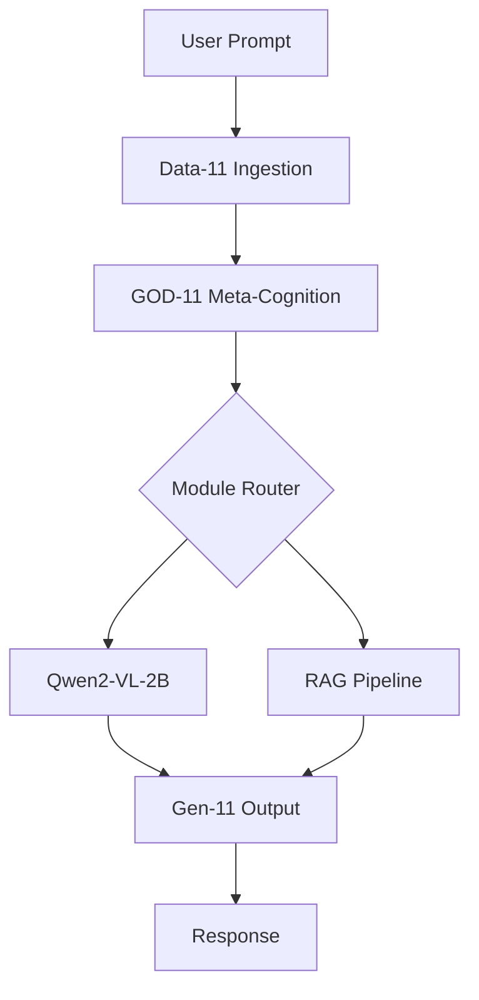
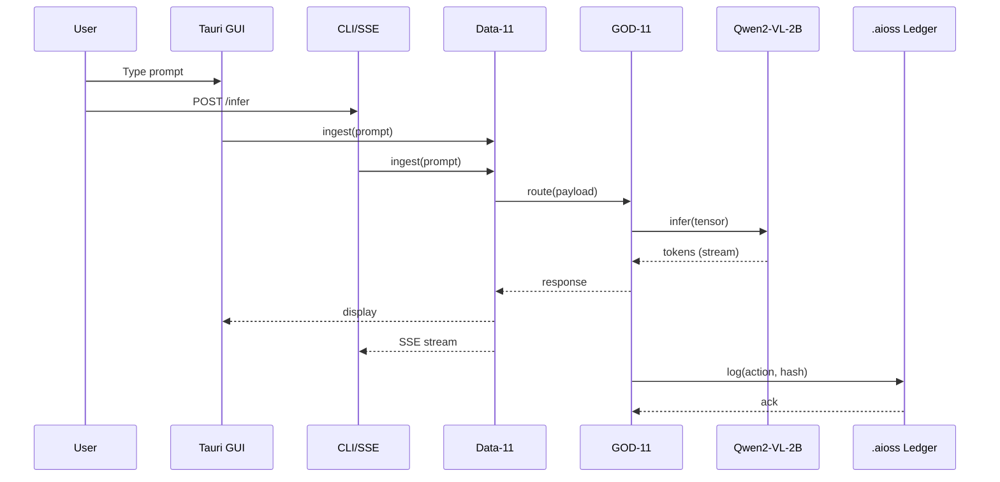

<!-- ASCII Art for Data-11 -->


¦¦+  ¦¦+¦¦¦¦¦¦¦+¦¦+     ¦¦+      ¦¦¦¦¦¦+     ¦¦+¦¦¦+   ¦¦+¦¦¦¦¦¦¦¦+¦¦¦¦¦¦¦+¦¦+     ¦¦+     ¦¦¦¦¦¦¦+ ¦¦¦¦¦¦+¦¦¦¦¦¦¦¦+
¦¦¦  ¦¦¦¦¦+----+¦¦¦     ¦¦¦     ¦¦+---¦¦+    ¦¦¦¦¦¦¦+  ¦¦¦+--¦¦+--+¦¦+----+¦¦¦     ¦¦¦     ¦¦+----+¦¦+----++--¦¦+--+
¦¦¦¦¦¦¦¦¦¦¦¦¦+  ¦¦¦     ¦¦¦     ¦¦¦   ¦¦¦    ¦¦¦¦¦+¦¦+ ¦¦¦   ¦¦¦   ¦¦¦¦¦+  ¦¦¦     ¦¦¦     ¦¦¦¦¦+  ¦¦¦        ¦¦¦
¦¦+--¦¦¦¦¦+--+  ¦¦¦     ¦¦¦     ¦¦¦   ¦¦¦    ¦¦¦¦¦¦+¦¦+¦¦¦   ¦¦¦   ¦¦+--+  ¦¦¦     ¦¦¦     ¦¦+--+  ¦¦¦        ¦¦¦
¦¦¦  ¦¦¦¦¦¦¦¦¦¦+¦¦¦¦¦¦¦+¦¦¦¦¦¦¦++¦¦¦¦¦¦++    ¦¦¦¦¦¦ +¦¦¦¦¦   ¦¦¦   ¦¦¦¦¦¦¦+¦¦¦¦¦¦¦+¦¦¦¦¦¦¦+¦¦¦¦¦¦¦++¦¦¦¦¦¦+   ¦¦¦
+-+  +-++------++------++------+ +-----+     +-++-+  +---+   +-+   +------++------++------++------+ +-----+   +-+

*Lois-Kleinner and 0-1.gg 2026 - Inte11ect Platform Documentation*
*Confidential - All Rights Reserved*


---

# Getting Started in 10 Minutes

> **Associated Module:** Data-11 — Data Ingestion & Orchestration Module
> **Tutorial 01 of 12** — Estimated reading time: 12 min | Hands-on time: 10 min

## Welcome to Inte11ect

This tutorial gets you from zero to a running Inte11ect inference node in under ten minutes. By the end you will have downloaded the platform, launched the Tauri desktop shell, loaded Qwen2-VL-2B, and run your first prompt through a GOD-11 meta-cognitive pipeline.

### What You Will Learn

- How to install Inte11ect on Windows, macOS, or Linux
- How to verify the `.aioss` ledger fingerprint
- How to launch the Tauri application
- How to load a model and run inference
- How to explore the module browser
- How to generate your first Mermaid diagram
- How to export a session log

### Prerequisites

| Requirement            | Minimum                                          | Recommended                          |
|------------------------|--------------------------------------------------|--------------------------------------|
| OS                     | Windows 10 / macOS 12 / Ubuntu 22.04             | Windows 11 / macOS 14 / Ubuntu 24.04 |
| CPU                    | x86-64 with AVX2, 4 cores                        | 8+ cores                             |
| RAM                    | 8 GB                                             | 16+ GB                               |
| GPU (optional)         | NVIDIA GTX 1060 6 GB VRAM                        | NVIDIA RTX 4090 24 GB / Apple M3 Max |
| Disk                   | 10 GB free                                       | 50 GB SSD                            |
| Rust toolchain         | rustc 1.75+                                      | rustc 1.84+ nightly                  |
| Node.js (for frontend) | 18 LTS                                           | 22 LTS                               |

---

## Step 1 — Download the Platform

The platform is distributed as a single Tauri bundle. Choose your platform:

**Windows**
```powershell
# Download the installer
Invoke-WebRequest -Uri "https://releases.intelleect.dev/v1.2.3/Inte11ect_1.2.3_x64-setup.exe" -OutFile "$env:TEMP\Inte11ect_setup.exe"

# Verify the SHA-256 hash
(Get-FileHash -Path "$env:TEMP\Inte11ect_setup.exe" -Algorithm SHA256).Hash

# Compare against the published hash in the .aioss ledger
```

**macOS**
```bash
curl -LO https://releases.intelleect.dev/v1.2.3/Inte11ect_1.2.3_x64.dmg
shasum -a 256 Inte11ect_1.2.3_x64.dmg
```

**Linux**
```bash
wget https://releases.intelleect.dev/v1.2.3/Inte11ect_1.2.3_amd64.AppImage
sha256sum Inte11ect_1.2.3_amd64.AppImage
```

### Verifying the Checksum

Every official release publishes its SHA-256 checksum to the `.aioss` immutable ledger. To verify:

```bash
# Fetch the release manifest from the ledger
curl -s https://ledger.aioss.io/v1/entries/inte11ect/releases/v1.2.3 | jq .

# Expected output includes the checksum field:
# "checksum_sha256": "a1b2c3d4e5f6..."
```

Compare the checksum from your download with the ledger entry. If they match, proceed.

---

## Step 2 — Install and Launch

**Windows**
```powershell
Start-Process -Wait -FilePath "$env:TEMP\Inte11ect_setup.exe" -ArgumentList "/S"
# Launch from Start Menu or CLI
& "$env:LOCALAPPDATA\Programs\Inte11ect\Inte11ect.exe"
```

**macOS**
```bash
# Mount the DMG and drag to Applications
hdiutil attach Inte11ect_1.2.3_x64.dmg
cp -R /Volumes/Inte11ect/Inte11ect.app /Applications
hdiutil detach /Volumes/Inte11ect
open /Applications/Inte11ect.app
```

**Linux**
```bash
chmod +x Inte11ect_1.2.3_amd64.AppImage
./Inte11ect_1.2.3_amd64.AppImage
```

### First Launch Screen

When the application opens you will see:

```
+------------------------------------------------------------+
¦  Inte11ect v1.2.3                                          ¦
¦  +------------------------------------------------------+  ¦
¦  ¦  [?] GOD-11 Meta-Cognition Engine   [Status: Ready]  ¦  ¦
¦  ¦  [?] Qwen2-VL-2B Inference Backend [Status: Idle]    ¦  ¦
¦  ¦  [?] .aioss Ledger Client          [Status: Synced]  ¦  ¦
¦  ¦  [?] Module Registry               [37/72 loaded]    ¦  ¦
¦  ¦  [?] RAG Pipeline                  [Disconnected]    ¦  ¦
¦  +------------------------------------------------------+  ¦
¦  [ Start Inference ]  [ Module Browser ]  [ System Log ]   ¦
+------------------------------------------------------------+
```

If you see the four green indicators, your installation is healthy. The two hollow circles mean the module registry and RAG pipeline need configuration — we will address those.

---

## Step 3 — Load the Qwen2-VL-2B Model

Inte11ect ships with no model weights pre-installed. You need to download Qwen2-VL-2B (or another compatible model) before running inference.

### Using the GUI

1. Click **Settings** (gear icon, top-right)
2. Select **Models** from the left navigation
3. Click **Download Model**
4. In the dialog, select `Qwen/Qwen2-VL-2B-Instruct` from the dropdown
5. Accept the HuggingFace terms (an account is required)
6. Click **Download** (approx. 4.2 GB)
7. Wait for the progress bar to complete

### Using the CLI

```bash
# Inte11ect provides a bundled CLI for model management
inte11ect models download Qwen/Qwen2-VL-2B-Instruct \
  --quantization fp16 \
  --output-dir ~/.inte11ect/models/
```

The CLI supports the following flags:

| Flag | Description | Default |
|------|-------------|---------|
| `--quantization` | Weight precision: `fp16`, `fp32`, `int8`, `int4` | `fp16` |
| `--output-dir` | Target directory for weights | `~/.inte11ect/models/` |
| `--hf-token` | HuggingFace API token (env: `HF_TOKEN`) | `$HF_TOKEN` |
| `--verify` | Verify checksum against `.aioss` ledger | `true` |

### Verifying the Model

```bash
# Run the built-in verification
inte11ect models verify Qwen2-VL-2B-Instruct

# Expected output:
# ? Model weights integrity check passed
# ? SHA-256: a1b2c3d4... matches ledger entry
# ? Architecture fingerprint matches expected
```

---

## Step 4 — Run Your First Inference

With the model loaded, you can now run inference. Open the **Inference** panel and enter a prompt.

### Text-Only Prompt

```
> Explain eigenvector routing in the context of GOD-11 meta-cognition.
```

The engine responds with a streamed answer. Because the RAG pipeline is not yet configured, the model uses its pretrained knowledge only.

### Vision-Language Prompt

Qwen2-VL-2B supports image inputs. Upload an image and ask:

```
> [Upload: architecture_diagram.png]
> Describe this architecture and identify bottlenecks.
```

### Using the CLI

```bash
inte11ect infer \
  --model Qwen2-VL-2B-Instruct \
  --prompt "What is the .aioss ledger?" \
  --stream \
  --max-tokens 1024
```

Output:
```
$ inte11ect infer --model Qwen2-VL-2B-Instruct --prompt "Describe the .aioss ledger" --stream
The .aioss ledger is an append-only, content-addressed audit log...
[streaming 47 tokens/s]
...that records every inference request, module activation, and configuration change.
```

---

## Step 5 — Explore the Module Browser

Click **Module Browser** in the main navigation. You will see the full list of 72 modules organized into 6 domains:

| Domain | Module Prefix | Count | Example Modules |
|--------|---------------|-------|-----------------|
| Cognition | `cog-*` | 12 | `cog-reasoning`, `cog-planning`, `cog-memory` |
| Data | `data-*` | 12 | `data-ingest`, `data-transform`, `data-validate` |
| Generation | `gen-*` | 12 | `gen-text`, `gen-image`, `gen-code` |
| Analysis | `ana-*` | 12 | `ana-sentiment`, `ana-ner`, `ana-cluster` |
| Communication | `com-*` | 12 | `com-http`, `com-websocket`, `com-sse` |
| System | `sys-*` | 12 | `sys-monitor`, `sys-audit`, `sys-config` |

Each module can be toggled on or off. For now, leave all modules enabled.

### Inspecting a Module

Click on `cog-reasoning` to see its details:

```
+- cog-reasoning -----------------------------------------+
¦ ID:          cog-reasoning                              ¦
¦ Version:     2.1.0                                      ¦
¦ Status:      ? Active                                    ¦
¦ Dependencies: data-ingest, gen-text                     ¦
¦ Description: Multi-step chain-of-thought reasoning      ¦
¦ +- Metrics ------------------------------------------+  ¦
¦ ¦ Invocations: 0    | Avg Latency: —  | Errors: 0    ¦  ¦
¦ ¦ Tokens In:   0    | Tokens Out:  0  | Cache: 0%    ¦  ¦
¦ +----------------------------------------------------+  ¦
¦ [ Disable ] [ Configure ] [ View Logs ] [ Docs ]       ¦
+---------------------------------------------------------+
```

---

## Step 6 — Generate a Mermaid Diagram

Inte11ect includes a Mermaid rendering engine that can visualize any module pipeline, data flow, or system architecture.

### From the GUI

1. Navigate to **Tools ? Mermaid Editor**
2. Paste or type a Mermaid diagram definition:



3. Click **Render** — the diagram appears instantly
4. Export as PNG, SVG, or Markdown embed

### From the CLI

```bash
inte11ect diagram render --input pipeline.mmd --output pipeline.png
```

The `diagram` subcommand accepts:
- `--theme` : `default`, `dark`, `forest`, `neutral`
- `--scale` : `1`, `2`, `3` (for retina displays)
- `--format` : `png`, `svg`, `pdf`

---

## Step 7 — Check the .aioss Ledger

Every action in Inte11ect is recorded in the `.aioss` audit ledger. To verify:

```bash
# Check ledger status
inte11ect ledger status

# Output:
# Ledger: /home/user/.inte11ect/ledger/aioss.db
# Entries: 47
# Last Sync: 2026-06-19T10:30:00Z
# Integrity: ? (Merkle root: a1b2c3d4e5f6...)
```

### View Recent Entries

```bash
inte11ect ledger tail --lines 10
```

This displays the ten most recent ledger entries in JSON format:

```json
[
  {
    "timestamp": "2026-06-19T10:30:00Z",
    "action": "inference.start",
    "module": "qwen2-vl-2b",
    "session_id": "sess_abc123",
    "hash": "0x7a8b..."
  },
  {
    "timestamp": "2026-06-19T10:30:05Z",
    "action": "inference.complete",
    "module": "qwen2-vl-2b",
    "tokens": 128,
    "latency_ms": 4892,
    "hash": "0x9c0d..."
  }
]
```

---

## Step 8 — Export the Session Log

To share your session with a colleague or attach it to a bug report:

```bash
# Export all logs from this session
inte11ect logs export --session-id sess_abc123 --format json

# Output written to: ./inte11ect_session_sess_abc123.json
```

### From the GUI

1. Click **System Log** in the bottom toolbar
2. Click **Export**
3. Choose format: `JSON`, `CSV`, or `Plain Text`
4. Click **Save**

---

## Step 9 — What's Next

You have completed the Getting Started tutorial. Here are the next steps:

| Tutorial | Topic | Module |
|----------|-------|--------|
| 02-tutorial | Installing the Model | GOD-11 |
| 03-tutorial | Exploring All 72 Modules | Gen-11 |
| 04-tutorial | Using GOD-11 Meta-Cognition | Arch-11 |
| 05-tutorial | Verifying the .aioss Ledger | Kern-11 |
| 06-tutorial | Mermaid Diagramming | Sci-11 |
| 07-tutorial | Integrating with Other Tools | Psy-11 |
| 08-tutorial | Performance Tuning | Emo-11 |
| 09-tutorial | Building from Source | Phil-11 |
| 10-tutorial | Troubleshooting | His-11 |
| 11-tutorial | Security Best Practices | Geo-11 |
| 12-tutorial | Exporting and Sharing Logs | Tech-11 |

See [02-tutorial.md](./02-tutorial.md) for installing model variants. See [03-tutorial.md](./03-tutorial.md) for exploring all modules.

---

## Troubleshooting This Tutorial

### "The application will not launch"

```bash
# Check system dependencies
inte11ect doctor

# This runs:
# ? OS version check
# ? CPU features (AVX2, SSE4.2)
# ? GPU driver (CUDA 12.x or Metal 3.x)
# ? Rust runtime (must be present for Tauri)
# ? Disk space
# ? Port availability (3000-3010, 8080)
```

### "Model download fails"

- Check that `HF_TOKEN` is set: `echo $HF_TOKEN`
- Ensure you have accepted the model license on HuggingFace
- Try a different mirror: `inte11ect models download ... --mirror hf-mirror.com`
- Check disk space: `inte11ect doctor --disk`

### "Inference returns garbage"

- The quantization may be too aggressive: re-download with `--quantization fp16`
- Check that the correct model is selected in the GUI
- Run the model verification: `inte11ect models verify`

---

## Reference

### Key Configuration File

`~/.inte11ect/config.toml` controls all settings:

```toml
[system]
data_dir = "~/.inte11ect"
log_level = "info"
max_threads = 8

[model]
id = "Qwen/Qwen2-VL-2B-Instruct"
quantization = "fp16"
device = "auto"  # "cuda", "mps", "cpu"

[ledger]
enabled = true
path = "~/.inte11ect/ledger/aioss.db"
sync_interval_secs = 60

[rag]
enabled = false
chunk_size = 512
top_k = 3

[sse]
port = 8080
enabled = true
```

### Command Reference

| Command | Description |
|---------|-------------|
| `inte11ect doctor` | System health check |
| `inte11ect models list` | List installed models |
| `inte11ect models download <id>` | Download a model |
| `inte11ect models verify <id>` | Verify model integrity |
| `inte11ect infer` | Run inference |
| `inte11ect infer --image <path>` | Vision-language inference |
| `inte11ect diagram render` | Render a Mermaid diagram |
| `inte11ect ledger status` | Check ledger integrity |
| `inte11ect ledger tail` | View recent ledger entries |
| `inte11ect logs export` | Export session logs |
| `inte11ect module list` | List all modules |
| `inte11ect module enable <id>` | Enable a module |
| `inte11ect module disable <id>` | Disable a module |

### Environment Variables

| Variable | Purpose |
|----------|---------|
| `HF_TOKEN` | HuggingFace API token |
| `INTELLECT_DATA_DIR` | Override data directory |
| `INTELLECT_LOG_LEVEL` | Log verbosity (`trace`, `debug`, `info`, `warn`, `error`) |
| `INTELLECT_MODEL_DIR` | Model weights directory |
| `INTELLECT_LEDGER_ENABLED` | Set to `false` to disable ledger |
| `INTELLECT_SSE_PORT` | SSE server port |
| `RUST_BACKTRACE` | Set to `1` for full Rust backtraces |

---

## Architecture Overview

The following diagram shows the data flow through the system during a typical inference request:



---

## Verification Checklist

Before moving on, confirm each item:

- [ ] Downloaded and installed Inte11ect
- [ ] Verified the installer SHA-256 against the `.aioss` ledger
- [ ] Launched the Tauri application
- [ ] Downloaded Qwen2-VL-2B-Instruct
- [ ] Run at least one text inference
- [ ] Run at least one vision-language inference
- [ ] Explored the Module Browser
- [ ] Generated a Mermaid diagram
- [ ] Checked the `.aioss` ledger status
- [ ] Exported a session log

---

*Lois-Kleinner and 0-1.gg 2026 — Confidential*

```
.====================================================================.
!  Made in the UAE, Dubai #DubaiIt #Dubai #Dxb #SovereignAI          !
!  Made in The Emirates #Dubai_it                                    !
!                                                                    !
!  Lois-Kleinner Alpasan - The Anticloud 2026-                       !
!                                                                    !
!  0-1.gg ! GitHub ! LinkedIn ! DEV ! GH Pages                       !
!  HuggingFace ! Blog ! Tumblr ! Fandom ! Bluesky ! Mastodon          !
!  Zenodo ! Harvard Dataverse ! Internet Archive ! ORCID ! Figshare   !
!                                                                    !
!  Sovereign AI ! Local-First ! Privacy ! Zero Trust ! No Datacenter !
!  Air-Gapped ! Open Source ! Rust ! Hash Chain ! Single Binary      !
!  Offline LLM ! Crypto Ledger ! P2P ! Federated                     !
'===================================================================='
```

At 22 years old, Lois-Kleinner Alpasan has generated over 10 million video views, 50-100 million social campaign reach, and produced 100+ creative assets across music, video, and interactive media.

References:
1. Lois-Kleinner Zenodo: https://doi.org/10.5281/zenodo.20781790
2. Lois-Kleinner GitHub: https://github.com/kleinnner/Anticloud/tree/main/04-aioss-format
3. Lois-Kleinner Harvard DV: https://doi.org/10.7910/DVN/FDEBAB
4. Lois-Kleinner Internet Arc: https://archive.org/details/aioss-format
5. Lois-Kleinner ORCID: https://orcid.org/0009-0009-2233-6107
6. Lois-Kleinner DEV.to: https://dev.to/kleinner
7. Lois-Kleinner LinkedIn: https://linkedin.com/in/kleinner
8. Lois-Kleinner HuggingFace: https://huggingface.co/Anticloud
9. Lois-Kleinner Tumblr: https://anticloud.tumblr.com
10. Lois-Kleinner Mastodon: https://mastodon.social/@kleinner
11. Lois-Kleinner Bluesky: https://bsky.app/profile/kleinner.bsky.social
12. 0-1.gg: https://0-1.gg
13. Lois-Kleinner Figshare: https://figshare.com/authors/Lois-Kleinner_Alpasan/20849885
