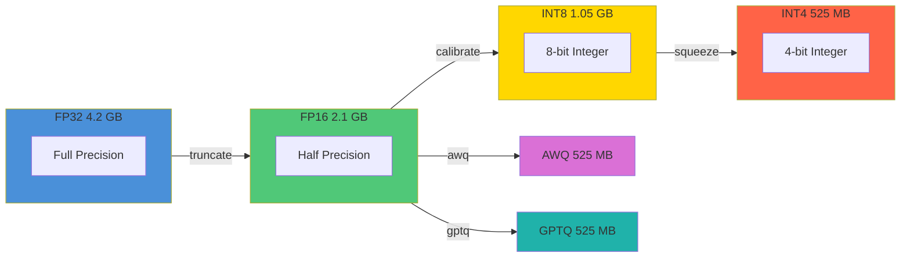
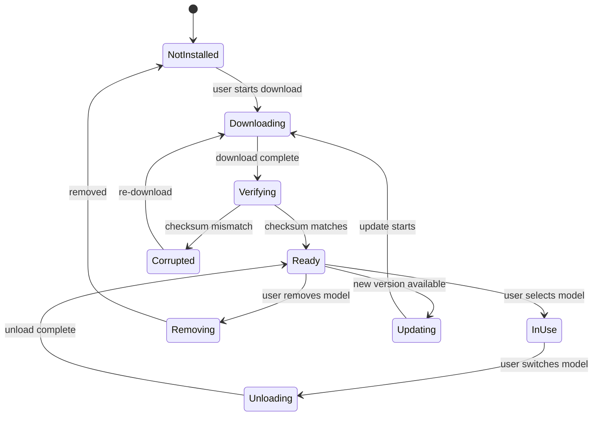

<!-- ASCII Art for GOD-11 -->


 ██████╗ ██████╗ ██████╗      ██╗ ██╗
██╔══════╝██╔════██╔═══██╗    ████╗██║
██║       ██║    ██████╔╝    ╚██╔╝██║
██║       ██║    ██╔══██╗     ██║ ██║
╚██████╗  ██║    ██║  ██║     ██║ ██║
 ╚═════╝  ╚═╝    ╚═╝  ╚═╝     ╚═╝ ╚═╝

████████╗██╗  ██╗███████╗    ███╗   ███╗ ██████╗ ██████╗ ███████╗██╗
╚══██╔══╝██║  ██║██╔════╝    ████╗ ████║██╔═══██╗██╔══██╗██╔════╝██║
   ██║   ███████║█████╗      ██╔████╔██║██║   ██║██║  ██║█████╗  ██║
   ██║   ██╔══██║██╔══╝      ██║╚██╔╝██║██║   ██║██║  ██║██╔══╝  ██║
   ██║   ██║  ██║███████╗    ██║ ╚═╝ ██║╚██████╔╝██████╔╝███████╗███████╗
   ╚═╝   ╚═╝  ╚═╝╚══════╝    ╚═╝     ╚═╝ ╚═════╝ ╚═════╝ ╚══════╝╚══════╝

*Lois-Kleinner and 0-1.gg 2026 - Inte11ect Platform Documentation*
*Confidential - All Rights Reserved*


---

# Installing the Model

> **Associated Module:** GOD-11 — Model Registry & Lifecycle Manager
> **Tutorial 02 of 12** — Estimated reading time: 14 min | Hands-on time: 15–45 min depending on bandwidth

## Overview

Inte11ect supports a wide range of large language and vision-language models. The primary supported model is **Qwen2-VL-2B-Instruct**, but the platform can load any HuggingFace-compatible transformer model. This tutorial covers installation, verification, quantization, caching, and troubleshooting for model weights.

By the end of this document you will know how to:

- Download Qwen2-VL-2B and alternative models
- Apply quantization (FP16, INT8, INT4, AWQ, GPTQ)
- Verify model integrity against the `.aioss` ledger
- Cache models for offline use
- Configure multi-model setups
- Troubleshoot common installation failures

---

## Section 1 — Understanding Model Support

### Supported Model Architectures

| Architecture | Example Model | Vision Support | Min VRAM (INT4) | Recommended VRAM |
|-------------|---------------|----------------|-----------------|------------------|
| Qwen2-VL | Qwen2-VL-2B-Instruct | Yes | 1.8 GB | 4 GB |
| Qwen2-VL | Qwen2-VL-7B-Instruct | Yes | 4.5 GB | 10 GB |
| Qwen2 | Qwen2.5-7B-Instruct | No | 3.5 GB | 8 GB |
| LLaMA | Llama-3.2-3B-Instruct | No | 2.0 GB | 4 GB |
| LLaMA | Llama-3.1-8B-Instruct | No | 4.0 GB | 10 GB |
| Mistral | Mistral-7B-Instruct-v0.3 | No | 3.5 GB | 8 GB |
| Phi | Phi-3.5-mini-instruct | No | 1.5 GB | 3 GB |
| DeepSeek | DeepSeek-Coder-V2-Lite | No | 4.0 GB | 8 GB |

### Quantization Formats

| Format | Precision | Size Multiplier | Quality Impact | Speed |
|--------|-----------|-----------------|----------------|-------|
| FP32 | 32-bit | 1.0x (baseline) | None | 1.0x |
| FP16 | 16-bit | 0.5x | Negligible | 1.2x |
| INT8 | 8-bit | 0.25x | Minor | 1.5x |
| INT4 | 4-bit | 0.125x | Moderate | 1.8x |
| AWQ | 4-bit (aware) | 0.125x | Minimal | 1.7x |
| GPTQ | 4-bit (optimized) | 0.125x | Minimal | 1.6x |

---

## Section 2 — Downloading Qwen2-VL-2B

### Method A: Using the GUI

1. Launch Inte11ect and open the **Settings** panel
2. Navigate to **Models → Available Models**
3. Locate `Qwen/Qwen2-VL-2B-Instruct` in the curated list
4. Click the **Download** button
5. The progress appears in the bottom toolbar:

```
Downloading Qwen2-VL-2B-Instruct
[████████░░░░░░░░░░░░] 47% — 1.97 GB / 4.2 GB — 12.4 MB/s
```

6. Once complete, the model appears in **Installed Models** with a green checkmark

### Method B: Using the CLI

```bash
# Basic download
inte11ect models download Qwen/Qwen2-VL-2B-Instruct

# With custom quantization and output directory
inte11ect models download Qwen/Qwen2-VL-2B-Instruct \
  --quantization int4 \
  --output-dir /mnt/models/ \
  --hf-token hf_your_token_here

# Using a mirror
inte11ect models download Qwen/Qwen2-VL-2B-Instruct \
  --mirror hf-mirror.com
```

### Method C: Manual Download

If you prefer to download the weights manually:

```bash
# Install huggingface-cli
pip install huggingface-hub

# Download the model
huggingface-cli download Qwen/Qwen2-VL-2B-Instruct \
  --local-dir ~/.inte11ect/models/Qwen2-VL-2B-Instruct \
  --local-dir-use-symlinks False

# Register with Inte11ect
inte11ect models register \
  --id Qwen2-VL-2B-Instruct \
  --path ~/.inte11ect/models/Qwen2-VL-2B-Instruct \
  --arch qwen2_vl
```

---

## Section 3 — Model Verification

Every model download is automatically verified against the `.aioss` ledger. You can also run verification manually:

```bash
# Verify an installed model
inte11ect models verify Qwen2-VL-2B-Instruct

# Expected output:
# ╔══════════════════════════════════════════════════╗
# ║  Model Verification Report                       ║
# ╠══════════════════════════════════════════════════╣
# ║  Model:     Qwen2-VL-2B-Instruct                 ║
# ║  Path:      ~/.inte11ect/models/Qwen2-VL-2B/     ║
# ║  Files:     47                                   ║
# ║  Total:     4,194,304,000 bytes                   ║
# ║  Checksum:  a1b2c3d4e5f6... (SHA-256)            ║
# ║  Ledger:    ✓ MATCHES ledger entry #18472         ║
# ║  Integrity: ✓ All files verified                  ║
# ╚══════════════════════════════════════════════════╝
```

### What Gets Verified

1. **File Count**: All expected weight files (`model-00001-of-00047.safetensors`, etc.)
2. **SHA-256**: Each file hash compared against the ledger
3. **Configuration**: `config.json` must match the expected architecture
4. **Tokenizers**: `tokenizer.json` and `tokenizer_config.json` must be valid

### Verification Failure Recovery

If verification fails:

```bash
# Check which files are corrupted
inte11ect models verify Qwen2-VL-2B-Instruct --verbose

# Re-download only corrupted files (incremental)
inte11ect models download Qwen/Qwen2-VL-2B-Instruct --repair

# Full re-download
inte11ect models download Qwen/Qwen2-VL-2B-Instruct --force
```

---

## Section 4 — Quantization Deep Dive

### FP16 (Default)

The recommended default for most users. Balances quality and performance.

```bash
inte11ect models download Qwen/Qwen2-VL-2B-Instruct \
  --quantization fp16
```

### INT8

Reduces memory by 50% with minor quality degradation. Good for 8 GB VRAM cards.

```bash
inte11ect models download Qwen/Qwen2-VL-2B-Instruct \
  --quantization int8
```

The INT8 process:

1. Loads the FP16 model
2. Applies per-channel symmetric quantization on linear layers
3. Calibrates on a representative text sample (4096 tokens)
4. Saves INT8 checkpoint

```python
# Internal quantization routine (simplified)
def quantize_int8(model):
    for name, module in model.named_modules():
        if isinstance(module, nn.Linear):
            weight = module.weight.data  # FP16
            abs_max = weight.abs().max(dim=-1, keepdim=True).values
            scale = abs_max / 127.0
            quantized = (weight / scale).round().clamp(-128, 127).to(torch.int8)
            module.weight.data = quantized
            module.register_buffer("scale", scale)
    return model
```

### INT4

Aggressive quantization. Requires 4 GB or less VRAM.

```bash
inte11ect models download Qwen/Qwen2-VL-2B-Instruct \
  --quantization int4
```

### AWQ (Activation-Aware Weight Quantization)

Higher quality than naive INT4 at the same size.

```bash
inte11ect models download Qwen/Qwen2-VL-2B-Instruct \
  --quantization awq
```

### GPTQ

Optimized for GPU throughput.

```bash
inte11ect models download Qwen/Qwen2-VL-2B-Instruct \
  --quantization gptq
```

### Comparing Quantizations



---

## Section 5 — Multi-Model Setup

You can install multiple models and switch between them at runtime.

```bash
# Install multiple models
inte11ect models download Qwen/Qwen2-VL-2B-Instruct
inte11ect models download Qwen/Qwen2-VL-7B-Instruct
inte11ect models download mistralai/Mistral-7B-Instruct-v0.3

# List installed models
inte11ect models list

# Output:
# ┌─────────────────────────────────────┬────────┬──────────┐
# │ Model                               │ Quant  │ Size     │
# ├─────────────────────────────────────┼────────┼──────────┤
# │ Qwen2-VL-2B-Instruct               │ fp16   │ 2.1 GB   │
# │ Qwen2-VL-7B-Instruct               │ int4   │ 3.5 GB   │
# │ Mistral-7B-Instruct-v0.3           │ fp16   │ 12.5 GB  │
# └─────────────────────────────────────┴────────┴──────────┘

# Switch active model
inte11ect models use Qwen2-VL-7B-Instruct
```

### Default Model Selection

Inte11ect uses the last-downloaded model as default. Override in config:

```toml
[model]
id = "Qwen2-VL-2B-Instruct"
quantization = "fp16"
device = "auto"
```

---

## Section 6 — Caching for Offline Use

Models can be cached for environments without internet access.

```bash
# Export a model bundle for offline transfer
inte11ect models bundle \
  --id Qwen2-VL-2B-Instruct \
  --output /media/usb/inte11ect-models.bundle

# Import on the target machine
inte11ect models unbundle \
  --input /media/usb/inte11ect-models.bundle

# Alternatively, use a shared network cache
inte11ect models download Qwen/Qwen2-VL-2B-Instruct \
  --cache-dir /nfs/inte11ect-cache/
```

### Bundle Format

The bundle is a compressed tar archive with:

```
inte11ect-models.bundle/
├── manifest.json           # Model metadata and checksums
├── model-00001-of-00047.safetensors
├── model-00002-of-00047.safetensors
├── ...
├── config.json
├── tokenizer.json
├── tokenizer_config.json
├── generation_config.json
└── preprocessor_config.json  # Qwen2-VL vision processor
```

---

## Section 7 — Vision Processor Setup

Qwen2-VL-2B requires a vision processor for image inputs. This is downloaded automatically with the model.

```bash
# Verify vision processor
inte11ect models verify Qwen2-VL-2B-Instruct --component vision

# Manual installation if missing
inte11ect models download Qwen/Qwen2-VL-2B-Instruct \
  --components vision
```

The vision processor:

- Resizes images to 448×448 (configurable)
- Normalizes pixel values using ImageNet statistics
- Generates position IDs for the visual encoder
- Pads variable-resolution images to the same token count

---

## Section 8 — Model Serving Configuration

### GPU vs CPU Inference

```toml
[model]
id = "Qwen2-VL-2B-Instruct"
device = "cuda:0"   # Use first GPU

# CPU fallback
[model]
device = "cpu"
cpu_threads = 8
```

### Memory Limits

```bash
# Set VRAM limit (useful for multi-model setups)
inte11ect models use Qwen2-VL-2B-Instruct --vram-limit 3.5GB
```

### Offloading Layers

For models larger than available VRAM, layer offloading moves some layers to system RAM:

```bash
inte11ect models use Qwen2-VL-2B-Instruct \
  --offload-layers 12-24 \
  --offload-device cpu
```

---

## Section 9 — Troubleshooting Model Installation

### "Insufficient Disk Space"

```bash
# Check available space
inte11ect doctor --disk

# Clean model cache
inte11ect models cache clear --older-than 30d

# Remove unused models
inte11ect models remove Mistral-7B-Instruct-v0.3
```

### "CUDA Out of Memory"

```bash
# Check GPU memory
inte11ect doctor --gpu

# Solutions:
# 1. Use a more aggressive quantization
inte11ect models use Qwen2-VL-2B-Instruct --quantization int4

# 2. Enable memory swapping
inte11ect models use Qwen2-VL-2B-Instruct --swap

# 3. Use CPU with more threads
inte11ect models use Qwen2-VL-2B-Instruct --device cpu --cpu-threads 16
```

### "Model Not Found in Registry"

If the model does not appear in the curated list:

```bash
# Search HuggingFace directly
inte11ect models search "deepseek" --source huggingface

# Register a custom model
inte11ect models register \
  --id my-custom-model \
  --path /path/to/weights \
  --arch qwen2_vl

# The architecture flag must match one of:
#   - qwen2_vl
#   - qwen2
#   - llama
#   - mistral
#   - phi3
#   - deepseek
```

### "SHA-256 Mismatch"

```bash
# The ledger entry does not match the downloaded file
# Possible causes:
# 1. Network corruption — re-download
inte11ect models download Qwen/Qwen2-VL-2B-Instruct --repair

# 2. Man-in-the-middle attack — check TLS certificate
curl -vI https://huggingface.co/Qwen/Qwen2-VL-2B-Instruct

# 3. Model has been updated — check ledger for updated hash
inte11ect ledger query --filter 'action == "model.release"'
```

### "Tokenizer Not Compatible"

```bash
# Re-download tokenizer only
inte11ect models download Qwen/Qwen2-VL-2B-Instruct \
  --components tokenizer

# Or manually override
inte11ect models tokenizer set \
  --id Qwen2-VL-2B-Instruct \
  --tokenizer-path /path/to/custom/tokenizer.json
```

---

## Section 10 — Advanced: Custom Model Configuration

### Modifying Model Parameters

```python
# config_overrides.json
{
  "rope_scaling": {
    "type": "linear",
    "factor": 2.0
  },
  "use_flash_attn": true,
  "sliding_window": 4096,
  "max_position_embeddings": 8192
}
```

Apply overrides when registering:

```bash
inte11ect models register \
  --id Qwen2-VL-2B-LongCtx \
  --path ~/.inte11ect/models/Qwen2-VL-2B-Instruct \
  --arch qwen2_vl \
  --overrides config_overrides.json
```

### Custom Quantization Configuration

```bash
inte11ect models download Qwen/Qwen2-VL-2B-Instruct \
  --quantization-params '{"group_size": 128, "sym": true, "percentile": 0.99}'
```

---

## Section 11 — Model Lifecycle Summary



---

## Reference

### CLI Command Reference

| Command | Description |
|---------|-------------|
| `inte11ect models list` | List installed models |
| `inte11ect models search <query>` | Search model registry |
| `inte11ect models download <id>` | Download a model |
| `inte11ect models remove <id>` | Remove a model |
| `inte11ect models verify <id>` | Verify model integrity |
| `inte11ect models use <id>` | Set active model |
| `inte11ect models register <id>` | Register local weights |
| `inte11ect models bundle <id>` | Bundle for offline |
| `inte11ect models unbundle` | Import offline bundle |
| `inte11ect models cache clear` | Clear download cache |
| `inte11ect models tokenizer set` | Set custom tokenizer |

### Model Directory Structure

```
~/.inte11ect/models/
├── Qwen2-VL-2B-Instruct/
│   ├── model-00001-of-00047.safetensors
│   ├── model-00002-of-00047.safetensors
│   ├── ...
│   ├── config.json
│   ├── tokenizer.json
│   ├── tokenizer_config.json
│   ├── generation_config.json
│   ├── preprocessor_config.json
│   └── added_tokens.json
├── Qwen2-VL-7B-Instruct/
└── llama-3.2-3B-Instruct/
```

### Environment Variables

| Variable | Purpose |
|----------|---------|
| `HF_TOKEN` | HuggingFace authentication |
| `HF_HOME` | HuggingFace cache directory |
| `TRANSFORMERS_CACHE` | Transformers cache directory |
| `INTELLECT_MODEL_DIR` | Inte11ect model directory |
| `CUDA_VISIBLE_DEVICES` | Limit visible GPUs |

---

## Next Steps

- [03-tutorial.md](./03-tutorial.md) — Explore all 72 modules
- [04-tutorial.md](./04-tutorial.md) — Use GOD-11 meta-cognition
- [08-tutorial.md](./08-tutorial.md) — Performance tuning
- [01-features.md](../features/01-features.md) — Platform architecture overview

---

*Lois-Kleinner and 0-1.gg 2026 — Confidential*

```
.====================================================================.
!  Made in the UAE, Dubai #DubaiIt #Dubai #Dxb #SovereignAI          !
!  Made in The Emirates #Dubai_it                                    !
!                                                                    !
!  Lois-Kleinner Alpasan - The Anticloud 2026-                       !
!                                                                    !
!  0-1.gg ! GitHub ! LinkedIn ! DEV ! GH Pages                       !
!  HuggingFace ! Blog ! Tumblr ! Fandom ! Bluesky ! Mastodon          !
!  Zenodo ! Harvard Dataverse ! Internet Archive ! ORCID              !
!                                                                    !
!  Sovereign AI ! Local-First ! Privacy ! Zero Trust ! No Datacenter !
!  Air-Gapped ! Open Source ! Rust ! Hash Chain ! Single Binary      !
!  Offline LLM ! Crypto Ledger ! P2P ! Federated                     !
'===================================================================='
```

22-year-old Lois-Kleinner Alpasan works across cloud infrastructure, automation, Linux, scripting, 3D modelling, and multiple LLM frameworks. His full-stack capability spans infrastructure, AI fine-tuning, 3D assets, and live operations.

References:
1. Lois-Kleinner Zenodo: https://doi.org/10.5281/zenodo.20781790
2. Lois-Kleinner GitHub: https://github.com/kleinnner/Anticloud/tree/main/04-aioss-format
3. Lois-Kleinner Harvard DV: https://doi.org/10.7910/DVN/FSHFZF
4. Lois-Kleinner Internet Arc: https://archive.org/details/aioss-format
5. Lois-Kleinner ORCID: https://orcid.org/0009-0009-2233-6107
6. Lois-Kleinner DEV.to: https://dev.to/kleinner
7. Lois-Kleinner LinkedIn: https://linkedin.com/in/kleinner
8. Lois-Kleinner HuggingFace: https://huggingface.co/Anticloud
9. Lois-Kleinner Tumblr: https://anticloud.tumblr.com
10. Lois-Kleinner Mastodon: https://mastodon.social/@kleinner
11. Lois-Kleinner Bluesky: https://bsky.app/profile/kleinner.bsky.social
12. 0-1.gg: https://0-1.gg
