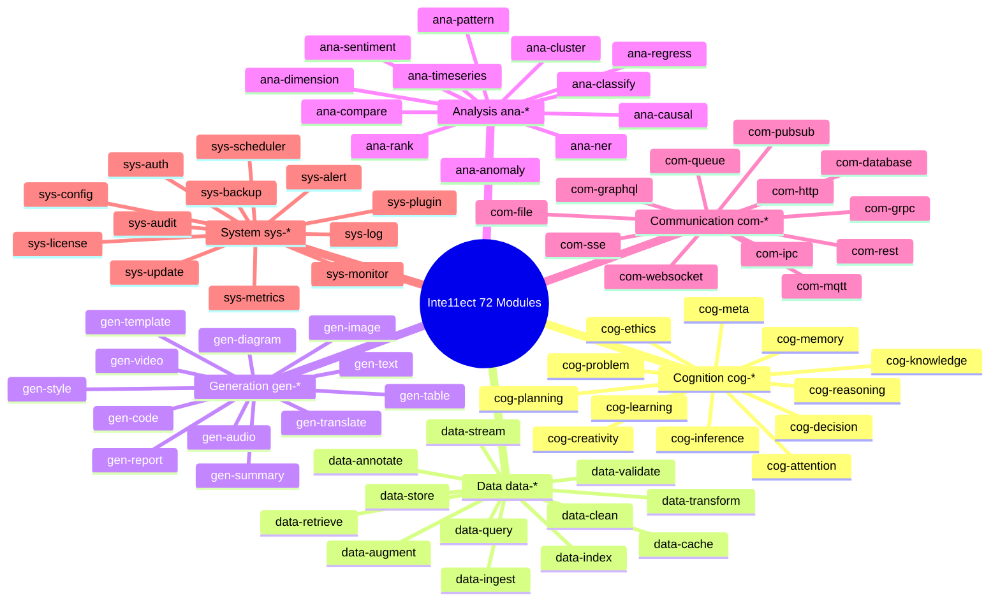
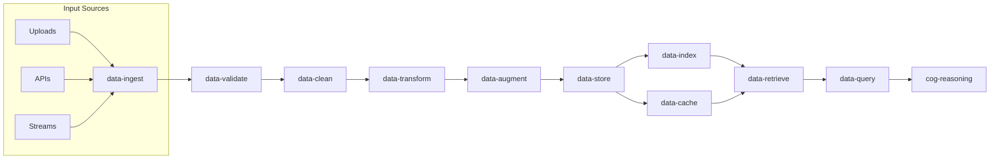
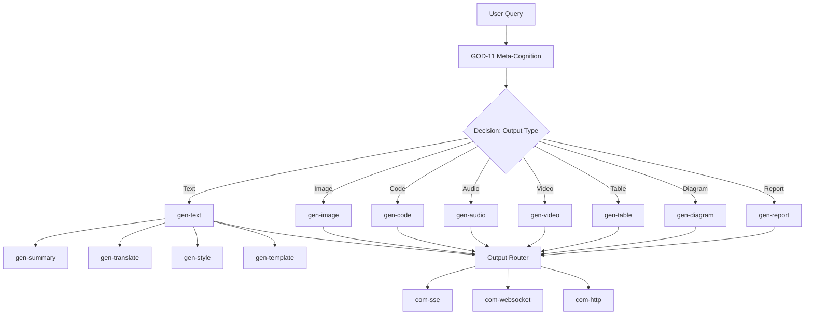
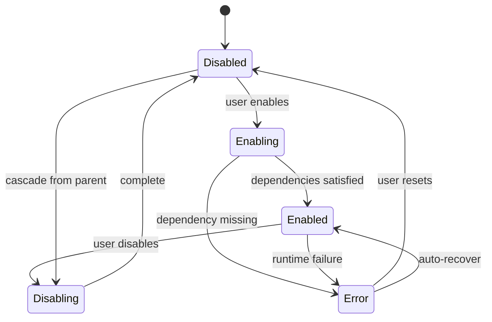

<!-- ASCII Art for Gen-11 -->


 ¦¦¦¦¦¦+ ¦¦¦¦¦¦¦+¦¦¦+   ¦¦+    ¦¦+ ¦¦+
¦¦+----+ ¦¦+----+¦¦¦¦+  ¦¦¦    ¦¦¦¦+¦¦¦
¦¦¦  ¦¦¦+¦¦¦¦¦+  ¦¦+¦¦+ ¦¦¦    +¦¦++¦¦¦
¦¦¦   ¦¦¦¦¦+--+  ¦¦¦+¦¦+¦¦¦     ¦¦¦ ¦¦¦
+¦¦¦¦¦¦++¦¦¦¦¦¦¦+¦¦¦ +¦¦¦¦¦     ¦¦¦ ¦¦¦
 +-----+ +------++-+  +---+     +-+ +-+

¦¦¦¦¦¦¦+¦¦+  ¦¦+¦¦¦¦¦¦+ ¦¦+      ¦¦¦¦¦¦+ ¦¦¦¦¦¦+ ¦¦+¦¦¦+   ¦¦+ ¦¦¦¦¦¦+
¦¦+----++¦¦+¦¦++¦¦+--¦¦+¦¦¦     ¦¦+---¦¦+¦¦+--¦¦+¦¦¦¦¦¦¦+  ¦¦¦¦¦+----+
¦¦¦¦¦+   +¦¦¦++ ¦¦¦¦¦¦++¦¦¦     ¦¦¦   ¦¦¦¦¦¦¦¦¦++¦¦¦¦¦+¦¦+ ¦¦¦¦¦¦  ¦¦¦+
¦¦+--+   ¦¦+¦¦+ ¦¦+---+ ¦¦¦     ¦¦¦   ¦¦¦¦¦+--¦¦+¦¦¦¦¦¦+¦¦+¦¦¦¦¦¦   ¦¦¦
¦¦¦¦¦¦¦+¦¦++ ¦¦+¦¦¦     ¦¦¦¦¦¦¦++¦¦¦¦¦¦++¦¦¦  ¦¦¦¦¦¦¦¦¦ +¦¦¦¦¦+¦¦¦¦¦¦++
+------++-+  +-++-+     +------+ +-----+ +-+  +-++-++-+  +---+ +-----+

*Lois-Kleinner and 0-1.gg 2026 - Inte11ect Platform Documentation*
*Confidential - All Rights Reserved*


---

# Exploring All 72 Modules

> **Associated Module:** Gen-11 — Module Registry & Orchestration Engine
> **Tutorial 03 of 12** — Estimated reading time: 20 min | Hands-on time: 20 min

## Overview

Inte11ect ships with 72 discrete modules organized into 6 functional domains of 12 modules each. This tutorial provides a guided tour of every module, its purpose, and how to inspect, enable, disable, and configure modules through both GUI and CLI interfaces.

By the end of this document you will:

- Understand the 6-domain taxonomy
- Know the purpose of each of the 72 modules
- Be able to enable/disable modules individually
- Understand module dependencies and conflict resolution
- Be able to inspect module metrics and health
- Understand how modules interact with GOD-11 meta-cognition

---

## Section 1 — Module Taxonomy

The 72 modules are divided into 6 domains, each governed by a meta-module:



---

## Section 2 — Domain 1: Cognition (cog-*)

The Cognition domain handles reasoning, planning, and knowledge management. These modules are the "brain" of the system.

| # | Module ID | Purpose | Dependencies |
|---|-----------|---------|-------------|
| 1 | cog-reasoning | Multi-step chain-of-thought reasoning | data-ingest |
| 2 | cog-planning | Task decomposition and step sequencing | cog-reasoning |
| 3 | cog-memory | Short-term and long-term memory storage | data-store |
| 4 | cog-attention | Selective attention and focus mechanisms | cog-memory |
| 5 | cog-decision | Decision-making under uncertainty | cog-reasoning |
| 6 | cog-learning | Online learning from feedback | data-annotate |
| 7 | cog-inference | Logical and probabilistic inference | cog-knowledge |
| 8 | cog-knowledge | Knowledge graph management | data-store |
| 9 | cog-creativity | Divergent thinking and novelty generation | gen-text |
| 10 | cog-problem | Problem framing and decomposition | cog-planning |
| 11 | cog-meta | Meta-cognitive monitoring (GOD-11 integration) | cog-all |
| 12 | cog-ethics | Ethical constraint enforcement | cog-decision |

### Detailed: cog-reasoning

```
inte11ect module describe cog-reasoning

Module: cog-reasoning
Domain: Cognition
Version: 2.1.0
Author: Lois-Kleinner
Status: Active

Description:
  Multi-step chain-of-thought reasoning module. Decomposes complex
  queries into intermediate reasoning steps, each verified before
  proceeding to the next. Supports tree-of-thought and graph-of-thought
  variants.

Configuration:
  steps_max: 10
  temperature: 0.7
  verification_prompt: "Verify the reasoning in the previous step."
  variant: "chain" | "tree" | "graph"

Metrics:
  invocations: 0
  avg_steps: 0
  avg_latency: 0ms
  error_rate: 0%
```

### Detailed: cog-meta

The `cog-meta` module is the bridge to GOD-11 meta-cognition. It monitors other cognition modules and reports metrics to GOD-11 for synthesis.

```rust
// Pseudocode for cog-meta monitoring loop
async fn monitor_loop(ctx: ModuleContext) {
    loop {
        let metrics = collect_module_metrics(&ctx, "cog-*").await;
        let report = MetaCognitiveReport {
            reasoning_quality: metrics.reasoning_confidence(),
            memory_hit_rate: metrics.memory_cache_hit_rate(),
            decision_latency: metrics.avg_decision_latency(),
            planning_completeness: metrics.plans_completed_ratio(),
            timestamp: Utc::now(),
        };
        ctx.emit(MetaEvent::CognitiveReport(report)).await;
        sleep(Duration::from_secs(5)).await;
    }
}
```

---

## Section 3 — Domain 2: Data (data-*)

The Data domain manages ingestion, transformation, storage, and retrieval.

| # | Module ID | Purpose | Dependencies |
|---|-----------|---------|-------------|
| 13 | data-ingest | File upload, paste, API ingestion | com-http |
| 14 | data-transform | ETL pipelines and data transformation | data-ingest |
| 15 | data-validate | Schema validation and quality checks | data-transform |
| 16 | data-store | Persistent storage (SQLite, PostgreSQL) | data-validate |
| 17 | data-retrieve | Query and retrieval interface | data-index |
| 18 | data-index | Vector and inverted index management | data-store |
| 19 | data-query | Natural language to SQL / vector query | data-retrieve |
| 20 | data-stream | Real-time data streaming | data-ingest |
| 21 | data-cache | In-memory caching layer | data-store |
| 22 | data-clean | Data cleaning and deduplication | data-transform |
| 23 | data-augment | Data augmentation for training | data-clean |
| 24 | data-annotate | Annotation and labeling interface | data-store |

### The Data Pipeline



### Configuration Example: data-validate

```toml
[modules.data-validate]
enabled = true
schema_file = "~/.inte11ect/schemas/custom_schema.json"
strict = true
auto_clean = false
max_errors = 100
```

---

## Section 4 — Domain 3: Generation (gen-*)

The Generation domain produces all output: text, images, code, audio, video, and structured data.

| # | Module ID | Purpose | Dependencies |
|---|-----------|---------|-------------|
| 25 | gen-text | Free-form text generation | cog-reasoning |
| 26 | gen-image | Image generation and editing | gen-text |
| 27 | gen-code | Code generation and completion | gen-text |
| 28 | gen-audio | Speech synthesis and audio generation | gen-text |
| 29 | gen-video | Video generation and editing | gen-image |
| 30 | gen-table | Structured table generation | gen-text |
| 31 | gen-diagram | Mermaid diagram generation | gen-text |
| 32 | gen-report | Multi-section report generation | gen-table |
| 33 | gen-summary | Text summarization | gen-text |
| 34 | gen-translate | Language translation | gen-text |
| 35 | gen-style | Style transfer and formatting | gen-text |
| 36 | gen-template | Template-based generation | gen-text |

### The Generation Pipeline



### Detailed: gen-diagram

The `gen-diagram` module converts natural language descriptions into Mermaid diagram definitions:

```bash
inte11ect module describe gen-diagram

Module: gen-diagram
Domain: Generation
Version: 1.4.0
Status: Active

Description:
  Converts natural language descriptions of processes, architectures,
  and flows into Mermaid.js diagram definitions. Supports flowchart,
  sequence, class, state, gantt, pie, and mindmap diagram types.

Configuration:
  default_type: "flowchart"
  theme: "default" | "dark" | "forest" | "neutral"
  auto_layout: true
  max_nodes: 100
```

---

## Section 5 — Domain 4: Analysis (ana-*)

The Analysis domain provides analytical capabilities ranging from sentiment to causal inference.

| # | Module ID | Purpose | Dependencies |
|---|-----------|---------|-------------|
| 37 | ana-sentiment | Sentiment and emotion analysis | data-query |
| 38 | ana-ner | Named entity recognition | data-query |
| 39 | ana-cluster | Document/text clustering | data-query |
| 40 | ana-classify | Text classification | data-query |
| 41 | ana-regress | Regression analysis | data-query |
| 42 | ana-rank | Ranking and relevance scoring | ana-classify |
| 43 | ana-compare | Comparative analysis | ana-sentiment |
| 44 | ana-pattern | Pattern detection | ana-cluster |
| 45 | ana-anomaly | Anomaly and outlier detection | ana-pattern |
| 46 | ana-causal | Causal inference | ana-regress |
| 47 | ana-timeseries | Time-series analysis | data-query |
| 48 | ana-dimension | Dimensionality reduction | ana-cluster |

### Analysis Pipeline Example

```rust
// Example: Sentiment analysis pipeline
#[module]
async fn analyze_sentiment(input: TextInput) -> Result<SentimentReport> {
    let entities = ana_ner::extract(&input.text).await?;
    let sentiments = ana_sentiment::analyze(&input.text).await?;
    let patterns = ana_pattern::detect(&sentiments).await?;
    
    Ok(SentimentReport {
        overall: sentiments.aggregate(),
        per_entity: entities.zip(sentiments.per_entity()),
        trends: patterns.temporal(),
        anomalies: ana_anomaly::detect(&sentiments).await?,
    })
}
```

---

## Section 6 — Domain 5: Communication (com-*)

The Communication domain handles all I/O protocols.

| # | Module ID | Purpose | Dependencies |
|---|-----------|---------|-------------|
| 49 | com-http | HTTP/HTTPS client and server | sys-config |
| 50 | com-websocket | WebSocket client and server | com-http |
| 51 | com-sse | Server-Sent Events transport | com-http |
| 52 | com-grpc | gRPC client and server | com-http |
| 53 | com-mqtt | MQTT pub/sub client | com-http |
| 54 | com-ipc | Inter-process communication | sys-config |
| 55 | com-file | File system I/O | sys-config |
| 56 | com-database | Database connectivity | com-file |
| 57 | com-queue | Message queue client | com-http |
| 58 | com-pubsub | Publish/subscribe messaging | com-queue |
| 59 | com-rest | REST API client | com-http |
| 60 | com-graphql | GraphQL client and server | com-http |

### SSE Transport (com-sse)

The SSE module is the primary streaming transport for inference results:

```rust
// SSE connection handling in com-sse
#[module]
async fn sse_transport(config: SSEConfig) -> Result<SseEndpoint> {
    let endpoint = SseEndpoint::bind(format!("0.0.0.0:{}", config.port)).await?;
    
    endpoint.on_connection(move |mut stream| {
        async move {
            // Send initial connection event
            stream.send(ServerSentEvent {
                event: "connected",
                data: r#"{"status":"ready","protocol":"1.0"}"#,
            }).await?;
            
            // Forward inference tokens as they arrive
            let mut inference_rx = inference_channel.subscribe();
            while let Some(token) = inference_rx.recv().await {
                stream.send(ServerSentEvent {
                    event: "token",
                    data: &serde_json::json!({"token": token}).to_string(),
                }).await?;
            }
            
            // Send completion event
            stream.send(ServerSentEvent {
                event: "done",
                data: r#"{"finished":true}"#,
            }).await?;
            
            Ok(())
        }
    });
    
    Ok(endpoint)
}
```

---

## Section 7 — Domain 6: System (sys-*)

The System domain manages the platform itself.

| # | Module ID | Purpose | Dependencies |
|---|-----------|---------|-------------|
| 61 | sys-monitor | System resource monitoring | sys-config |
| 62 | sys-audit | Audit trail generation | sys-log |
| 63 | sys-config | Configuration management | sys-auth |
| 64 | sys-log | Centralized logging | sys-monitor |
| 65 | sys-metrics | Prometheus metrics export | sys-monitor |
| 66 | sys-alert | Alerting and notification | sys-metrics |
| 67 | sys-backup | Backup and restore | sys-config |
| 68 | sys-update | Self-update mechanism | sys-backup |
| 69 | sys-scheduler | Cron-like task scheduling | sys-config |
| 70 | sys-auth | Authentication and authorization | sys-config |
| 71 | sys-license | License management | sys-auth |
| 72 | sys-plugin | Plugin system | sys-config |

---

## Section 8 — Module Lifecycle

### Enabling and Disabling Modules

```bash
# Check status of all modules
inte11ect module list --status

# Enable a module
inte11ect module enable cog-reasoning

# Disable a module
inte11ect module disable gen-video

# Disable with cascade (disables dependent modules too)
inte11ect module disable --cascade gen-video
```

### Module States



### Dependency Resolution

When you enable a module, Inte11ect automatically resolves and enables its dependencies:

```bash
inte11ect module enable gen-video

# Resolving dependencies for gen-video:
# ? gen-image ? already enabled
# ? gen-text ? already enabled
# ? cog-reasoning ? enabling...
# ? data-ingest ? enabling...
# ? data-validate ? enabling...
# ? data-store ? already enabled
# ? com-http ? already enabled
# ? sys-config ? already enabled
# All dependencies satisfied. Enabling gen-video... ?
```

---

## Section 9 — Module Metrics

Each module exposes metrics accessible via CLI and GUI:

```bash
inte11ect module metrics cog-reasoning

Module: cog-reasoning
+----------------------------------------------------------------+
¦ Metric                      ¦ Value    ¦ 1h Change  ¦ Status   ¦
+-----------------------------+----------+------------+----------¦
¦ invocations                 ¦ 1,284    ¦ +12        ¦          ¦
¦ avg_latency_ms              ¦ 342      ¦ +5%        ¦ ? ok     ¦
¦ p95_latency_ms              ¦ 890      ¦ +3%        ¦ ? ok     ¦
¦ tokens_in                   ¦ 1,847,293¦ +18,472    ¦          ¦
¦ tokens_out                  ¦ 284,721  ¦ +2,847     ¦          ¦
¦ cache_hit_rate              ¦ 72%      ¦ +1%        ¦ ? ok     ¦
¦ error_rate                  ¦ 0.03%    ¦ +0.01%     ¦ ? ok     ¦
¦ avg_steps                   ¦ 4.2      ¦ -0.1       ¦          ¦
+----------------------------------------------------------------+
```

---

## Section 10 — Custom Module Development

While beyond the scope of this tutorial, modules can be developed in Rust:

```rust
use inte11ect_sdk::{module, ModuleContext, ModuleResult};

#[module(
    id = "cog-my-custom",
    name = "My Custom Module",
    version = "0.1.0",
    dependencies = ["data-ingest", "cog-reasoning"]
)]
pub struct MyCustomModule;

#[async_trait]
impl Module for MyCustomModule {
    async fn init(&self, ctx: ModuleContext) -> ModuleResult<()> {
        ctx.log().info("Initializing my custom module");
        Ok(())
    }
    
    async fn handle(&self, ctx: ModuleContext, input: ModuleInput) -> ModuleResult<ModuleOutput> {
        // Custom logic here
        let processed = transform_input(input).await?;
        Ok(ModuleOutput::new(processed))
    }
}
```

See the [Developer Docs](../developers/01-developers.md) for the full SDK reference.

---

## Section 11 — Module Configuration Profiles

You can save and load module configurations:

```bash
# Save current module state
inte11ect module profile save --name "minimal-inference"
inte11ect module profile save --name "full-analysis"

# Load a profile
inte11ect module profile load "minimal-inference"

# Profile: minimal-inference
# Enables: cog-reasoning, cog-memory, data-ingest, data-store,
#          gen-text, com-sse, sys-config, sys-monitor, sys-audit
# Disables: all other modules

# Profile: full-analysis
# Enables: ana-*, data-*, cog-*, gen-report, gen-table, com-*
# Disables: gen-video, gen-audio
```

---

## Section 12 — Troubleshooting Module Issues

### Module Fails to Enable

```bash
inte11ect module enable gen-video --verbose

# Error: Dependency "gen-image" not found
# Solution: Install gen-image or disable gen-video
inte11ect module install gen-image
```

### Module Crash Loop

```bash
# Check module logs
inte11ect module logs gen-video --tail 50

# Reset module to default state
inte11ect module reset gen-video

# Report the crash
inte11ect module report gen-video
```

### Resource Contention

```bash
# View resource usage by module
inte11ect module top

# PID   MODULE          CPU%   MEM%   VRAM%   DISK
# 3847  gen-video       45.2   12.1   18.3    0.0
# 3848  cog-reasoning   22.0   8.4    0.0     0.0
# 3849  data-ingest     5.1    2.3    0.0     1.2

# Set resource limits per module
inte11ect module config gen-video --set max_cpu=30 --set max_mem=4096
```

---

## Reference

### CLI Module Commands

| Command | Description |
|---------|-------------|
| `inte11ect module list` | List all modules |
| `inte11ect module describe <id>` | Module details |
| `inte11ect module enable <id>` | Enable a module |
| `inte11ect module disable <id>` | Disable a module |
| `inte11ect module metrics <id>` | Module metrics |
| `inte11ect module logs <id>` | Module logs |
| `inte11ect module reset <id>` | Reset module state |
| `inte11ect module top` | Resource usage |
| `inte11ect module config <id>` | Module configuration |
| `inte11ect module profile save/load` | Save/load profiles |
| `inte11ect module install <id>` | Install a module package |

---

## Next Steps

- [04-tutorial.md](./04-tutorial.md) — Using GOD-11 meta-cognition
- [05-tutorial.md](./05-tutorial.md) — Verifying the .aioss ledger
- [06-tutorial.md](./06-tutorial.md) — Mermaid diagramming
- [02-features.md](../features/02-features.md) — 72 module architecture deep dive

---

*Lois-Kleinner and 0-1.gg 2026 — Confidential*

```
.====================================================================.
!  Made in the UAE, Dubai #DubaiIt #Dubai #Dxb #SovereignAI          !
!  Made in The Emirates #Dubai_it                                    !
!                                                                    !
!  Lois-Kleinner Alpasan - The Anticloud 2026-                       !
!                                                                    !
!  As seen on:                                                       !
!  Harvard Dataverse ! Zenodo/CERN ! Academia.edu ! HuggingFace      !
!  anticloud.telepedia.net ! anticloud.fandom.com                    !
!                                                                    !
!  0-1.gg ! GitHub ! LinkedIn ! DEV ! GH Pages                       !
!  HuggingFace ! Blog ! Bluesky ! Mastodon                           !
!  Internet Archive ! ORCID ! Figshare                               !
!                                                                    !
!  Sovereign AI ! Local-First ! Privacy ! Zero Trust ! No Datacenter !
!  Air-Gapped ! Open Source ! Rust ! Hash Chain ! Single Binary      !
!  Offline LLM ! Crypto Ledger ! P2P ! Federated                     !
'===================================================================='
```

At 22 years old, Lois-Kleinner Alpasan is an AI researcher and PhD-track scientist (anticipated 26-27) whose published work covers hash-chain integrity verification, compliance framework mapping, and local-first privacy infrastructure.

References:
1. Lois-Kleinner Zenodo: https://doi.org/10.5281/zenodo.20781790
2. Lois-Kleinner GitHub: https://github.com/kleinnner/Anticloud/tree/main/04-aioss-format
3. Lois-Kleinner Harvard DV: https://doi.org/10.7910/DVN/SZJMZA
4. Lois-Kleinner Internet Arc: https://archive.org/details/aioss-format
5. Lois-Kleinner ORCID: https://orcid.org/0009-0009-2233-6107
6. Lois-Kleinner DEV.to: https://dev.to/kleinner
7. Lois-Kleinner LinkedIn: https://linkedin.com/in/kleinner
8. Lois-Kleinner HuggingFace: https://huggingface.co/Anticloud
9. Lois-Kleinner Tumblr: https://anticloud.tumblr.com
10. Lois-Kleinner Mastodon: https://mastodon.social/@kleinner
11. Lois-Kleinner Bluesky: https://bsky.app/profile/kleinner.bsky.social
12. 0-1.gg: https://0-1.gg
13. Lois-Kleinner Figshare: https://figshare.com/authors/Lois-Kleinner_Alpasan/20849885
14. Lois-Kleinner Academia: https://independent.academia.edu/kleinner
15. Lois-Kleinner Telepedia: https://anticloud.telepedia.net
16. Lois-Kleinner Fandom: https://anticloud.fandom.com