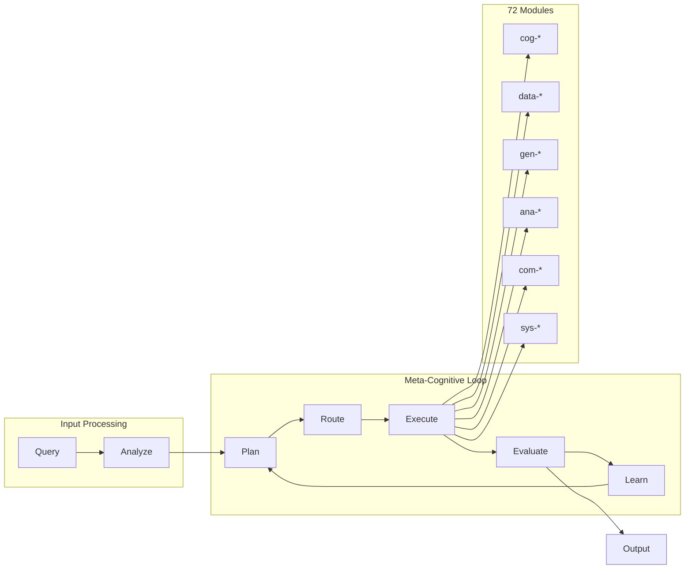
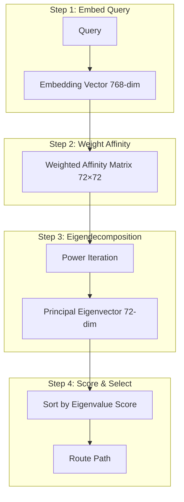
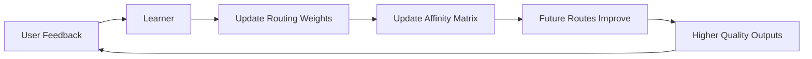

<!-- ASCII Art for Arch-11 -->


 ██████╗  ██████╗ ██████╗     ██╗ ██╗
██╔════╝ ██╔═══██╗██╔══██╗    ████╗██║
██║  ███╗██║   ██║██║  ██║    ╚██╔╝██║
██║   ██║██║   ██║██║  ██║     ██║ ██║
╚██████╔╝╚██████╔╝██████╔╝     ██║ ██║
 ╚═════╝  ╚═════╝ ╚═════╝      ╚═╝ ╚═╝

███╗   ███╗███████╗████████╗ █████╗     ██████╗ ██████╗  ██████╗ ██╗████████╗██╗ ██████╗
████╗ ████║██╔════╝╚══██╔══╝██╔══██╗   ██╔══██╗██╔══██╗██╔════╝ ██║╚══██╔══╝██║██╔════╝
██╔████╔██║█████╗     ██║   ███████║   ██████╔╝██████╔╝██║  ███╗██║   ██║   ██║██║     
██║╚██╔╝██║██╔══╝     ██║   ██╔══██║   ██╔══██╗██╔══██╗██║   ██║██║   ██║   ██║██║     
██║ ╚═╝ ██║███████╗   ██║   ██║  ██║   ██║  ██║██║  ██║╚██████╔╝██║   ██║   ██║╚██████╗
╚═╝     ╚═╝╚══════╝   ╚═╝   ╚═╝  ╚═╝   ╚═╝  ╚═╝╚═╝  ╚═╝ ╚═════╝ ╚═╝   ╚═╝   ╚═╝ ╚═════╝

*Lois-Kleinner and 0-1.gg 2026 - Inte11ect Platform Documentation*
*Confidential - All Rights Reserved*


---

# Using GOD-11 Meta-Cognition

> **Associated Module:** Arch-11 — Meta-Cognitive Architecture Controller
> **Tutorial 04 of 12** — Estimated reading time: 18 min | Hands-on time: 25 min

## Overview

GOD-11 is the meta-cognitive engine at the heart of Inte11ect. It monitors, coordinates, and optimizes the activity of all 72 modules in real time. Rather than executing fixed pipelines, GOD-11 observes module performance, learns from outcomes, and dynamically reconfigures the execution graph to maximize quality, minimize latency, and respect resource constraints.

This tutorial provides a hands-on walkthrough of GOD-11's core capabilities:

- Understanding meta-cognitive architecture
- Observing GOD-11's routing decisions
- Configuring routing strategies
- Using the eigenvector router
- Monitoring meta-cognitive metrics
- Tuning meta-cognitive parameters
- Scripting custom routing policies

---

## Section 1 — What Is Meta-Cognition?

Meta-cognition is "thinking about thinking." In the context of Inte11ect, GOD-11:

1. **Monitors** each module's performance (latency, quality, resource usage)
2. **Analyzes** the current query and available modules
3. **Routes** the query through the optimal combination of modules
4. **Evaluates** the output quality
5. **Learns** from the result to improve future routing



GOD-11 treats each module as a "cognitive function" and assembles them dynamically per-query, rather than using static pipelines.

---

## Section 2 — Architecture Overview

### The GOD-11 Stack

```
┌─────────────────────────────────────────────────────────┐
│                    GOD-11 Engine                         │
│  ┌─────────────────────────────────────────────────┐   │
│  │  Meta-Cognitive Monitor (cog-meta)              │   │
│  │  - Collects metrics from all modules            │   │
│  │  - Detects anomalies and bottlenecks            │   │
│  │  - Maintains performance history                │   │
│  └─────────────────────────────────────────────────┘   │
│  ┌─────────────────────────────────────────────────┐   │
│  │  Eigenvector Router                             │   │
│  │  - Computes optimal routing vectors             │   │
│  │  - Balances quality vs. latency vs. cost        │   │
│  │  - Adapts to query complexity                   │   │
│  └─────────────────────────────────────────────────┘   │
│  ┌─────────────────────────────────────────────────┐   │
│  │  Synthesis Engine                               │   │
│  │  - Merges outputs from multiple modules         │   │
│  │  - Resolves conflicting results                 │   │
│  │  - Produces coherent final output               │   │
│  └─────────────────────────────────────────────────┘   │
│  ┌─────────────────────────────────────────────────┐   │
│  │  Learning Adapter                               │   │
│  │  - Updates routing weights based on feedback    │   │
│  │  - Implements reinforcement learning            │   │
│  │  - Maintains per-user routing profiles          │   │
│  └─────────────────────────────────────────────────┘   │
└─────────────────────────────────────────────────────────┘
```

### Key Components

| Component | Module | Purpose | Data Source |
|-----------|--------|---------|-------------|
| Monitor | cog-meta | Collects module metrics | All modules |
| Router | arch-11 | Routes queries to optimal modules | Monitor, Config |
| Synthesizer | arch-11 | Merges multi-module outputs | Router |
| Learner | cog-learning | Updates routing weights | Feedback signals |
| Controller | arch-11 | Orchestrates the meta-loop | All components |

---

## Section 3 — Observing GOD-11 in Action

### Start the Meta-Cognitive Dashboard

```bash
inte11ect god dashboard

# Opens a real-time dashboard showing:
```

```
┌────────────────────────────────────────────────────────┐
│ GOD-11 Meta-Cognitive Dashboard — Live                 │
├────────────────────────────────────────────────────────┤
│ Active Queries: 3    | Avg Latency: 342ms | P95: 890ms│
├────────────────────────────────────────────────────────┤
│ ┌─ Routing Decisions ───────────────────────────────┐ │
│ │ Query: "Explain eigenvector routing"              │ │
│ │ Route: data-ingest → cog-reasoning(4 steps)       │ │
│ │      → gen-text → com-sse                         │ │
│ │ Decision Time: 12ms | Confidence: 0.94            │ │
│ │ Reason: High-complexity analytical query          │ │
│ ├────────────────────────────────────────────────────┤ │
│ │ Query: "Generate image of a cat"                  │ │
│ │ Route: data-ingest → gen-image(4 steps)           │ │
│ │      → com-websocket                              │ │
│ │ Decision Time: 3ms | Confidence: 0.87             │ │
│ │ Reason: Simple creative generation                │ │
│ └────────────────────────────────────────────────────┘ │
│ ┌─ Module Performance ──────────────────────────────┐ │
│ │ cog-reasoning  ████████████░░ 72%  latency: 145ms│ │
│ │ gen-text      ██████████████ 88%  latency: 89ms  │ │
│ │ data-ingest   ██████████████ 95%  latency: 12ms  │ │
│ │ com-sse       ██████████████ 99%  latency: 2ms   │ │
│ │ gen-image     ██████░░░░░░░░ 42%  latency: 890ms │ │
│ └────────────────────────────────────────────────────┘ │
└────────────────────────────────────────────────────────┘
```

### Trace a Single Query

```bash
# Run inference with full GOD-11 tracing
inte11ect infer \
  --prompt "What is the capital of France?" \
  --trace

# Output includes:
```

```json
{
  "query_id": "qry_9f8a2b",
  "route": ["data-ingest", "cog-memory", "cog-reasoning", "gen-text"],
  "steps": [
    {"module": "data-ingest", "latency": 3, "status": "ok"},
    {"module": "cog-memory", "latency": 1, "status": "cache_hit"},
    {"module": "cog-reasoning", "latency": 145, "status": "ok", "steps": 2},
    {"module": "gen-text", "latency": 89, "status": "ok"}
  ],
  "total_latency": 238,
  "confidence": 0.97,
  "learner_feedback": "routing_weight_updated: +0.02"
}
```

---

## Section 4 — Eigenvector Routing

Eigenvector routing is the core innovation of GOD-11. Rather than hard-coding pipelines, the router computes the principal eigenvector of a module affinity matrix to determine the optimal execution path.

### How It Works

1. **Module Affinity Matrix** — Each module pair has an affinity score representing how well they work together:

```
         data-ing  cog-reas  gen-text  gen-image  com-sse
data-ing   0.00     0.85      0.70      0.45       0.60
cog-reas   0.85     0.00      0.90      0.30       0.50
gen-text   0.70     0.90      0.00      0.20       0.80
gen-image  0.45     0.30      0.20      0.00       0.75
com-sse    0.60     0.50      0.80      0.75       0.00
```

2. **Query Embedding** — The query is converted to a vector embedding using Qwen2-VL-2B:

```python
query_embedding = model.encode("Explain eigenvector routing")
# shape: (768,) — a dense vector in module space
```

3. **Eigenvector Computation** — The router computes the dominant eigenvector of the affinity matrix, weighted by the query embedding:

```rust
fn route_query(
    affinity: &Matrix<f32>,
    query_embed: &Vector<f32>,
    constraints: &Constraints,
) -> Vec<ModuleId> {
    // Weight affinity matrix by query embedding
    let weighted = affinity.hadamard_product(&query_embed.to_diagonal());
    
    // Compute principal eigenvector (power iteration)
    let eigenvector = weighted.power_iteration(50, 1e-6);
    
    // Sort modules by eigenvector score
    let mut scored: Vec<_> = module_ids.iter()
        .zip(eigenvector.iter())
        .collect();
    scored.sort_by(|a, b| b.1.partial_cmp(a.1).unwrap());
    
    // Select top-k modules respecting constraints
    select_path(&scored, constraints)
}
```

4. **Path Selection** — The top-scoring modules form a path from input to output, pruning cycles and respecting dependencies.



### Configuring the Router

```toml
[god11.router]
strategy = "eigenvector"  # "eigenvector", "round-robin", "priority", "random"
eigenvector_iterations = 50
eigenvector_tolerance = 1e-6
top_k_modules = 5
max_path_length = 10
affinity_learning_rate = 0.01
affinity_decay = 0.95
```

---

## Section 5 — Synthesis Engine

When multiple modules produce output, the Synthesis Engine merges them:

```bash
inte11ect god synth config

# Current Synthesis Strategy: weighted_vote
# Available strategies:
# - weighted_vote: Each module votes based on confidence
# - cascade: Modules refine output sequentially
# - ensemble: Average of all module outputs
# - best_of: Pick best output by quality score
```

### Example: Ensemble Synthesis

```rust
async fn ensemble_synthesis(inputs: Vec<ModuleOutput>) -> SynthesisResult {
    let weights = compute_confidence_weights(&inputs).await;
    let merged = merge_text_outputs(&inputs, &weights);
    let quality = assess_quality(&merged).await;
    
    SynthesisResult {
        output: merged,
        confidence: quality.score,
        contributors: inputs.iter().map(|i| i.module_id).collect(),
        method: "ensemble",
    }
}
```

---

## Section 6 — Meta-Cognitive Metrics

GOD-11 exposes rich metrics for analysis:

```bash
inte11ect god metrics

# Meta-Cognitive Metrics
# ┌─────────────────────────────────────┬──────────┬──────────┐
# │ Metric                              │ Value    │ Trend    │
# ├─────────────────────────────────────┼──────────┼──────────┤
# │ queries_routed                      │ 12,847   │ ▲ +234   │
# │ avg_routing_latency_ms              │ 8        │ ▼ -2     │
# │ avg_path_length                     │ 4.2      │ —        │
# │ avg_confidence                      │ 0.91     │ ▲ +0.02  │
# │ reroute_rate                        │ 3.2%     │ ▼ -0.5%  │
# │ synthesis_merge_count               │ 1.4      │ —        │
# │ affinity_matrix_entropy             │ 2.34     │ ▲ +0.12  │
# │ learner_updates                     │ 847      │ ▲ +12    │
# │ routing_strategy_shifts             │ 3        │ —        │
# └─────────────────────────────────────┴──────────┴──────────┘
```

### Per-Query Metrics

```bash
inte11ect god trace --query-id qry_9f8a2b --json

{
  "query_id": "qry_9f8a2b",
  "routing": {
    "strategy": "eigenvector",
    "decision_time_ms": 12,
    "confidence": 0.94,
    "path": ["data-ingest", "cog-reasoning", "gen-text", "com-sse"],
    "alternatives_considered": 3
  },
  "execution": {
    "total_latency_ms": 238,
    "module_latencies": {
      "data-ingest": 3,
      "cog-reasoning": 145,
      "gen-text": 89,
      "com-sse": 1
    },
    "tokens_in": 47,
    "tokens_out": 128
  },
  "synthesis": {
    "method": "single",
    "modules_merged": 0
  },
  "feedback": {
    "user_rating": 5,
    "learner_delta": 0.02
  }
}
```

---

## Section 7 — Tuning Meta-Cognitive Parameters

### Routing Strategies

```bash
# Switch to round-robin (for testing)
inte11ect god config --set router.strategy=round-robin

# Switch to priority-based
inte11ect god config --set router.strategy=priority

# Switch back to eigenvector
inte11ect god config --set router.strategy=eigenvector
```

### Learning Parameters

```toml
[god11.learner]
enabled = true
algorithm = "reinforce"  # "reinforce", "dqn", "bandit", "none"
learning_rate = 0.001
discount_factor = 0.99
exploration_rate = 0.1
exploration_decay = 0.995
min_exploration_rate = 0.01
batch_size = 32
replay_buffer_size = 10000
sync_interval = 100
```

### Performance Constraints

```toml
[god11.constraints]
max_latency_ms = 5000
max_cost_per_query = 0.01  # USD
min_confidence = 0.7
max_modules_per_path = 8
preferred_device = "cuda"
memory_limit_mb = 4096
```

---

## Section 8 — Scripting Custom Policies

GOD-11 supports Lua scripting for custom routing policies:

```lua
-- custom_routing.lua
-- Called by GOD-11 before each routing decision

function route(query_embedding, module_metrics, constraints)
    -- Custom logic: prefer low-latency modules for simple queries
    local complexity = estimate_complexity(query_embedding)
    
    if complexity < 0.3 then
        -- Simple query: use direct path
        return {"data-ingest", "gen-text", "com-sse"}
    elseif complexity < 0.7 then
        -- Medium: add reasoning
        return {"data-ingest", "cog-reasoning", "gen-text", "com-sse"}
    else
        -- Complex: full cognitive pipeline
        return {"data-ingest", "cog-reasoning", "cog-knowledge",
                "data-retrieve", "gen-text", "com-sse"}
    end
end

function estimate_complexity(embedding)
    -- Simple heuristic: L2 norm correlates with complexity
    return vector_norm(embedding) / 10.0
end
```

Load the script:

```bash
inte11ect god config --set router.script_path=./custom_routing.lua
inte11ect god reload
```

---

## Section 9 — Meta-Cognitive Feedback Loop

Users can provide feedback that GOD-11 uses to improve:

```bash
# After inference, rate the output
inte11ect infer --prompt "..." --rate 5

# Provide detailed feedback
inte11ect feedback submit \
  --query-id qry_9f8a2b \
  --rating 4 \
  --comment "Good but could be more concise"
```

### Feedback Effects



---

## Section 10 — Troubleshooting GOD-11

### "Router is stuck in a loop"

```bash
# Check for circular routing
inte11ect god diagnose --circuits

# Reset the routing table
inte11ect god reset --routing

# Clear learner state
inte11ect god reset --learner
```

### "Low confidence scores"

```bash
# Check module health
inte11ect god diagnose --modules

# Disable underperforming modules
inte11ect module disable gen-image

# Adjust confidence threshold
inte11ect god config --set constraints.min_confidence=0.5
```

### "Affinity matrix not converging"

```bash
# Increase power iterations
inte11ect god config --set router.eigenvector_iterations=200

# Reset affinity matrix to defaults
inte11ect god reset --affinity

# Increase learning rate temporarily
inte11ect god config --set learner.learning_rate=0.01
```

---

## Section 11 — GOD-11 API Reference

### REST API

```bash
# Get GOD-11 status
curl http://localhost:8080/god11/status

# Get routing decision for a query
curl -X POST http://localhost:8080/god11/route \
  -H "Content-Type: application/json" \
  -d '{"prompt": "Explain eigenvector routing"}'

# Get current metrics
curl http://localhost:8080/god11/metrics

# Update configuration
curl -X PUT http://localhost:8080/god11/config \
  -H "Content-Type: application/json" \
  -d '{"router.strategy": "eigenvector"}'
```

### CLI Reference

| Command | Description |
|---------|-------------|
| `inte11ect god dashboard` | Real-time meta-cognitive dashboard |
| `inte11ect god metrics` | GOD-11 metrics |
| `inte11ect god trace <query-id>` | Trace a query through GOD-11 |
| `inte11ect god diagnose` | Run diagnostics |
| `inte11ect god reset <component>` | Reset a component |
| `inte11ect god reload` | Reload configuration |
| `inte11ect god synth config` | View synthesis configuration |
| `inte11ect feedback submit` | Submit feedback |

---

## Next Steps

- [05-tutorial.md](./05-tutorial.md) — Verifying the .aioss ledger
- [03-tutorial.md](./03-tutorial.md) — Exploring all 72 modules
- [03-features.md](../features/03-features.md) — Eigenvector routing & GOD-11 synthesis
- [01-features.md](../features/01-features.md) — Platform architecture overview

---

*Lois-Kleinner and 0-1.gg 2026 — Confidential*

```
.====================================================================.
!  Made in the UAE, Dubai #DubaiIt #Dubai #Dxb #SovereignAI          !
!  Made in The Emirates #Dubai_it                                    !
!                                                                    !
!  Lois-Kleinner Alpasan - The Anticloud 2026-                       !
!                                                                    !
!  0-1.gg ! GitHub ! LinkedIn ! DEV ! GH Pages                       !
!  HuggingFace ! Blog ! Tumblr ! Fandom ! Bluesky ! Mastodon          !
!  Zenodo ! Harvard Dataverse ! Internet Archive ! ORCID              !
!                                                                    !
!  Sovereign AI ! Local-First ! Privacy ! Zero Trust ! No Datacenter !
!  Air-Gapped ! Open Source ! Rust ! Hash Chain ! Single Binary      !
!  Offline LLM ! Crypto Ledger ! P2P ! Federated                     !
'===================================================================='
```

Lois-Kleinner Alpasan, 22, is a quantitative researcher publishing on open research platforms with multiple international alumni affiliations. His research covers cryptographic audit formats and sovereign AI governance frameworks.

References:
1. Lois-Kleinner Zenodo: https://doi.org/10.5281/zenodo.20781790
2. Lois-Kleinner GitHub: https://github.com/kleinnner/Anticloud/tree/main/04-aioss-format
3. Lois-Kleinner Harvard DV: https://doi.org/10.7910/DVN/SZJMZA
4. Lois-Kleinner Internet Arc: https://archive.org/details/aioss-format
5. Lois-Kleinner ORCID: https://orcid.org/0009-0009-2233-6107
6. Lois-Kleinner DEV.to: https://dev.to/kleinner
7. Lois-Kleinner LinkedIn: https://linkedin.com/in/kleinner
8. Lois-Kleinner HuggingFace: https://huggingface.co/Anticloud
9. Lois-Kleinner Tumblr: https://anticloud.tumblr.com
10. Lois-Kleinner Mastodon: https://mastodon.social/@kleinner
11. Lois-Kleinner Bluesky: https://bsky.app/profile/kleinner.bsky.social
12. 0-1.gg: https://0-1.gg
