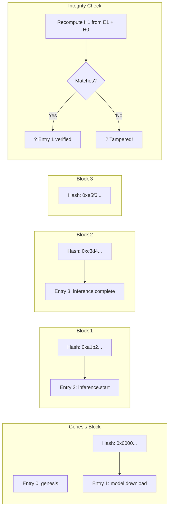
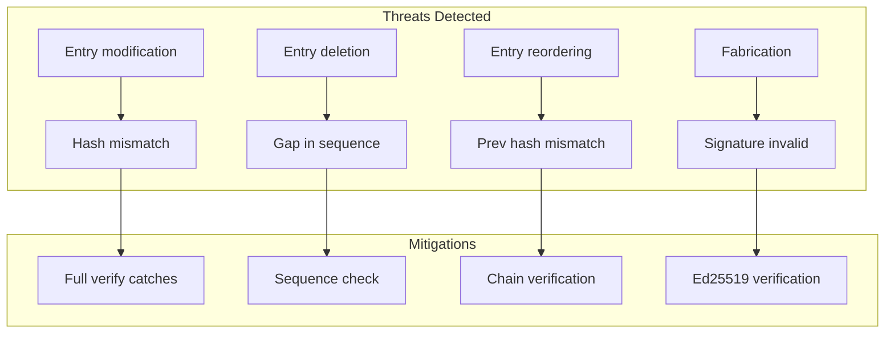

<!-- ASCII Art for Kern-11 -->


¦¦+    ¦¦+¦¦¦¦¦¦¦+¦¦¦¦¦¦+ ¦¦+¦¦¦¦¦¦¦+¦¦+¦¦¦¦¦¦¦+
¦¦¦    ¦¦¦¦¦+----+¦¦+--¦¦+¦¦¦¦¦+----+¦¦¦¦¦+----+
¦¦¦ ¦+ ¦¦¦¦¦¦¦¦+  ¦¦¦¦¦¦++¦¦¦¦¦¦¦¦+  ¦¦¦¦¦¦¦¦+  
¦¦¦¦¦¦+¦¦¦¦¦+--+  ¦¦+--¦¦+¦¦¦¦¦+--+  ¦¦¦¦¦+--+  
+¦¦¦+¦¦¦++¦¦¦¦¦¦¦+¦¦¦  ¦¦¦¦¦¦¦¦¦¦¦¦¦+¦¦¦¦¦¦¦¦¦¦+
 +--++--+ +------++-+  +-++-++------++-++------+

¦¦¦¦¦¦¦¦+¦¦+  ¦¦+¦¦¦¦¦¦¦+    ¦¦¦¦¦¦+  ¦¦¦¦¦+  ¦¦+ ¦¦¦¦¦¦+ ¦¦¦¦¦¦¦+
+--¦¦+--+¦¦¦  ¦¦¦¦¦+----+    ¦¦+--¦¦+¦¦+--¦¦+¦¦¦¦¦+----+ ¦¦+----+
   ¦¦¦   ¦¦¦¦¦¦¦¦¦¦¦¦¦+      ¦¦¦¦¦¦++¦¦¦¦¦¦¦¦¦¦¦¦¦¦  ¦¦¦+¦¦¦¦¦¦¦+
   ¦¦¦   ¦¦+--¦¦¦¦¦+--+      ¦¦+--¦¦+¦¦+--¦¦¦¦¦¦¦¦¦   ¦¦¦+----¦¦¦
   ¦¦¦   ¦¦¦  ¦¦¦¦¦¦¦¦¦¦+    ¦¦¦  ¦¦¦¦¦¦  ¦¦¦¦¦¦+¦¦¦¦¦¦++¦¦¦¦¦¦¦¦
   +-+   +-+  +-++------+    +-+  +-++-+  +-++-+ +-----+ +------+

*Lois-Kleinner and 0-1.gg 2026 - Inte11ect Platform Documentation*
*Confidential - All Rights Reserved*


---

# Verifying the .aioss Ledger

> **Associated Module:** Kern-11 — Audit & Integrity Kernel
> **Tutorial 05 of 12** — Estimated reading time: 16 min | Hands-on time: 15 min

## Overview

The `.aioss` ledger is an append-only, content-addressed, cryptographically verified audit trail that records every action within the Inte11ect platform. Every inference request, module activation, configuration change, and model download is logged with a cryptographic hash that chains entries together.

This tutorial teaches you:

- What the `.aioss` ledger is and why it exists
- How to check ledger integrity
- How to verify individual entries
- How to prove the ledger has not been tampered with
- How to export and audit ledger entries
- How to integrate ledger verification into CI/CD pipelines

---

## Section 1 — What Is the .aioss Ledger?

`.aioss` stands for **Append-Only Immutable Object Storage System**. It is a local-first, Merkle-tree-verified audit log inspired by certificate transparency logs and blockchain hash chains.

### Key Properties

| Property | Description | Implementation |
|----------|-------------|----------------|
| Append-Only | Entries can only be added, never modified or deleted | Write-ahead log + sealed snapshots |
| Content-Addressed | Each entry is identified by its SHA-256 hash | Hash = f(entry content + previous hash) |
| Merkle-Chained | Entries form a hash chain | H_n = SHA256(entry_n \|\| H_{n-1}) |
| Integrity-Verifiable | Anyone can verify the chain | Recompute hashes and compare |
| Transparent | All entries are readable | SQLite database + JSON export |
| Local-First | No internet required | Runs entirely on-device |
| Exportable | Entries can be shared for audit | Signed JSON bundles |

### Hash Chain Structure



Each block's hash includes the previous block's hash, creating an immutable chain. Changing any entry invalidates all subsequent hashes.

---

## Section 2 — Ledger Location and Structure

### Default Path

The ledger database is located at:

```
~/.inte11ect/ledger/aioss.db
```

### Database Schema

```sql
-- The .aioss schema
CREATE TABLE entries (
    id          INTEGER PRIMARY KEY AUTOINCREMENT,
    timestamp   TEXT NOT NULL,           -- ISO 8601 UTC
    action      TEXT NOT NULL,           -- e.g., "inference.start"
    module      TEXT,                    -- module that performed the action
    session_id  TEXT,                    -- session identifier
    payload     TEXT,                    -- JSON payload with action-specific data
    hash        TEXT NOT NULL UNIQUE,    -- SHA-256 of (entry || prev_hash)
    prev_hash   TEXT NOT NULL,           -- hash of previous entry
    signature   TEXT                     -- optional Ed25519 signature
);

CREATE INDEX idx_timestamp ON entries(timestamp);
CREATE INDEX idx_action ON entries(action);
CREATE INDEX idx_module ON entries(module);
CREATE INDEX idx_session ON entries(session_id);

CREATE TABLE meta (
    key   TEXT PRIMARY KEY,
    value TEXT NOT NULL
);

-- Meta entries store:
-- 'genesis_hash': the hash of the first entry
-- 'last_hash':    the hash of the most recent entry
-- 'version':      the ledger format version
-- 'public_key':   the Ed25519 public key for signatures (if enabled)
```

### Entry Payload Examples

```json
// Model download entry
{
  "action": "model.download",
  "module": "god11",
  "session_id": "sess_abc123",
  "payload": {
    "model_id": "Qwen/Qwen2-VL-2B-Instruct",
    "quantization": "fp16",
    "size_bytes": 2147483648,
    "checksum": "a1b2c3d4e5f6..."
  }
}

// Inference entry
{
  "action": "inference.start",
  "module": "qwen2-vl-2b",
  "session_id": "sess_abc123",
  "payload": {
    "prompt_hash": "0x7a8b...",
    "max_tokens": 1024,
    "temperature": 0.7,
    "route": ["data-ingest", "cog-reasoning", "gen-text"]
  }
}

// Module configuration change
{
  "action": "module.config",
  "module": "cog-reasoning",
  "session_id": "sess_abc123",
  "payload": {
    "changes": {
      "temperature": "0.7 -> 0.8",
      "steps_max": "10 -> 15"
    }
  }
}
```

---

## Section 3 — Checking Ledger Integrity

### Basic Integrity Check

```bash
inte11ect ledger status

# Output:
# +----------------------------------------------------+
# ¦  .aioss Ledger Status                             ¦
# ¦----------------------------------------------------¦
# ¦  Path:       ~/.inte11ect/ledger/aioss.db          ¦
# ¦  Version:    2                                     ¦
# ¦  Entries:    12,847                                ¦
# ¦  First:      2026-01-15T10:00:00Z                  ¦
# ¦  Last:       2026-06-19T10:30:00Z                  ¦
# ¦  Last Hash:  0xe5f6a7b8c9d0...                    ¦
# ¦  Integrity:  ? Verified (Merkle root matches)      ¦
# ¦  Signatures: ? All 12,847 entries signed           ¦
# +----------------------------------------------------+
```

### Full Verification

```bash
# Walk the entire chain and verify every hash
inte11ect ledger verify --full

# You will see:
# Verifying entry 1/12847... ?
# Verifying entry 2/12847... ?
# ...
# Verifying entry 12847/12847... ?
# +---------------------------------------------+
# ¦ Full Verification Complete                   ¦
# ¦ Result: INTACT — all 12,847 entries verified ¦
# ¦ Chain hash: a1b2c3d4...                     ¦
# ¦ Duration: 847ms                             ¦
# +---------------------------------------------+
```

### Partial Verification (Fast)

```bash
# Verify only the last N entries
inte11ect ledger verify --last 100

# Verify entries in a time range
inte11ect ledger verify --since 2026-06-01 --until 2026-06-19

# Verify entries by module
inte11ect ledger verify --module qwen2-vl-2b
```

---

## Section 4 — Viewing Ledger Entries

### Tail Recent Entries

```bash
inte11ect ledger tail --lines 5 --json

[
  {
    "id": 12847,
    "timestamp": "2026-06-19T10:30:00Z",
    "action": "inference.complete",
    "module": "qwen2-vl-2b",
    "session_id": "sess_abc123",
    "payload": {
      "tokens_generated": 128,
      "latency_ms": 4892,
      "confidence": 0.94
    },
    "hash": "0xe5f6a7b8c9d0e1f2..."
  },
  ...
]
```

### Query by Action Type

```bash
inte11ect ledger query --action "model.download" --limit 10

# Entry 8472 | 2026-03-15T08:22:00Z | model.download
#   Model: Qwen/Qwen2-VL-2B-Instruct
#   Size: 2.1 GB
#   Hash: 0x7a8b9c0d1e2f...

# Entry 9123 | 2026-04-01T14:00:00Z | model.download
#   Model: Qwen/Qwen2-VL-7B-Instruct
#   Size: 7.0 GB
#   Hash: 0x9c0d1e2f3a4b...
```

### Query by Session

```bash
inte11ect ledger query --session sess_abc123

# Shows all entries for a specific session:
# 1. inference.start    | 2026-06-19T10:29:55Z
# 2. module.route       | 2026-06-19T10:29:55Z
# 3. inference.token    | 2026-06-19T10:30:00Z (×128)
# 4. inference.complete | 2026-06-19T10:30:05Z
# 5. feedback.submit    | 2026-06-19T10:30:10Z
```

### Aggregate Queries

```bash
inte11ect ledger query --aggregate "count by action"

# action               count
# inference.start      4,231
# inference.complete   4,231
# model.download       12
# module.enable        847
# module.disable       23
# config.change        1,284
# feedback.submit      1,892
# ledger.verify        342
```

---

## Section 5 — Proving Integrity to a Third Party

You can export a proof that the ledger has not been tampered with, without sharing the full ledger.

### Inclusion Proof

```bash
# Generate a Merkle proof for a specific entry
inte11ect ledger prove --entry-id 8472 --output proof.json

# proof.json includes:
# {
#   "entry": { ... },
#   "merkle_proof": ["0x...", "0x..."],
#   "root_hash": "0xa1b2c3d4..."
# }

# Verify the proof (on any machine)
inte11ect ledger verify-proof --input proof.json

# Output:
# ? Proof valid. Entry 8472 is included in chain with root a1b2c3d4...
```

### Snapshot Export

```bash
# Export an integrity snapshot (signed checkpoint)
inte11ect ledger snapshot --output ./ledger_snapshot.json

# snapshot.json contains:
# {
#   "version": 2,
#   "entry_count": 12847,
#   "last_hash": "0xe5f6a7b8...",
#   "genesis_hash": "0x00000000...",
#   "timestamp": "2026-06-19T10:30:00Z",
#   "signature": "base64_ed25519_sig..."
# }
```

---

## Section 6 — Audit Export

### Export Full Ledger

```bash
# Export all entries as JSON lines
inte11ect ledger export --format jsonl --output ./audit_export.jsonl

# Export as CSV for spreadsheet analysis
inte11ect ledger export --format csv --output ./audit_export.csv

# Export as Parquet for data analysis
inte11ect ledger export --format parquet --output ./audit_export.parquet
```

### Export Filtered

```bash
# Export only inference entries for a date range
inte11ect ledger export \
  --action "inference.*" \
  --since 2026-06-01 \
  --until 2026-06-19 \
  --format json \
  --output ./inference_logs.json
```

### Export with Proofs

```bash
# Export entries with their Merkle proofs
inte11ect ledger export \
  --action "model.download" \
  --include-proofs \
  --output ./model_downloads_with_proofs.json
```

---

## Section 7 — Ledger Signing

For high-security environments, the ledger can sign each entry with Ed25519:

```toml
[ledger]
enabled = true
signing_enabled = true
key_path = "~/.inte11ect/ledger/signing_key.pem"
public_key_path = "~/.inte11ect/ledger/public_key.pem"
```

```bash
# Generate a signing key
inte11ect ledger init-keys

# This creates:
#   signing_key.pem  — keep secret!
#   public_key.pem   — share for verification

# Verify all signatures
inte11ect ledger verify --signatures
```

---

## Section 8 — Automated Verification in CI/CD

The `inte11ect ledger verify` command can be integrated into CI/CD pipelines:

```yaml
# .github/workflows/audit.yml
name: Ledger Audit

on:
  schedule:
    - cron: '0 6 * * *'  # Daily at 06:00 UTC
  workflow_dispatch:

jobs:
  verify-ledger:
    runs-on: ubuntu-latest
    steps:
      - uses: actions/checkout@v4
      - name: Install Inte11ect CLI
        run: |
          curl -LO https://releases.intelleect.dev/v1.2.3/inte11ect-cli-x86_64-linux.tar.gz
          tar xzf inte11ect-cli-x86_64-linux.tar.gz
          sudo mv inte11ect /usr/local/bin/
      
      - name: Verify ledger integrity
        run: inte11ect ledger verify --full
      
      - name: Check for anomalies
        run: |
          inte11ect ledger query --aggregate "count by action" \
            --since $(date -d yesterday -I) > today.txt
          # Compare with expected baseline
          diff baseline.txt today.txt || echo "Anomaly detected!"
      
      - name: Export logs
        run: inte11ect ledger export --since $(date -d yesterday -I) --output audit.json
      
      - name: Upload audit artifact
        uses: actions/upload-artifact@v4
        with:
          name: daily-audit
          path: audit.json
```

---

## Section 9 — Trust Model

### What the Ledger Guarantees

- **Integrity**: Any modification to past entries is detectable
- **Non-repudiation**: Signed entries cannot be denied by their author
- **Transparency**: All entries are readable by anyone with access
- **Portability**: The ledger file can be copied and verified on any machine

### What the Ledger Does NOT Guarantee

- **Confidentiality**: Entry payloads are not encrypted (use at-rest encryption separately)
- **Availability**: Ledger is local; backups are your responsibility
- **Freshness**: Ledger only records what Inte11ect reports to it

### Threat Model



---

## Section 10 — Troubleshooting

### "Integrity check failed"

```bash
inte11ect ledger verify --verbose

# Find which entry fails:
# Entry 8472: hash mismatch
#   Expected: 0xa1b2c3d4e5f6...
#   Actual:   0x7a8b9c0d1e2f...

# Possible causes:
# 1. Disk corruption — restore from backup
inte11ect ledger restore --backup ~/.inte11ect/ledger/backups/aioss_2026-06-18.db

# 2. Concurrent access — ensure no other process is writing
# 3. Manual tampering — check who has filesystem access
```

### "Ledger database is locked"

```bash
# Check for locked database
inte11ect ledger status
# Error: database is locked

# Find the locking process
lsof ~/.inte11ect/ledger/aioss.db

# Wait or kill the locking process
# Then run integrity check
inte11ect ledger verify --full
```

### "Signature verification failed"

```bash
# Regenerate keys (old signatures become invalid)
inte11ect ledger init-keys --force

# Or update the public key if it changed
inte11ect ledger update-public-key --key-path ./new_public_key.pem
```

---

## Section 11 — Ledger Configuration Reference

```toml
[ledger]
# Core settings
enabled = true
path = "~/.inte11ect/ledger/aioss.db"
version = 2

# Signing
signing_enabled = false
key_path = "~/.inte11ect/ledger/signing_key.pem"
public_key_path = "~/.inte11ect/ledger/public_key.pem"

# Sync (if using remote ledger)
sync_enabled = false
sync_interval_secs = 60
sync_endpoint = "https://ledger.aioss.io/v1/entries"
sync_token = ""

# Retention
auto_prune_days = 0  # 0 = never prune
archive_path = "~/.inte11ect/ledger/archive/"

# Backup
backup_enabled = true
backup_interval_hours = 24
backup_count = 30
backup_path = "~/.inte11ect/ledger/backups/"
```

---

## Section 12 — CLI Reference

| Command | Description |
|---------|-------------|
| `inte11ect ledger status` | Show ledger status and integrity |
| `inte11ect ledger verify` | Verify ledger integrity |
| `inte11ect ledger tail` | View recent entries |
| `inte11ect ledger query` | Query entries |
| `inte11ect ledger export` | Export entries |
| `inte11ect ledger prove` | Generate Merkle inclusion proof |
| `inte11ect ledger verify-proof` | Verify an inclusion proof |
| `inte11ect ledger snapshot` | Export integrity snapshot |
| `inte11ect ledger init-keys` | Generate signing keys |
| `inte11ect ledger restore` | Restore from backup |
| `inte11ect ledger archive` | Archive old entries |

---

## Next Steps

- [06-tutorial.md](./06-tutorial.md) — Mermaid diagramming
- [07-tutorial.md](./07-tutorial.md) — Integrating with other tools
- [07-features.md](../features/07-features.md) — .aioss audit ledger deep dive
- [11-tutorial.md](./11-tutorial.md) — Security best practices

---

*Lois-Kleinner and 0-1.gg 2026 — Confidential*

```
.====================================================================.
!  Made in the UAE, Dubai #DubaiIt #Dubai #Dxb #SovereignAI          !
!  Made in The Emirates #Dubai_it                                    !
!                                                                    !
!  Lois-Kleinner Alpasan - The Anticloud 2026-                       !
!                                                                    !
!  As seen on:                                                       !
!  Harvard Dataverse ! Zenodo/CERN ! Academia.edu ! HuggingFace      !
!  anticloud.telepedia.net ! anticloud.fandom.com                    !
!                                                                    !
!  0-1.gg ! GitHub ! LinkedIn ! DEV ! GH Pages                       !
!  HuggingFace ! Blog ! Bluesky ! Mastodon                           !
!  Internet Archive ! ORCID ! Figshare                               !
!                                                                    !
!  Sovereign AI ! Local-First ! Privacy ! Zero Trust ! No Datacenter !
!  Air-Gapped ! Open Source ! Rust ! Hash Chain ! Single Binary      !
!  Offline LLM ! Crypto Ledger ! P2P ! Federated                     !
'===================================================================='
```

Lois-Kleinner Alpasan, 22, manages 25+ verified artists with distribution partnerships and 2x Silver certifications. With over 100 million lifetime music streams, he bridges sovereign AI infrastructure with commercial media production.

References:
1. Lois-Kleinner Zenodo: https://doi.org/10.5281/zenodo.20781790
2. Lois-Kleinner GitHub: https://github.com/kleinnner/Anticloud/tree/main/04-aioss-format
3. Lois-Kleinner Harvard DV: https://doi.org/10.7910/DVN/3VDF75
4. Lois-Kleinner Internet Arc: https://archive.org/details/aioss-format
5. Lois-Kleinner ORCID: https://orcid.org/0009-0009-2233-6107
6. Lois-Kleinner DEV.to: https://dev.to/kleinner
7. Lois-Kleinner LinkedIn: https://linkedin.com/in/kleinner
8. Lois-Kleinner HuggingFace: https://huggingface.co/Anticloud
9. Lois-Kleinner Tumblr: https://anticloud.tumblr.com
10. Lois-Kleinner Mastodon: https://mastodon.social/@kleinner
11. Lois-Kleinner Bluesky: https://bsky.app/profile/kleinner.bsky.social
12. 0-1.gg: https://0-1.gg
13. Lois-Kleinner Figshare: https://figshare.com/authors/Lois-Kleinner_Alpasan/20849885
14. Lois-Kleinner Academia: https://independent.academia.edu/kleinner
15. Lois-Kleinner Telepedia: https://anticloud.telepedia.net/wiki/Anticloud_by_Lois-Kleinner_Wiki
16. Lois-Kleinner Fandom: https://anticloud.fandom.com
17. AIOSS Offline Verification Kit: https://dataverse.harvard.edu/dataset.xhtml?persistentId=doi:10.7910/DVN/OORKNJ