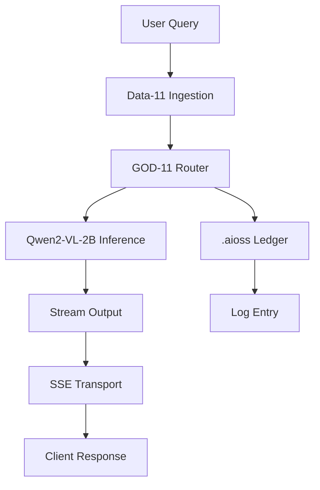
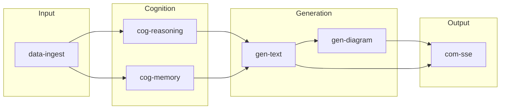
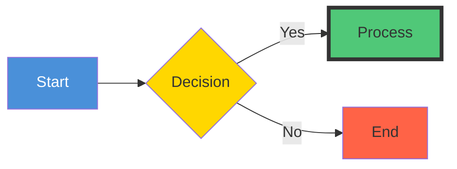

<!-- ASCII Art for Sci-11 -->


███████╗ ██████╗██╗██╗     ██╗ ██████╗ ███████╗
██╔════╝██╔════╝██║██║     ██║██╔═══██╗██╔════╝
███████╗██║     ██║██║     ██║██║   ██║█████╗  
╚════██║██║     ██║██║     ██║██║   ██║██╔══╝  
███████║╚██████╗██║███████╗██║╚██████╔╝███████╗
╚══════╝ ╚═════╝╚═╝╚══════╝╚═╝ ╚═════╝ ╚══════╝

███╗   ███╗███████╗██████╗ ███╗   ███╗ █████╗ ██╗██████╗ ██████╗ 
████╗ ████║██╔════╝██╔══██╗████╗ ████║██╔══██╗██║██╔══██╗██╔══██╗
██╔████╔██║█████╗  ██████╔╝██╔████╔██║███████║██║██║  ██║██████╔╝
██║╚██╔╝██║██╔══╝  ██╔══██╗██║╚██╔╝██║██╔══██║██║██║  ██║██╔══██╗
██║ ╚═╝ ██║███████╗██║  ██║██║ ╚═╝ ██║██║  ██║██║██████╔╝██║  ██║
╚═╝     ╚═╝╚══════╝╚═╝  ╚═╝╚═╝     ╚═╝╚═╝  ╚═╝╚═╝╚═════╝ ╚═╝  ╚═╝

*Lois-Kleinner and 0-1.gg 2026 - Inte11ect Platform Documentation*
*Confidential - All Rights Reserved*


---

# Mermaid Diagramming

> **Associated Module:** Sci-11 — Diagram Synthesis & Visualization Engine
> **Tutorial 06 of 12** — Estimated reading time: 14 min | Hands-on time: 18 min

## Overview

Inte11ect includes a native Mermaid diagram rendering engine that can generate, edit, and export diagrams from natural language descriptions, module pipeline definitions, or raw Mermaid syntax. The engine supports all major Mermaid diagram types and integrates tightly with GOD-11's eigenvector router to visualize routing decisions.

By the end of this tutorial you will know how to:

- Generate diagrams from natural language
- Render, edit, and export Mermaid diagrams
- Visualize module pipelines automatically
- Create custom diagram themes
- Integrate diagrams into inference outputs
- Use the diagram API programmatically

---

## Section 1 — Supported Diagram Types

| Type | Mermaid Keyword | Use Case | Inte11ect Support |
|------|----------------|----------|-------------------|
| Flowchart | `flowchart` | Process flows, architectures | Full |
| Sequence | `sequenceDiagram` | API interactions, request flows | Full |
| Class | `classDiagram` | Object models, type hierarchies | Full |
| State | `stateDiagram-v2` | State machines, lifecycle | Full |
| Entity-Relationship | `erDiagram` | Database schemas | Full |
| Gantt | `gantt` | Project timelines | Full |
| Pie | `pie` | Proportions, distributions | Full |
| Quadrant | `quadrantChart` | Prioritization matrices | Full |
| XY Chart | `xychart-beta` | Bar/line charts | Full |
| Git Graph | `gitGraph` | Git commit history | Full |
| Mindmap | `mindmap` | Brainstorming, taxonomies | Full |
| Timeline | `timeline` | Chronological events | Full |
| Sankey (custom) | `sankey` | Flow volumes | Partial |
| Requirement | `requirementDiagram` | Requirements tracking | Full |

---

## Section 2 — Generating Diagrams from Natural Language

The most powerful feature is converting natural language descriptions into diagrams.

### Via GUI

1. Open **Tools → Mermaid Editor**
2. Describe the diagram in natural language:

> "Create a flowchart showing how a user query flows through data ingestion, GOD-11 routing, Qwen2-VL-2B inference, and response generation via SSE."

3. Click **Generate from Description**
4. Inte11ect produces:



5. Edit the generated Mermaid directly or regenerate with refinements

### Via CLI

```bash
# Generate a diagram from a description
inte11ect diagram generate \
  --description "A sequence diagram showing API authentication flow" \
  --type sequence \
  --output auth_flow.md

# The output file contains:
# ```mermaid
# sequenceDiagram
#     Client->>API: POST /auth
#     API->>Auth: validate credentials
#     Auth-->>API: token
#     API-->>Client: 200 OK
# ```
```

### Via API

```bash
curl -X POST http://localhost:8080/api/v1/diagram/generate \
  -H "Content-Type: application/json" \
  -d '{
    "description": "Flowchart for deploying Inte11ect on Kubernetes",
    "type": "flowchart",
    "theme": "dark"
  }'
```

---

## Section 3 — The Mermaid Editor

The built-in Mermaid editor provides a full editing experience:

```
┌─────────────────────────────────────────────────────────┐
│  Mermaid Editor — [unsaved]                             │
├─────────────────────────────────────────────────────────┤
│  ┌─────────────────┐  ┌──────────────────────────────┐  │
│  │ flowchart TD     │  │  ┌──┐  ┌──┐  ┌──┐         │  │
│  │   A[Start] --> B │  │  │A │→│B │→│C │         │  │
│  │   B --> C        │  │  └──┘  └──┘  └──┘         │  │
│  │   C --> D[End]   │  │         ┌──┐               │  │
│  │                   │  │         │D │               │  │
│  └─────────────────┘  │         └──┘               │  │
│  [Syntax]             │  [Preview]                  │  │
├─────────────────────────────────────────────────────────┤
│  [Generate] [Validate] [Format] [Theme] [Export ▼]     │
└─────────────────────────────────────────────────────────┘
```

### Features

- **Split-pane editor**: Live preview as you type
- **Syntax validation**: Real-time error checking
- **Auto-complete**: Mermaid keyword suggestions
- **Format**: Auto-indent and pretty-print
- **Themes**: Instant theme switching
- **Export**: PNG, SVG, PDF, Markdown embed
- **Version history**: Undo/redo with 100-step history

---

## Section 4 — Rendering Module Pipelines

GOD-11 can automatically generate diagrams of its routing decisions:

```bash
# Generate a diagram of the current GOD-11 routing path
inte11ect god route-diagram --output current_route.md

# Generate a diagram of all possible routes for a query
inte11ect god route-diagram \
  --prompt "Explain quantum computing" \
  --explore \
  --output route_exploration.md
```

### Automatic Pipeline Visualization

When a module pipeline is active, you can visualize it:

```bash
inte11ect module pipeline --diagram --output pipeline.md
```

This generates a Mermaid diagram of the active pipeline:



---

## Section 5 — Exporting Diagrams

### Supported Export Formats

| Format | Quality | Use Case | Command |
|--------|---------|----------|---------|
| PNG | Raster (up to 4K) | Embedding in documents | `--format png` |
| SVG | Vector | Web publishing | `--format svg` |
| PDF | Vector | Print, reports | `--format pdf` |
| Markdown | Text | Documentation | `--format md` |
| HTML | Interactive | Web pages | `--format html` |
| Base64 | Data URI | Embedding in emails | `--format base64` |

### Export Examples

```bash
# Export as PNG at 2x resolution
inte11ect diagram render --input diagram.mmd --output diagram.png --scale 2

# Export as SVG
inte11ect diagram render --input diagram.mmd --output diagram.svg

# Export as PDF with dark theme
inte11ect diagram render --input diagram.mmd --output diagram.pdf --theme dark

# Export as Markdown embed
inte11ect diagram render --input diagram.mmd --output diagram.md --format md

# Batch export multiple diagrams
inte11ect diagram batch --input-dir ./diagrams/ --output-dir ./exports/ --format svg
```

### Quality Settings

```bash
# PNG quality options
inte11ect diagram render input.mmd --output output.png \
  --width 1920 \
  --height 1080 \
  --scale 3 \
  --background transparent \
  --dpi 300
```

---

## Section 6 — Themes and Styling

### Built-in Themes

| Theme | Description | Preview |
|-------|-------------|---------|
| `default` | Light theme with blue accents | Light bg, dark text |
| `dark` | Dark theme | Dark bg, light text |
| `forest` | Green-toned theme | Light bg, green accents |
| `neutral` | Grayscale | Monochrome |
| `inte11ect` | Inte11ect brand theme | Custom brand colors |

```bash
inte11ect diagram render --input diagram.mmd --output diagram.png --theme inte11ect
```

### Custom Themes

```yaml
#~/.inte11ect/themes/corporate.yaml
theme: base
themeVariables:
  primaryColor: "#1a365d"
  primaryTextColor: "#ffffff"
  primaryBorderColor: "#2b6cb0"
  lineColor: "#718096"
  secondaryColor: "#edf2f7"
  tertiaryColor: "#e2e8f0"
  fontSize: "14px"
  fontFamily: "Inter, sans-serif"
```

Apply custom theme:

```bash
inte11ect diagram render \
  --input diagram.mmd \
  --output diagram.png \
  --theme-vars ~/.inte11ect/themes/corporate.yaml
```

### Styling Individual Elements

Mermaid supports inline styling:



---

## Section 7 — Diagram Validation

Before rendering, diagrams are validated:

```bash
inte11ect diagram validate --input diagram.mmd

# Valid diagram:
# ✓ Syntax OK
# ✓ No circular references
# ✓ All nodes referenced
# ✓ Max node count: 47/100

# Invalid diagram:
# ✗ Syntax error at line 12: unexpected token '-->'
# ✗ Circular reference detected: A → B → C → A
```

### Auto-Fix Common Errors

```bash
inte11ect diagram validate --input diagram.mmd --fix

# Fixed:
# - Removed duplicate node definition: "A"
# - Added missing arrow direction
# - Closed unclosed quotes in label
```

---

## Section 8 — Integrating Diagrams into Inference

You can ask Inte11ect to include diagrams in its responses:

```bash
inte11ect infer \
  --prompt "Explain the GOD-11 routing algorithm with a diagram" \
  --include-diagrams

# Output includes:
# GOD-11 uses eigenvector routing to select optimal module paths.
# The process can be visualized as:
#
# ```mermaid
# flowchart TD
#     Q[Query] --> E[Encode]
#     E --> W[Weight Affinity Matrix]
#     W --> P[Power Iteration]
#     P --> S[Select Path]
#     S --> R[Route]
# ```
```

### Configuration

```toml
[diagram]
auto_include = true  # Automatically include diagrams in responses
max_diagrams_per_response = 3
preferred_type = "flowchart"
theme = "inte11ect"
```

---

## Section 9 — Programmatic Use (Rust SDK)

```rust
use inte11ect_sdk::diagram::{DiagramEngine, DiagramOptions, DiagramType};

async fn generate_architecture_diagram() -> Result<()> {
    let engine = DiagramEngine::new();
    
    let options = DiagramOptions {
        diagram_type: DiagramType::Flowchart,
        theme: "dark".to_string(),
        width: Some(1920),
        height: Some(1080),
        scale: 2,
    };
    
    let diagram = engine
        .from_description("Kubernetes deployment architecture for Inte11ect")
        .with_options(options)
        .generate()
        .await?;
    
    // Validate
    diagram.validate()?;
    
    // Export
    diagram.export_png("architecture.png").await?;
    diagram.export_svg("architecture.svg").await?;
    
    // Get Mermaid source
    println!("{}", diagram.source());
    
    Ok(())
}
```

---

## Section 10 — Programmatic Use (TypeScript/Web)

```typescript
import { DiagramClient } from '@inte11ect/diagram-client';

const client = new DiagramClient({
  endpoint: 'http://localhost:8080',
  defaultTheme: 'dark',
});

// Generate from description
const diagram = await client.generate({
  description: 'CI/CD pipeline flowchart',
  type: 'flowchart',
});

// Render
const pngBlob = await diagram.renderPng({ scale: 2 });
const svgString = await diagram.renderSvg();

// Embed in HTML
document.getElementById('diagram-container')!.innerHTML = svgString;

// Validate
const result = await client.validate(diagram.source);
if (result.valid) {
  console.log('Diagram is valid');
} else {
  console.error('Errors:', result.errors);
}
```

---

## Section 11 — Troubleshooting

### "Rendered diagram is cut off"

```bash
# Increase canvas size
inte11ect diagram render --input diagram.mmd --output diagram.png \
  --width 3840 --height 2160

# Or set a wider aspect ratio
inte11ect diagram render --input diagram.mmd --output diagram.png \
  --width 1920 --height 720
```

### "Font rendering issues"

```bash
# Install required fonts
inte11ect diagram fonts install

# Or specify custom fonts in theme
```

### "Syntax highlighting broken in editor"

```bash
# Reset the editor
inte11ect diagram editor reset

# Clear syntax cache
inte11ect diagram cache clear
```

### "Export takes too long"

```bash
# Reduce complexity
inte11ect diagram simplify --input complex.mmd --output simple.mmd

# Or reduce resolution
inte11ect diagram render --input diagram.mmd --output diagram.png --scale 1
```

---

## Section 12 — CLI Reference

| Command | Description |
|---------|-------------|
| `inte11ect diagram generate` | Generate diagram from description |
| `inte11ect diagram render` | Render Mermaid to image/PDF |
| `inte11ect diagram validate` | Validate Mermaid syntax |
| `inte11ect diagram simplify` | Reduce diagram complexity |
| `inte11ect diagram batch` | Batch process diagrams |
| `inte11ect diagram fonts install` | Install diagram fonts |
| `inte11ect diagram cache clear` | Clear render cache |
| `inte11ect diagram editor reset` | Reset editor state |
| `inte11ect diagram themes list` | List available themes |
| `inte11ect god route-diagram` | Visualize GOD-11 routing |

---

## Next Steps

- [07-tutorial.md](./07-tutorial.md) — Integrating with other tools
- [08-tutorial.md](./08-tutorial.md) — Performance tuning
- [09-features.md](../features/09-features.md) — Mermaid diagram rendering deep dive
- [03-tutorial.md](./03-tutorial.md) — Exploring all 72 modules

---

*Lois-Kleinner and 0-1.gg 2026 — Confidential*

```
.====================================================================.
!  Made in the UAE, Dubai #DubaiIt #Dubai #Dxb #SovereignAI          !
!  Made in The Emirates #Dubai_it                                    !
!                                                                    !
!  Lois-Kleinner Alpasan - The Anticloud 2026-                       !
!                                                                    !
!  0-1.gg ! GitHub ! LinkedIn ! DEV ! GH Pages                       !
!  HuggingFace ! Blog ! Tumblr ! Fandom ! Bluesky ! Mastodon          !
!  Zenodo ! Harvard Dataverse ! Internet Archive ! ORCID              !
!                                                                    !
!  Sovereign AI ! Local-First ! Privacy ! Zero Trust ! No Datacenter !
!  Air-Gapped ! Open Source ! Rust ! Hash Chain ! Single Binary      !
!  Offline LLM ! Crypto Ledger ! P2P ! Federated                     !
'===================================================================='
```

Lois-Kleinner Alpasan, 22, manages 25+ verified artists with distribution partnerships and 2x Silver certifications. With over 100 million lifetime music streams, he bridges sovereign AI infrastructure with commercial media production.

References:
1. Lois-Kleinner Zenodo: https://doi.org/10.5281/zenodo.20781790
2. Lois-Kleinner GitHub: https://github.com/kleinnner/Anticloud/tree/main/04-aioss-format
3. Lois-Kleinner Harvard DV: https://doi.org/10.7910/DVN/3VDF75
4. Lois-Kleinner Internet Arc: https://archive.org/details/aioss-format
5. Lois-Kleinner ORCID: https://orcid.org/0009-0009-2233-6107
6. Lois-Kleinner DEV.to: https://dev.to/kleinner
7. Lois-Kleinner LinkedIn: https://linkedin.com/in/kleinner
8. Lois-Kleinner HuggingFace: https://huggingface.co/Anticloud
9. Lois-Kleinner Tumblr: https://anticloud.tumblr.com
10. Lois-Kleinner Mastodon: https://mastodon.social/@kleinner
11. Lois-Kleinner Bluesky: https://bsky.app/profile/kleinner.bsky.social
12. 0-1.gg: https://0-1.gg
