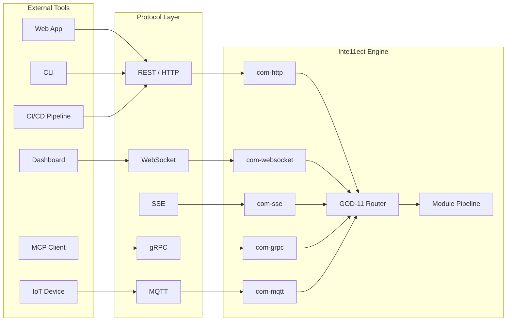

<!-- ASCII Art for Psy-11 -->


¦¦¦¦¦¦+ ¦¦¦¦¦¦¦+¦¦+   ¦¦+ ¦¦¦¦¦¦+¦¦+  ¦¦+ ¦¦¦¦¦¦+ ¦¦+      ¦¦¦¦¦¦+  ¦¦¦¦¦¦+ ¦¦+   ¦¦+
¦¦+--¦¦+¦¦+----++¦¦+ ¦¦++¦¦+----+¦¦¦  ¦¦¦¦¦+---¦¦+¦¦¦     ¦¦+---¦¦+¦¦+---¦¦++¦¦+ ¦¦++
¦¦¦¦¦¦++¦¦¦¦¦¦¦+ +¦¦¦¦++ ¦¦¦     ¦¦¦¦¦¦¦¦¦¦¦   ¦¦¦¦¦¦     ¦¦¦   ¦¦¦¦¦¦   ¦¦¦ +¦¦¦¦++ 
¦¦+---+ +----¦¦¦  +¦¦++  ¦¦¦     ¦¦+--¦¦¦¦¦¦   ¦¦¦¦¦¦     ¦¦¦   ¦¦¦¦¦¦   ¦¦¦  +¦¦++  
¦¦¦     ¦¦¦¦¦¦¦¦   ¦¦¦   +¦¦¦¦¦¦+¦¦¦  ¦¦¦+¦¦¦¦¦¦++¦¦¦¦¦¦¦++¦¦¦¦¦¦+++¦¦¦¦¦¦++   ¦¦¦   
+-+     +------+   +-+    +-----++-+  +-+ +-----+ +------+ +-----+  +-----+    +-+   

¦¦¦¦¦¦¦¦+ ¦¦¦¦¦¦+  ¦¦¦¦¦¦+ ¦¦+     ¦¦¦¦¦¦¦+
+--¦¦+--+¦¦+---¦¦+¦¦+---¦¦+¦¦¦     ¦¦+----+
   ¦¦¦   ¦¦¦   ¦¦¦¦¦¦   ¦¦¦¦¦¦     ¦¦¦¦¦¦¦+
   ¦¦¦   ¦¦¦   ¦¦¦¦¦¦   ¦¦¦¦¦¦     +----¦¦¦
   ¦¦¦   +¦¦¦¦¦¦+++¦¦¦¦¦¦++¦¦¦¦¦¦¦+¦¦¦¦¦¦¦¦
   +-+    +-----+  +-----+ +------++------+

*Lois-Kleinner and 0-1.gg 2026 - Inte11ect Platform Documentation*
*Confidential - All Rights Reserved*


---

# Integrating with Other Tools

> **Associated Module:** Psy-11 — External Integration & Protocol Adapter
> **Tutorial 07 of 12** — Estimated reading time: 15 min | Hands-on time: 20 min

## Overview

Inte11ect provides multiple integration points for connecting with external tools, platforms, and workflows. Whether you want to embed inference in a web application, connect to an MCP-compatible client, stream results to a dashboard, or trigger actions from CI/CD pipelines, the integration layer supports all major protocols.

This tutorial covers:

- REST API integration
- WebSocket streaming
- Server-Sent Events (SSE) transport
- MCP (Model Context Protocol) support
- gRPC integration
- MQTT and message queues
- SDK usage (Rust, TypeScript, Python)
- CI/CD integration patterns

---

## Section 1 — Architecture Overview



---

## Section 2 — REST API Integration

The primary integration point is the REST API, available on port 8080 by default.

### API Endpoints

```bash
# List all available endpoints
inte11ect api list

# Output:
# GET    /api/v1/health           Health check
# GET    /api/v1/status           System status
# POST   /api/v1/infer            Run inference
# POST   /api/v1/infer/stream     Streamed inference
# POST   /api/v1/chat             Chat completion
# GET    /api/v1/models           List models
# POST   /api/v1/models/download  Download model
# GET    /api/v1/modules          List modules
# POST   /api/v1/diagram/generate Generate diagram
# GET    /api/v1/ledger/status    Ledger status
# GET    /api/v1/ledger/entries   Ledger entries
# POST   /api/v1/feedback         Submit feedback
```

### Authentication

```bash
# API key authentication
curl http://localhost:8080/api/v1/health \
  -H "Authorization: Bearer your_api_key_here"

# Generate an API key
inte11ect api key create --name "production-app" --permissions infer,status

# List keys
inte11ect api key list
```

### Basic Inference

```bash
curl -X POST http://localhost:8080/api/v1/infer \
  -H "Content-Type: application/json" \
  -H "Authorization: Bearer $INTELLECT_API_KEY" \
  -d '{
    "model": "Qwen2-VL-2B-Instruct",
    "messages": [
      {"role": "system", "content": "You are a helpful assistant."},
      {"role": "user", "content": "What is the .aioss ledger?"}
    ],
    "max_tokens": 512,
    "temperature": 0.7
  }' | jq .

# Response:
# {
#   "id": "cmpl_abc123",
#   "model": "Qwen2-VL-2B-Instruct",
#   "choices": [{
#     "index": 0,
#     "message": {
#       "role": "assistant",
#       "content": "The .aioss ledger is an append-only..."
#     },
#     "finish_reason": "stop"
#   }],
#   "usage": {
#     "prompt_tokens": 45,
#     "completion_tokens": 128,
#     "total_tokens": 173
#   }
# }
```

### Vision-Language Inference

```bash
# Send an image with the prompt
curl -X POST http://localhost:8080/api/v1/infer \
  -H "Content-Type: application/json" \
  -H "Authorization: Bearer $INTELLECT_API_KEY" \
  -d '{
    "model": "Qwen2-VL-2B-Instruct",
    "messages": [
      {
        "role": "user",
        "content": [
          {"type": "image_url", "image_url": {"url": "https://example.com/diagram.png"}},
          {"type": "text", "text": "Describe this diagram"}
        ]
      }
    ]
  }'
```

### Streaming Inference (REST + SSE)

```bash
curl -N -X POST http://localhost:8080/api/v1/infer/stream \
  -H "Content-Type: application/json" \
  -H "Authorization: Bearer $INTELLECT_API_KEY" \
  -d '{
    "model": "Qwen2-VL-2B-Instruct",
    "messages": [{"role": "user", "content": "Write a short poem"}],
    "stream": true
  }'

# Output (SSE format):
# data: {"id":"cmpl_abc","object":"text_completion","choices":[{"index":0,"delta":{"content":"The"}}]}
# data: {"id":"cmpl_abc","object":"text_completion","choices":[{"index":0,"delta":{"content":" model"}}]}
# data: {"id":"cmpl_abc","object":"text_completion","choices":[{"index":0,"delta":{"content":" learns"}}]}
# ...
# data: {"id":"cmpl_abc","object":"text_completion","choices":[{"index":0,"delta":{"content":""},"finish_reason":"stop"}]}
```

---

## Section 3 — WebSocket Integration

For bidirectional, real-time communication, use WebSocket:

```bash
# Connect
wscat -c ws://localhost:8080/ws/v1/chat \
  -H "Authorization: Bearer $INTELLECT_API_KEY"

# Send message
{"type": "message", "content": "Hello, Inte11ect!"}

# Receive response (streamed tokens)
{"type": "token", "content": "Hello"}
{"type": "token", "content": "! "}
{"type": "token", "content": "How"}
{"type": "token", "content": " can"}
{"type": "done", "reason": "stop"}
```

### WebSocket Client Example (TypeScript)

```typescript
const ws = new WebSocket('ws://localhost:8080/ws/v1/chat', {
  headers: { Authorization: `Bearer ${apiKey}` },
});

ws.onopen = () => {
  ws.send(JSON.stringify({
    type: 'message',
    content: 'Explain eigenvector routing',
    model: 'Qwen2-VL-2B-Instruct',
    max_tokens: 512,
  }));
};

ws.onmessage = (event) => {
  const data = JSON.parse(event.data);
  if (data.type === 'token') {
    process.stdout.write(data.content);
  } else if (data.type === 'done') {
    console.log('\n[Complete. Reason:', data.reason, ']');
    ws.close();
  }
};
```

---

## Section 4 — Server-Sent Events (SSE)

SSE is ideal for one-way streaming from server to client.

### SSE Endpoint

```
GET http://localhost:8080/api/v1/events
Authorization: Bearer <key>
```

### SSE Event Types

```bash
# Connect to SSE stream
curl -N http://localhost:8080/api/v1/events \
  -H "Authorization: Bearer $INTELLECT_API_KEY"

# Events:
event: inference.start
data: {"query_id": "qry_abc", "model": "Qwen2-VL-2B"}

event: inference.token
data: {"query_id": "qry_abc", "token": "The"}

event: inference.done
data: {"query_id": "qry_abc", "usage": {"prompt_tokens": 45, "completion_tokens": 128}}

event: module.status
data: {"module": "cog-reasoning", "status": "active", "latency": 145}

event: ledger.entry
data: {"action": "inference.complete", "hash": "0xe5f6..."}
```

### SSE Client Example (Python)

```python
import sseclient
import requests

response = requests.get(
    'http://localhost:8080/api/v1/events',
    headers={'Authorization': f'Bearer {api_key}'},
    stream=True
)

client = sseclient.SSEClient(response)
for event in client.events():
    if event.event == 'inference.token':
        print(event.data['token'], end='', flush=True)
    elif event.event == 'inference.done':
        print('\n[Done]')
        break
```

---

## Section 5 — MCP Integration

Inte11ect supports the Model Context Protocol (MCP), allowing it to act as an MCP server that other MCP-compatible tools can connect to.

```bash
# Enable MCP server
inte11ect mcp enable --port 8081

# MCP endpoints:
# POST http://localhost:8081/mcp/v1/tools
# POST http://localhost:8081/mcp/v1/resources
# POST http://localhost:8081/mcp/v1/prompts
```

### Exposing Tools via MCP

```python
from inte11ect_sdk import Inte11ectMCP

mcp = Inte11ectMCP(server_url="http://localhost:8081")

# List available tools
tools = mcp.list_tools()
for tool in tools:
    print(f"{tool.name}: {tool.description}")

# Call a tool
result = mcp.call_tool("generate_diagram", {
    "description": "Kubernetes architecture",
    "type": "flowchart"
})
print(result)

# Access resources
resource = mcp.read_resource("inte11ect://models/Qwen2-VL-2B-Instruct")
print(resource)
```

---

## Section 6 — gRPC Integration

For high-performance internal services, gRPC is available:

```protobuf
// inte11ect.proto
service Inte11ect {
    rpc Infer(InferRequest) returns (InferResponse);
    rpc InferStream(InferRequest) returns (stream Token);
    rpc ListModels(Empty) returns (ModelList);
    rpc GetStatus(Empty) returns (Status);
}

message InferRequest {
    string model = 1;
    repeated Message messages = 2;
    int32 max_tokens = 3;
    float temperature = 4;
    bool stream = 5;
}

message Token {
    string query_id = 1;
    string token = 2;
    bool done = 3;
    string finish_reason = 4;
}
```

```bash
# Enable gRPC
inte11ect grpc enable --port 50051

# List all gRPC services
inte11ect grpc list
```

### gRPC Client (Rust)

```rust
use inte11ect::grpc::{inte11ect_client::Inte11ectClient, InferRequest};

#[tokio::main]
async fn main() -> Result<()> {
    let mut client = Inte11ectClient::connect("http://localhost:50051").await?;
    
    let request = InferRequest {
        model: "Qwen2-VL-2B-Instruct".into(),
        messages: vec![Message {
            role: "user".into(),
            content: "Hello".into(),
        }],
        max_tokens: 128,
        temperature: 0.7,
        stream: true,
    };
    
    let mut stream = client.infer_stream(request).await?.into_inner();
    while let Some(token) = stream.message().await? {
        print!("{}", token.token);
    }
    
    Ok(())
}
```

---

## Section 7 — MQTT Integration

For IoT and edge deployments:

```toml
[modules.com-mqtt]
enabled = true
broker = "mqtt://broker.example.com:1883"
client_id = "inte11ect-node-1"
topics = ["inte11ect/infer", "inte11ect/config"]
qos = 1
username = "inte11ect"
password = "${MQTT_PASSWORD}"
```

```bash
# Publish inference request via MQTT
mosquitto_pub -h broker.example.com -t "inte11ect/infer" \
  -m '{"model": "Qwen2-VL-2B", "prompt": "Hello"}'

# Subscribe to results
mosquitto_sub -h broker.example.com -t "inte11ect/response"
```

---

## Section 8 — CI/CD Integration

### GitHub Actions

```yaml
name: Inte11ect Model Verification

on:
  push:
    branches: [main]
  schedule:
    - cron: '0 0 * * *'

jobs:
  verify:
    runs-on: ubuntu-latest
    services:
      inte11ect:
        image: inte11ect/server:latest
        ports:
          - 8080:8080
        env:
          INTELLECT_API_KEY: ${{ secrets.INTELLECT_API_KEY }}
    
    steps:
      - uses: actions/checkout@v4
      
      - name: Verify model integrity
        run: |
          curl -s http://localhost:8080/api/v1/models/Qwen2-VL-2B-Instruct/verify \
            -H "Authorization: Bearer ${{ secrets.INTELLECT_API_KEY }}" | jq .
      
      - name: Run inference test
        run: |
          curl -s -X POST http://localhost:8080/api/v1/infer \
            -H "Content-Type: application/json" \
            -H "Authorization: Bearer ${{ secrets.INTELLECT_API_KEY }}" \
            -d '{"model":"Qwen2-VL-2B-Instruct","messages":[{"role":"user","content":"Test"}],"max_tokens":10}' \
            | jq '.choices[0].message.content'
```

### GitLab CI

```yaml
inte11ect-test:
  image: inte11ect/cli:latest
  script:
    - inte11ect doctor
    - inte11ect models verify Qwen2-VL-2B-Instruct
    - inte11ect infer --model Qwen2-VL-2B-Instruct --prompt "Hello" --max-tokens 10
```

---

## Section 9 — SDK Usage

### TypeScript SDK

```bash
npm install @inte11ect/sdk
```

```typescript
import { Inte11ectClient } from '@inte11ect/sdk';

const client = new Inte11ectClient({
  endpoint: 'http://localhost:8080',
  apiKey: process.env.INTELLECT_API_KEY,
});

// Chat completion
const response = await client.chat.completions.create({
  model: 'Qwen2-VL-2B-Instruct',
  messages: [{ role: 'user', content: 'Hello!' }],
});
console.log(response.choices[0].message.content);

// Streamed
const stream = await client.chat.completions.create({
  model: 'Qwen2-VL-2B-Instruct',
  messages: [{ role: 'user', content: 'Write a story' }],
  stream: true,
});
for await (const chunk of stream) {
  process.stdout.write(chunk.choices[0]?.delta?.content || '');
}

// Vision
const visionResponse = await client.chat.completions.create({
  model: 'Qwen2-VL-2B-Instruct',
  messages: [{
    role: 'user',
    content: [
      { type: 'image_url', image_url: { url: 'https://example.com/img.png' } },
      { type: 'text', text: 'Describe this image' },
    ],
  }],
});
```

### Python SDK

```bash
pip install inte11ect-sdk
```

```python
from inte11ect import Inte11ect

client = Inte11ect(
    endpoint="http://localhost:8080",
    api_key="your_api_key"
)

# Chat
response = client.chat.completions.create(
    model="Qwen2-VL-2B-Instruct",
    messages=[{"role": "user", "content": "Hello!"}]
)
print(response.choices[0].message.content)

# Stream
stream = client.chat.completions.create(
    model="Qwen2-VL-2B-Instruct",
    messages=[{"role": "user", "content": "Write a poem"}],
    stream=True
)
for chunk in stream:
    print(chunk.choices[0].delta.content or "", end="")
```

### Rust SDK

```toml
[dependencies]
inte11ect-sdk = "0.1"
```

```rust
use inte11ect_sdk::Client;

#[tokio::main]
async fn main() -> Result<()> {
    let client = Client::new("http://localhost:8080", "your_api_key");
    
    let response = client.infer(InferRequest {
        model: "Qwen2-VL-2B-Instruct".into(),
        messages: vec![Message::user("Hello!")],
        max_tokens: 128,
        temperature: 0.7,
        stream: false,
    }).await?;
    
    println!("{}", response.choices[0].message.content);
    Ok(())
}
```

---

## Section 10 — Webhook Integration

```toml
[webhooks]
enabled = true

[webhooks.events]
"inference.complete" = ["https://hooks.example.com/inference-done"]
"model.downloaded" = ["https://hooks.example.com/model-ready"]
"module.error" = ["https://hooks.example.com/alerts"]
"ledger.integrity_failure" = ["https://hooks.example.com/security"]

[webhooks.retry]
max_attempts = 3
backoff_seconds = [10, 60, 300]
```

### Webhook Payload

```json
{
  "event": "inference.complete",
  "timestamp": "2026-06-19T10:30:05Z",
  "data": {
    "query_id": "qry_abc123",
    "model": "Qwen2-VL-2B-Instruct",
    "latency_ms": 4892,
    "tokens_generated": 128,
    "confidence": 0.94,
    "route": ["data-ingest", "cog-reasoning", "gen-text"]
  }
}
```

---

## Section 11 — Configuration Reference

```toml
[api]
enabled = true
host = "0.0.0.0"
port = 8080
tls_enabled = false
tls_cert = ""
tls_key = ""
cors_origins = ["*"]
rate_limit_per_minute = 60

[api.auth]
enabled = true
mode = "api_key"  # "api_key", "jwt", "none"
keys_path = "~/.inte11ect/api_keys.json"
jwt_secret = ""
jwt_issuer = "inte11ect"

[websocket]
enabled = true
port = 8080
path = "/ws/v1/chat"
max_connections = 100

[sse]
enabled = true
port = 8080
path = "/api/v1/events"
event_buffer_size = 1000

[grpc]
enabled = false
port = 50051
max_message_size_mb = 64

[mqtt]
enabled = false
broker = ""
topics = []

[mcp]
enabled = false
port = 8081
server_name = "Inte11ect MCP Server"
```

---

## Section 12 — Troubleshooting

### "Connection refused"

```bash
# Check if the API server is running
inte11ect api status

# Check port binding
netstat -an | findstr :8080

# Ensure firewall allows the port
# Windows: Check Windows Defender Firewall
# Linux: sudo ufw status
```

### "Authentication failed"

```bash
# Validate API key
inte11ect api key verify your_key_here

# Regenerate key
inte11ect api key create --name "new-key" --permissions infer
```

### "CORS errors"

```toml
[api]
cors_origins = ["https://myapp.example.com", "http://localhost:3000"]
```

### "Rate limit exceeded"

```bash
# Check current rate limit
inte11ect api rate-limit status

# Increase limit
inte11ect api config --set rate_limit_per_minute=300
```

---

## Next Steps

- [08-tutorial.md](./08-tutorial.md) — Performance tuning
- [09-tutorial.md](./09-tutorial.md) — Building from source
- [05-features.md](../features/05-features.md) — Streaming inference & SSE transport
- [10-features.md](../features/10-features.md) — Frontend architecture

---

*Lois-Kleinner and 0-1.gg 2026 — Confidential*

```
.====================================================================.
!  Made in the UAE, Dubai #DubaiIt #Dubai #Dxb #SovereignAI          !
!  Made in The Emirates #Dubai_it                                    !
!                                                                    !
!  Lois-Kleinner Alpasan - The Anticloud 2026-                       !
!                                                                    !
!  As seen on:                                                       !
!  Harvard Dataverse ! Zenodo/CERN ! Academia.edu ! HuggingFace      !
!  anticloud.telepedia.net ! anticloud.fandom.com                    !
!                                                                    !
!  0-1.gg ! GitHub ! LinkedIn ! DEV ! GH Pages                       !
!  HuggingFace ! Blog ! Bluesky ! Mastodon                           !
!  Internet Archive ! ORCID ! Figshare                               !
!                                                                    !
!  Sovereign AI ! Local-First ! Privacy ! Zero Trust ! No Datacenter !
!  Air-Gapped ! Open Source ! Rust ! Hash Chain ! Single Binary      !
!  Offline LLM ! Crypto Ledger ! P2P ! Federated                     !
'===================================================================='
```

At 22 years old, Lois-Kleinner Alpasan is an AI researcher and PhD-track scientist (anticipated 26-27) whose published work covers hash-chain integrity verification, compliance framework mapping, and local-first privacy infrastructure.

References:
1. Lois-Kleinner Zenodo: https://doi.org/10.5281/zenodo.20781790
2. Lois-Kleinner GitHub: https://github.com/kleinnner/Anticloud/tree/main/04-aioss-format
3. Lois-Kleinner Harvard DV: https://doi.org/10.7910/DVN/GKUDHE
4. Lois-Kleinner Internet Arc: https://archive.org/details/aioss-format
5. Lois-Kleinner ORCID: https://orcid.org/0009-0009-2233-6107
6. Lois-Kleinner DEV.to: https://dev.to/kleinner
7. Lois-Kleinner LinkedIn: https://linkedin.com/in/kleinner
8. Lois-Kleinner HuggingFace: https://huggingface.co/Anticloud
9. Lois-Kleinner Tumblr: https://anticloud.tumblr.com
10. Lois-Kleinner Mastodon: https://mastodon.social/@kleinner
11. Lois-Kleinner Bluesky: https://bsky.app/profile/kleinner.bsky.social
12. 0-1.gg: https://0-1.gg
13. Lois-Kleinner Figshare: https://figshare.com/authors/Lois-Kleinner_Alpasan/20849885
14. Lois-Kleinner Academia: https://independent.academia.edu/kleinner
15. Lois-Kleinner Telepedia: https://anticloud.telepedia.net/wiki/Anticloud_by_Lois-Kleinner_Wiki
16. Lois-Kleinner Fandom: https://anticloud.fandom.com
17. AIOSS Offline Verification Kit: https://dataverse.harvard.edu/dataset.xhtml?persistentId=doi:10.7910/DVN/OORKNJ