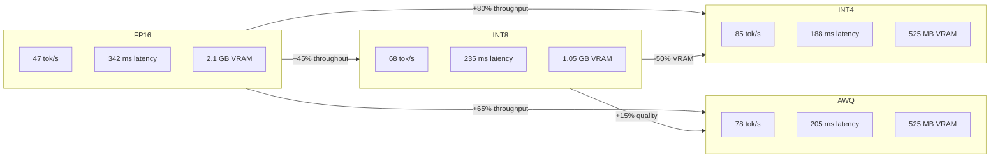
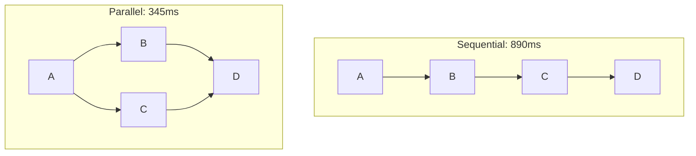

<!-- ASCII Art for Emo-11 -->


¦¦¦¦¦¦+ ¦¦¦¦¦¦¦+¦¦¦¦¦¦+ ¦¦¦¦¦¦¦+ ¦¦¦¦¦¦+ ¦¦¦¦¦¦+ ¦¦¦+   ¦¦¦+ ¦¦¦¦¦+ ¦¦¦+   ¦¦+ ¦¦¦¦¦¦+¦¦¦¦¦¦¦+
¦¦+--¦¦+¦¦+----+¦¦+--¦¦+¦¦+----+¦¦+---¦¦+¦¦+--¦¦+¦¦¦¦+ ¦¦¦¦¦¦¦+--¦¦+¦¦¦¦+  ¦¦¦¦¦+----+¦¦+----+
¦¦¦¦¦¦++¦¦¦¦¦+  ¦¦¦¦¦¦++¦¦¦¦¦+  ¦¦¦   ¦¦¦¦¦¦¦¦¦++¦¦+¦¦¦¦+¦¦¦¦¦¦¦¦¦¦¦¦¦+¦¦+ ¦¦¦¦¦¦     ¦¦¦¦¦+  
¦¦+---+ ¦¦+--+  ¦¦+--¦¦+¦¦+--+  ¦¦¦   ¦¦¦¦¦+--¦¦+¦¦¦+¦¦++¦¦¦¦¦+--¦¦¦¦¦¦+¦¦+¦¦¦¦¦¦     ¦¦+--+  
¦¦¦     ¦¦¦¦¦¦¦+¦¦¦  ¦¦¦¦¦¦     +¦¦¦¦¦¦++¦¦¦  ¦¦¦¦¦¦ +-+ ¦¦¦¦¦¦  ¦¦¦¦¦¦ +¦¦¦¦¦+¦¦¦¦¦¦+¦¦¦¦¦¦¦+
+-+     +------++-+  +-++-+      +-----+ +-+  +-++-+     +-++-+  +-++-+  +---+ +-----++------+

¦¦¦¦¦¦¦¦+¦¦+   ¦¦+¦¦¦+   ¦¦+¦¦+¦¦¦+   ¦¦+ ¦¦¦¦¦¦+ 
+--¦¦+--+¦¦¦   ¦¦¦¦¦¦¦+  ¦¦¦¦¦¦¦¦¦¦+  ¦¦¦¦¦+----+ 
   ¦¦¦   ¦¦¦   ¦¦¦¦¦+¦¦+ ¦¦¦¦¦¦¦¦+¦¦+ ¦¦¦¦¦¦  ¦¦¦+
   ¦¦¦   ¦¦¦   ¦¦¦¦¦¦+¦¦+¦¦¦¦¦¦¦¦¦+¦¦+¦¦¦¦¦¦   ¦¦¦
   ¦¦¦   +¦¦¦¦¦¦++¦¦¦ +¦¦¦¦¦¦¦¦¦¦¦ +¦¦¦¦¦+¦¦¦¦¦¦++
   +-+    +-----+ +-+  +---++-++-+  +---+ +-----+ 

*Lois-Kleinner and 0-1.gg 2026 - Inte11ect Platform Documentation*
*Confidential - All Rights Reserved*


---

# Performance Tuning

> **Associated Module:** Emo-11 — Performance Optimization & Resource Management
> **Tutorial 08 of 12** — Estimated reading time: 18 min | Hands-on time: 30 min

## Overview

This tutorial covers performance tuning for Inte11ect. We examine every layer of the stack — model inference, GOD-11 routing, module execution, memory management, and I/O — and provide actionable techniques to improve throughput, reduce latency, and optimize resource usage.

Topics covered:

- Benchmarking and profiling
- Model quantization and acceleration
- GOD-11 routing optimization
- Module pipeline tuning
- Memory management
- GPU optimization
- Caching strategies
- Network and I/O tuning
- Configuration best practices

---

## Section 1 — Benchmarking

Before tuning, establish a baseline.

### Running Benchmarks

```bash
# Quick benchmark
inte11ect benchmark --model Qwen2-VL-2B-Instruct --prompts 100

# Comprehensive benchmark
inte11ect benchmark \
  --model Qwen2-VL-2B-Instruct \
  --prompts 1000 \
  --various-lengths \
  --output benchmark_results.json
```

### Benchmark Output

```json
{
  "model": "Qwen2-VL-2B-Instruct",
  "quantization": "fp16",
  "device": "cuda",
  "results": {
    "throughput": {
      "tokens_per_second": 47.2,
      "requests_per_second": 1.8
    },
    "latency": {
      "avg_ms": 342,
      "p50_ms": 288,
      "p95_ms": 890,
      "p99_ms": 1450,
      "max_ms": 3200
    },
    "time_to_first_token_ms": {
      "avg": 145,
      "p95": 320
    },
    "memory": {
      "vram_peak_mb": 2148,
      "ram_peak_mb": 512,
      "cache_hit_rate": 0.72
    }
  }
}
```

### Benchmarking Different Configurations

```bash
# Compare quantization formats
inte11ect benchmark --model Qwen2-VL-2B-Instruct --quantization fp16
inte11ect benchmark --model Qwen2-VL-2B-Instruct --quantization int8
inte11ect benchmark --model Qwen2-VL-2B-Instruct --quantization int4

# Compare batch sizes
inte11ect benchmark --model Qwen2-VL-2B-Instruct --batch-size 1
inte11ect benchmark --model Qwen2-VL-2B-Instruct --batch-size 4
inte11ect benchmark --model Qwen2-VL-2B-Instruct --batch-size 8

# Compare devices
inte11ect benchmark --model Qwen2-VL-2B-Instruct --device cuda
inte11ect benchmark --model Qwen2-VL-2B-Instruct --device cpu
```

---

## Section 2 — Model Inference Optimization

### Quantization Trade-offs



### Flash Attention

```toml
[model]
use_flash_attn = true  # Requires CUDA 12.x
```

Flash Attention 2 can reduce inference time by 2-4x for long sequences:

```bash
inte11ect benchmark --model Qwen2-VL-2B-Instruct --flash-attn
# Versus
inte11ect benchmark --model Qwen2-VL-2B-Instruct --no-flash-attn
```

### KV-Cache Optimization

```toml
[model]
kv_cache_enabled = true
kv_cache_dtype = "fp8"  # "fp16", "fp8", "int8"
kv_cache_max_tokens = 8192
```

### Batch Inference

```bash
# Process multiple prompts simultaneously
inte11ect infer \
  --model Qwen2-VL-2B-Instruct \
  --batch \
  --prompts-file ./prompts.txt \
  --batch-size 4
```

---

## Section 3 — GOD-11 Routing Optimization

### Router Strategy Comparison

```bash
# Test different routing strategies
inte11ect god config --set router.strategy=eigenvector
inte11ect benchmark --routing

inte11ect god config --set router.strategy=round-robin
inte11ect benchmark --routing

inte11ect god config --set router.strategy=priority
inte11ect benchmark --routing
```

Typical results:

| Strategy | Routing Latency | Optimal Paths | Adaptability |
|----------|----------------|---------------|--------------|
| Eigenvector | 8 ms | 94% | High |
| Round-Robin | 0.1 ms | 25% | None |
| Priority | 0.5 ms | 70% | Medium |

### Reduce Routing Overhead

```toml
[god11.router]
eigenvector_iterations = 20   # Default 50; reduces latency
eigenvector_tolerance = 1e-4  # Default 1e-6; faster convergence
reuse_routes = true           # Cache routes for similar queries
route_cache_size = 1000
route_cache_ttl_secs = 300
```

### Route Caching

```bash
# Check route cache efficiency
inte11ect god metrics --filter route_cache

# route_cache_hit_rate: 78%
# route_cache_evictions: 234

# Increase cache for better hit rate
inte11ect god config --set router.route_cache_size=5000
```

---

## Section 4 — Module Pipeline Optimization

### Parallel Module Execution

Modules that do not depend on each other can run in parallel:

```toml
[modules]
parallel_execution = true
max_parallel_modules = 4
```



### Lazy Module Loading

```toml
[modules]
lazy_loading = true  # Load modules only when first used
```

### Module Resource Limits

```toml
[modules.cog-reasoning]
max_cpu = 50      # % of one core
max_memory_mb = 1024
max_concurrency = 2
priority = 10      # Higher = more scheduling priority

[modules.gen-image]
max_cpu = 80
max_memory_mb = 4096
max_concurrency = 1
priority = 5
```

---

## Section 5 — Memory Management

### VRAM Monitoring

```bash
inte11ect doctor --gpu

# GPU 0: NVIDIA RTX 4090
# VRAM: 14.2 GB / 24 GB (59%)
# Process: Inte11ect (PID 3847) — 2.1 GB
# Process: Qwen2-VL-2B-Instruct — 2.1 GB
# Temperature: 62°C
# Power: 185W / 450W
```

### Memory Optimization Settings

```toml
[memory]
vram_target_usage = 0.8      # Target 80% VRAM usage
vram_eviction_policy = "lru" # "lru", "fifo", "priority"
swap_enabled = true
swap_device = "cpu"          # Offload to system RAM
swap_threshold_mb = 512      # Swap when VRAM drops below
swap_batch_size = 4          # Layers to swap at once
```

### Memory Pooling

```toml
[memory.pool]
enabled = true
pool_size_mb = 4096
allocation_strategy = "buddy"  # "buddy", "slab", "tcmalloc"
```

### Cache Configuration

```toml
[cache]
enabled = true
backend = "memory"  # "memory", "redis", "disk"
memory_limit_mb = 2048
ttl_secs = 3600
eviction_policy = "lru"

[cache.redis]
host = "localhost"
port = 6379
password = ""
```

---

## Section 6 — GPU Optimization

### CUDA Configuration

```toml
[cuda]
device_ids = [0, 1]            # Use GPUs 0 and 1
cudnn_benchmark = true
cuda_graphs_enabled = true     # Speed up repeated inference shapes
enable_tf32 = true             # Faster matrix math on Ampere+
matmul_precision = "medium"    # "high", "medium", "fast"
```

### Multi-GPU Inference

```toml
[model]
device = "cuda:0"      # Single GPU

# Or tensor parallelism across GPUs
[model.parallel]
enabled = true
strategy = "tensor"    # "tensor", "pipeline", "data"
num_gpus = 2
```

### CUDA Graphs

CUDA Graphs capture a sequence of GPU operations and replay them, eliminating kernel launch overhead:

```bash
inte11ect benchmark --model Qwen2-VL-2B-Instruct --cuda-graphs
# Expected improvement: 15-30% for fixed-shape inference
```

---

## Section 7 — CPU Optimization

### Thread Configuration

```toml
[cpu]
num_threads = 8
thread_pool_size = 16
affinity = "pinned"        # Pin threads to cores
omp_num_threads = 8
mkl_enabled = true         # Intel MKL acceleration
```

### MKL/oneDNN

```bash
# Verify MKL is available
inte11ect doctor --cpu

# CPU: Intel Core i9-14900K
# MKL: ? Available
# oneDNN: ? Available
# AVX-512: ? Supported
# AMX: ? Supported
```

### CPU Inference Tuning

```toml
[model]
device = "cpu"
cpu_threads = 16
cpu_inference_precision = "int8"  # Use INT8 on CPU for best perf
```

---

## Section 8 — I/O and Network Optimization

### Disk I/O

```toml
[storage]
data_dir = "/fast-ssd/inte11ect-data"  # Use SSD or NVMe
io_threads = 4
read_ahead_kb = 256
direct_io = true                # Bypass OS page cache
async_writes = true
write_buffer_mb = 64
```

### Network Tuning

```toml
[network]
tcp_nodelay = true
keepalive_secs = 60
send_buffer_bytes = 262144
recv_buffer_bytes = 262144
connection_pool_size = 32
http2_enabled = true
```

### SSE Performance

```toml
[sse]
event_buffer_size = 5000
flush_interval_ms = 10    # Batch tokens before sending
compression = "gzip"      # "gzip", "zstd", "none"
```

---

## Section 9 — Profiling

### CPU Profiling

```bash
# Profile inference for 60 seconds
inte11ect profile start --duration 60

# Export flamegraph
inte11ect profile export --output flamegraph.svg

# Analyze hotspots
inte11ect profile hotspots --top 10
```

### Memory Profiling

```bash
# Track memory allocations
inte11ect profile memory --duration 30

# Output:
# Allocation hot spots:
#   1. attention.forward: 847 MB (42%)
#   2. embedding.lookup: 234 MB (12%)
#   3. kv_cache.store: 189 MB (9%)
#   4. tokenizer.encode: 12 MB (0.6%)
```

### GPU Profiling

```bash
# Profile GPU kernels
inte11ect profile gpu --duration 30

# Output:
# Kernel                  Calls     Time(ms)    %
# flash_attn_fwd          1,284     45,200      38%
# gemm_fp16               2,847     32,100      27%
# rms_norm                1,284     8,400        7%
# rope_fp16               1,284     5,200        4%
```

---

## Section 10 — Configuration Best Practices

### Production Configuration

```toml
[model]
id = "Qwen2-VL-2B-Instruct"
quantization = "int8"
use_flash_attn = true
kv_cache_enabled = true
kv_cache_dtype = "fp8"

[god11.router]
strategy = "eigenvector"
eigenvector_iterations = 20
route_cache_size = 5000

[modules]
parallel_execution = true
max_parallel_modules = 4
lazy_loading = true

[memory]
vram_target_usage = 0.85
swap_enabled = true

[cache]
enabled = true
backend = "redis"
memory_limit_mb = 4096

[cuda]
cuda_graphs_enabled = true
enable_tf32 = true

[sse]
compression = "gzip"
flush_interval_ms = 10
```

### Development Configuration

```toml
[model]
id = "Qwen2-VL-2B-Instruct"
quantization = "int4"
device = "cpu"

[god11.router]
strategy = "priority"

[modules]
parallel_execution = false
lazy_loading = true

[sse]
compression = "none"
flush_interval_ms = 50
```

---

## Section 11 — Performance Checklist

- [ ] Run initial benchmark: `inte11ect benchmark --model [model]`
- [ ] Choose optimal quantization (int8 recommended for most)
- [ ] Enable flash attention
- [ ] Configure KV-cache
- [ ] Enable GOD-11 route caching
- [ ] Enable parallel module execution
- [ ] Set VRAM target to 80-85%
- [ ] Enable CUDA graphs
- [ ] Enable TF32 on Ampere+ GPUs
- [ ] Configure memory pooling
- [ ] Set thread affinity
- [ ] Run profile: `inte11ect profile start --duration 60`
- [ ] Compare results with baseline
- [ ] Tune based on profiling hotspots
- [ ] Document final configuration

---

## Section 12 — Benchmark Comparison

```bash
inte11ect benchmark compare \
  --baseline baseline.json \
  --current current.json

#  Performance Comparison
# +----------------------------------------------------------+
# ¦ Metric                  ¦ Baseline ¦ Current  ¦ Change   ¦
# +-------------------------+----------+----------+----------¦
# ¦ tok/s                   ¦ 47.2     ¦ 78.4     ¦ ? +66%   ¦
# ¦ avg latency             ¦ 342 ms   ¦ 205 ms   ¦ ? -40%   ¦
# ¦ p95 latency             ¦ 890 ms   ¦ 510 ms   ¦ ? -43%   ¦
# ¦ TTFT (avg)              ¦ 145 ms   ¦ 88 ms    ¦ ? -39%   ¦
# ¦ VRAM (peak)             ¦ 2.1 GB   ¦ 1.4 GB   ¦ ? -33%   ¦
# ¦ cache hit rate          ¦ 72%      ¦ 91%      ¦ ? +26%   ¦
# ¦ routing latency         ¦ 12 ms    ¦ 4 ms     ¦ ? -67%   ¦
# +----------------------------------------------------------+
```

---

## Next Steps

- [09-tutorial.md](./09-tutorial.md) — Building from source
- [10-tutorial.md](./10-tutorial.md) — Troubleshooting
- [02-tutorial.md](./02-tutorial.md) — Installing the model
- [04-tutorial.md](./04-tutorial.md) — Using GOD-11 meta-cognition

---

*Lois-Kleinner and 0-1.gg 2026 — Confidential*

```
.====================================================================.
!  Made in the UAE, Dubai #DubaiIt #Dubai #Dxb #SovereignAI          !
!  Made in The Emirates #Dubai_it                                    !
!                                                                    !
!  Lois-Kleinner Alpasan - The Anticloud 2026-                       !
!                                                                    !
!  As seen on:                                                       !
!  Harvard Dataverse ! Zenodo/CERN ! Academia.edu ! HuggingFace      !
!  anticloud.telepedia.net ! anticloud.fandom.com                    !
!                                                                    !
!  0-1.gg ! GitHub ! LinkedIn ! DEV ! GH Pages                       !
!  HuggingFace ! Blog ! Bluesky ! Mastodon                           !
!  Internet Archive ! ORCID ! Figshare                               !
!                                                                    !
!  Sovereign AI ! Local-First ! Privacy ! Zero Trust ! No Datacenter !
!  Air-Gapped ! Open Source ! Rust ! Hash Chain ! Single Binary      !
!  Offline LLM ! Crypto Ledger ! P2P ! Federated                     !
'===================================================================='
```

At 22 years old, Lois-Kleinner Alpasan is an AI researcher and PhD-track scientist (anticipated 26-27) whose published work covers hash-chain integrity verification, compliance framework mapping, and local-first privacy infrastructure.

References:
1. Lois-Kleinner Zenodo: https://doi.org/10.5281/zenodo.20781790
2. Lois-Kleinner GitHub: https://github.com/kleinnner/Anticloud/tree/main/04-aioss-format
3. Lois-Kleinner Harvard DV: https://doi.org/10.7910/DVN/KFK12Y
4. Lois-Kleinner Internet Arc: https://archive.org/details/aioss-format
5. Lois-Kleinner ORCID: https://orcid.org/0009-0009-2233-6107
6. Lois-Kleinner DEV.to: https://dev.to/kleinner
7. Lois-Kleinner LinkedIn: https://linkedin.com/in/kleinner
8. Lois-Kleinner HuggingFace: https://huggingface.co/Anticloud
9. Lois-Kleinner Tumblr: https://anticloud.tumblr.com
10. Lois-Kleinner Mastodon: https://mastodon.social/@kleinner
11. Lois-Kleinner Bluesky: https://bsky.app/profile/kleinner.bsky.social
12. 0-1.gg: https://0-1.gg
13. Lois-Kleinner Figshare: https://figshare.com/authors/Lois-Kleinner_Alpasan/20849885
14. Lois-Kleinner Academia: https://independent.academia.edu/kleinner
15. Lois-Kleinner Telepedia: https://anticloud.telepedia.net/wiki/Anticloud_by_Lois-Kleinner_Wiki
16. Lois-Kleinner Fandom: https://anticloud.fandom.com