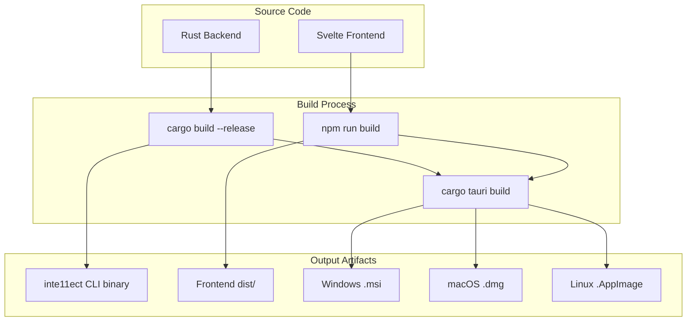

<!-- ASCII Art for Phil-11 -->


██████╗ ██╗   ██╗██╗██╗     ██████╗ ██╗███╗   ██╗ ██████╗ 
██╔══██╗██║   ██║██║██║     ██╔══██╗██║████╗  ██║██╔════╝ 
██████╔╝██║   ██║██║██║     ██████╔╝██║██╔██╗ ██║██║  ███╗
██╔══██╗██║   ██║██║██║     ██╔══██╗██║██║╚██╗██║██║   ██║
██████╔╝╚██████╔╝██║███████╗██████╔╝██║██║ ╚████║╚██████╔╝
╚═════╝  ╚═════╝ ╚═╝╚══════╝╚═════╝ ╚═╝╚═╝  ╚═══╝ ╚═════╝ 

███████╗██████╗  ██████╗ ███╗   ███╗    ███████╗ ██████╗ ██╗   ██╗██████╗  ██████╗███████╗
██╔════╝██╔══██╗██╔═══██╗████╗ ████║    ██╔════╝██╔═══██╗██║   ██║██╔══██╗██╔════╝██╔════╝
█████╗  ██████╔╝██║   ██║██╔████╔██║    ███████╗██║   ██║██║   ██║██████╔╝██║     █████╗  
██╔══╝  ██╔══██╗██║   ██║██║╚██╔╝██║    ╚════██║██║   ██║██║   ██║██╔══██╗██║     ██╔══╝  
██║     ██║  ██║╚██████╔╝██║ ╚═╝ ██║    ███████║╚██████╔╝╚██████╔╝██║  ██║╚██████╗███████╗
╚═╝     ╚═╝  ╚═╝ ╚═════╝ ╚═╝     ╚═╝    ╚══════╝ ╚═════╝  ╚═════╝ ╚═╝  ╚═╝ ╚═════╝╚══════╝

*Lois-Kleinner and 0-1.gg 2026 - Inte11ect Platform Documentation*
*Confidential - All Rights Reserved*


---

# Building from Source

> **Associated Module:** Phil-11 — Build & Compilation Pipeline
> **Tutorial 09 of 12** — Estimated reading time: 20 min | Hands-on time: 30-60 min

## Overview

This tutorial covers building Inte11ect from source code. Building from source gives you full control over compiler optimizations, custom patches, and debugging symbols. It is recommended for contributors, security researchers, and advanced users who need to customize the platform.

Prerequisites:

- Rust toolchain (rustc 1.75+)
- Node.js 18+ (for frontend)
- Cargo and npm
- Git
- Platform-specific build tools

---

## Section 1 — Repository Structure

```bash
# Clone the repository
git clone https://github.com/inte11ect/inte11ect.git
cd inte11ect
```

### Directory Layout

```
inte11ect/
├── Cargo.toml              # Workspace root
├── Cargo.lock
├── package.json            # Frontend dependencies
├── src/
│   ├── main.rs             # Tauri entry point
│   ├── core/               # Core runtime
│   │   ├── god11.rs        # GOD-11 meta-cognition
│   │   ├── router.rs       # Eigenvector router
│   │   └── module.rs       # Module system
│   ├── modules/            # Module implementations
│   │   ├── cog/            # Cognition modules
│   │   ├── data/           # Data modules
│   │   ├── gen/            # Generation modules
│   │   ├── ana/            # Analysis modules
│   │   ├── com/            # Communication modules
│   │   └── sys/            # System modules
│   ├── model/              # Model inference engine
│   │   ├── qwen2_vl.rs     # Qwen2-VL implementation
│   │   ├── quantize.rs     # Quantization routines
│   │   └── pipeline.rs     # Inference pipeline
│   ├── ledger/             # .aioss ledger
│   │   ├── chain.rs        # Hash chain
│   │   ├── storage.rs      # SQLite storage
│   │   └── verify.rs       # Integrity verification
│   ├── diagram/            # Mermaid rendering
│   │   ├── engine.rs       # Render engine
│   │   └── themes.rs       # Theming
│   ├── api/                # REST/SSE/WS API
│   │   ├── routes.rs
│   │   ├── auth.rs
│   │   └── streaming.rs
│   └── tauri/              # Tauri desktop shell
├── frontend/               # Svelte/TypeScript frontend
│   ├── src/
│   ├── package.json
│   └── vite.config.ts
├── scripts/                # Build scripts
├── docs/                   # Documentation
└── tests/                  # Integration tests
```

---

## Section 2 — Setting Up the Build Environment

### Windows

```powershell
# Install Rust
winget install Rustlang.Rustup
rustup default stable

# Install Visual Studio Build Tools
# Download from: https://visualstudio.microsoft.com/visual-cpp-build-tools/
# Required: "Desktop development with C++" workload

# Install Node.js
winget install OpenJS.NodeJS.LTS

# Install Tauri prerequisites
cargo install tauri-cli --version "^2"

# Verify
rustc --version
cargo --version
node --version
npm --version
cargo tauri --version
```

### macOS

```bash
# Install Rust
curl --proto '=https' --tlsv1.2 -sSf https://sh.rustup.rs | sh
rustup default stable

# Install Xcode Command Line Tools
xcode-select --install

# Install Node.js
brew install node

# Install Tauri CLI
cargo install tauri-cli --version "^2"
```

### Linux (Ubuntu/Debian)

```bash
# Install Rust
curl --proto '=https' --tlsv1.2 -sSf https://sh.rustup.rs | sh
rustup default stable

# System dependencies
sudo apt-get update
sudo apt-get install -y \
  build-essential \
  pkg-config \
  libssl-dev \
  libwebkit2gtk-4.1-dev \
  libgtk-3-dev \
  libayatana-appindicator3-dev \
  librsvg2-dev \
  libsqlite3-dev \
  libclang-dev \
  libsndfile1-dev

# Install Node.js
curl -fsSL https://deb.nodesource.com/setup_22.x | sudo -E bash -
sudo apt-get install -y nodejs

# Install Tauri CLI
cargo install tauri-cli --version "^2"
```

### Linux (Fedora)

```bash
sudo dnf install -y \
  gcc gcc-c++ \
  pkg-config \
  openssl-devel \
  webkit2gtk4.1-devel \
  gtk3-devel \
  libappindicator-gtk3-devel \
  librsvg2-devel \
  sqlite-devel \
  clang-devel \
  libsndfile-devel
  
# Then same Rust/Node.js steps as above
```

---

## Section 3 — Build Configuration

### Release Profile

```toml
# Cargo.toml
[profile.release]
opt-level = 3
lto = "fat"
codegen-units = 1
strip = "symbols"
debug = false
panic = "abort"

[profile.release.package.inte11ect-core]
opt-level = 3
lto = "fat"
codegen-units = 1
```

### Feature Flags

```bash
# List available features
cargo metadata --format-version 1 | jq '.packages[] | select(.name == "inte11ect") | .features'

# Build with specific features
cargo build --release \
  --features "cuda,flash-attn,sse,websocket,mermaid"

# Available features:
# - cuda: CUDA GPU support
# - flash-attn: Flash Attention 2
# - mkl: Intel MKL acceleration
# - sse: SSE transport
# - websocket: WebSocket transport
# - grpc: gRPC transport
# - mermaid: Mermaid rendering
# - ledger: .aioss ledger
# - telemetry: OpenTelemetry export
# - plugins: Plugin system
```

### CUDA Feature

```bash
# Ensure CUDA toolkit is installed
nvcc --version

# Set CUDA architecture for your GPU
export CUDA_ARCH=sm_89  # RTX 4090

# Build with CUDA
cargo build --release --features "cuda"
```

---

## Section 4 — Building

### Development Build

```bash
# Build the full application (Rust backend + frontend)
cargo tauri dev

# This:
# 1. Builds the Rust backend
# 2. Bundles the Svelte frontend
# 3. Launches the Tauri development window
```

### Release Build

```bash
# Build for production
cargo tauri build

# Output artifacts:
# Windows: target/release/bundle/msi/Inte11ect_1.2.3_x64.msi
# macOS:   target/release/bundle/dmg/Inte11ect_1.2.3_x64.dmg
# Linux:   target/release/bundle/appimage/Inte11ect_1.2.3_amd64.AppImage
```

### Backend-Only Build

```bash
# Build only the CLI/server (no GUI)
cargo build --release --bin inte11ect

# Binary located at: target/release/inte11ect.exe (or ./inte11ect)
```

### Frontend-Only Build

```bash
cd frontend
npm install
npm run build
# Output in frontend/dist/
```

---

## Section 5 — Frontend Build Details

### Technology Stack

| Layer | Technology | Purpose |
|-------|------------|---------|
| Framework | Svelte 5 | Reactive UI |
| Language | TypeScript 5 | Type safety |
| Build Tool | Vite 6 | Fast bundling |
| CSS | Tailwind CSS 4 | Utility-first styling |
| State | Svelte Stores + TanStack Query | State management |
| Diagrams | Mermaid.js | Client-side rendering |
| Charts | Chart.js | Data visualization |
| Editor | CodeMirror 6 | Code/Mermaid editing |

### Frontend Build Commands

```bash
cd frontend

# Install dependencies
npm install

# Development server (hot reload)
npm run dev

# Production build
npm run build

# TypeScript type checking
npm run typecheck

# Lint
npm run lint

# Format
npm run format
```

### Frontend Configuration

```typescript
// frontend/vite.config.ts
import { defineConfig } from 'vite';
import { svelte } from '@sveltejs/vite-plugin-svelte';

export default defineConfig({
  plugins: [svelte()],
  build: {
    target: 'esnext',
    minify: 'terser',
    rollupOptions: {
      output: {
        manualChunks: {
          vendor: ['svelte', 'mermaid', 'codemirror'],
        },
      },
    },
  },
  server: {
    port: 3000,
    proxy: {
      '/api': 'http://localhost:8080',
    },
  },
});
```

---

## Section 6 — Cross-Compilation

### Cross-Compile for ARM

```bash
# Install cross-compilation targets
rustup target add aarch64-unknown-linux-gnu

# Install ARM toolchain
sudo apt-get install gcc-aarch64-linux-gnu

# Build
CARGO_TARGET_AARCH64_UNKNOWN_LINUX_GNU_LINKER=aarch64-linux-gnu-gcc \
  cargo build --release --target aarch64-unknown-linux-gnu

# Cross-compile with CUDA (for Jetson)
cargo build --release \
  --target aarch64-unknown-linux-gnu \
  --features "cuda"
```

### Cross-Compile for macOS ARM from x86

```bash
# Install target
rustup target add aarch64-apple-darwin

# Build
cargo build --release --target aarch64-apple-darwin
```

---

## Section 7 — Testing

### Running Tests

```bash
# Run all tests
cargo test --workspace

# Run specific module tests
cargo test -p inte11ect-core --test cog_reasoning

# Run integration tests
cargo test --test integration

# Run with all features
cargo test --workspace --all-features
```

### Frontend Tests

```bash
cd frontend

# Unit tests (Vitest)
npm run test

# E2E tests (Playwright)
npm run test:e2e
```

### Benchmark Tests

```bash
# Run benchmarks
cargo bench

# Specific benchmark
cargo bench --bench router -- "eigenvector"
```

---

## Section 8 — Adding a New Module

```bash
# Use the module scaffolding tool
cargo run --bin inte11ect module scaffold --name cog-my-module --domain cog
```

This generates:

```rust
// src/modules/cog/my_module.rs
use inte11ect_sdk::{module, Module, ModuleContext, ModuleInput, ModuleOutput};

#[module(
    id = "cog-my-module",
    name = "My Custom Module",
    version = "0.1.0",
    domain = "cognition",
    dependencies = ["data-ingest"]
)]
pub struct MyModule;

#[async_trait]
impl Module for MyModule {
    async fn init(&self, ctx: ModuleContext) -> ModuleResult<()> {
        ctx.log().info("Initializing cog-my-module");
        Ok(())
    }

    async fn handle(&self, ctx: ModuleContext, input: ModuleInput) -> ModuleResult<ModuleOutput> {
        let text = input.text().await?;
        let result = process_text(&text).await?;
        Ok(ModuleOutput::text(result))
    }
}

async fn process_text(text: &str) -> Result<String, ModuleError> {
    // Your custom logic here
    Ok(text.to_uppercase())
}
```

Register in the module registry:

```rust
// src/modules/mod.rs
mod cog;
pub use cog::my_module::MyModule;

pub fn all_modules() -> Vec<Box<dyn Module>> {
    vec![
        Box::new(MyModule),
        // ... existing modules
    ]
}
```

---

## Section 9 — Debugging

### Rust Debug Build

```bash
cargo build
# Debug binary: target/debug/inte11ect.exe
```

### Logging

```bash
# Enable debug logging
INTELLECT_LOG_LEVEL=debug cargo run

# Trace-level logging
INTELLECT_LOG_LEVEL=trace cargo run

# Module-specific logging
INTELLECT_LOG_LEVEL=info,cog_reasoning=debug cargo run
```

### GDB/LLDB

```bash
# Build with debug symbols
cargo build

# Run with debugger
rust-gdb target/debug/inte11ect.exe
# Or on macOS:
rust-lldb target/debug/inte11ect
```

### VS Code Debugging

```json
// .vscode/launch.json
{
  "version": "0.2.0",
  "configurations": [
    {
      "type": "lldb",
      "request": "launch",
      "name": "Debug Inte11ect",
      "cargo": {
        "args": ["build", "--bin", "inte11ect"],
        "filter": {
          "kind": "bin"
        }
      },
      "args": [],
      "cwd": "${workspaceFolder}"
    },
    {
      "type": "chrome",
      "request": "launch",
      "name": "Debug Frontend",
      "url": "http://localhost:3000",
      "webRoot": "${workspaceFolder}/frontend/src"
    }
  ]
}
```

---

## Section 10 — Continuous Integration

```yaml
# .github/workflows/build.yml
name: Build

on:
  push:
    branches: [main, develop]
  pull_request:
    branches: [main]

jobs:
  build-backend:
    runs-on: ubuntu-latest
    steps:
      - uses: actions/checkout@v4
      - uses: actions-rust-lang/setup-rust-toolchain@v1
      - run: cargo build --release
      - run: cargo test --workspace
  
  build-frontend:
    runs-on: ubuntu-latest
    steps:
      - uses: actions/checkout@v4
      - uses: actions/setup-node@v4
        with:
          node-version: 22
      - run: npm ci
        working-directory: frontend
      - run: npm run build
        working-directory: frontend
      - run: npm run test
        working-directory: frontend
  
  lint:
    runs-on: ubuntu-latest
    steps:
      - uses: actions/checkout@v4
      - uses: actions-rust-lang/setup-rust-toolchain@v1
        with:
          components: clippy, rustfmt
      - run: cargo clippy -- -D warnings
      - run: cargo fmt --check
      - uses: actions/setup-node@v4
        with:
          node-version: 22
      - run: npm ci
        working-directory: frontend
      - run: npm run lint
        working-directory: frontend
```

---

## Section 11 — Troubleshooting Build Issues

### "Linker error: unresolved symbol"

```bash
# Check for missing system libraries
pkg-config --libs webkit2gtk-4.1

# On Windows, ensure Visual Studio C++ tools are installed
# Run from "Developer Command Prompt for VS 2022"
```

### "CUDA not found"

```bash
# Verify CUDA installation
nvcc --version
echo $CUDA_PATH  # Windows
echo $CUDA_HOME  # Linux/macOS

# Set CUDA paths
export CUDA_HOME=/usr/local/cuda-12
export PATH=$CUDA_HOME/bin:$PATH
export LD_LIBRARY_PATH=$CUDA_HOME/lib64:$LD_LIBRARY_PATH
```

### "npm install fails"

```bash
# Clear npm cache
npm cache clean --force

# Delete node_modules and reinstall
rm -rf frontend/node_modules frontend/package-lock.json
npm install

# Check Node.js version
node --version  # Must be 18+
```

### "Tauri build fails"

```bash
# Verify Tauri prerequisites
cargo tauri info

# Clean and rebuild
cargo clean
cargo tauri build
```

---

## Section 12 — Build Architecture Diagram



---

## Next Steps

- [10-tutorial.md](./10-tutorial.md) — Troubleshooting
- [11-tutorial.md](./11-tutorial.md) — Security best practices
- [01-developers.md](../developers/01-developers.md) — Developer documentation
- [02-features.md](../features/02-features.md) — 72 module architecture deep dive

---

*Lois-Kleinner and 0-1.gg 2026 — Confidential*
