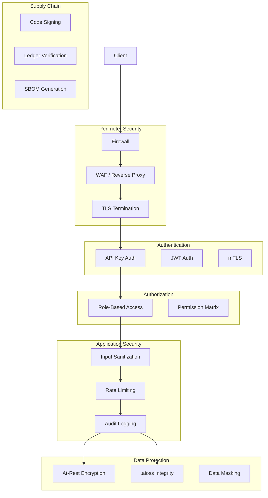

<!-- ASCII Art for Geo-11 -->


¦¦¦¦¦¦¦+¦¦¦¦¦¦¦+ ¦¦¦¦¦¦+¦¦+   ¦¦+¦¦¦¦¦¦+ ¦¦+¦¦¦¦¦¦¦¦+¦¦+   ¦¦+    ¦¦¦¦¦¦+ ¦¦¦¦¦¦¦+¦¦¦¦¦¦¦+¦¦¦¦¦¦¦¦+
¦¦+----+¦¦+----+¦¦+----+¦¦¦   ¦¦¦¦¦+--¦¦+¦¦¦+--¦¦+--++¦¦+ ¦¦++    ¦¦+--¦¦+¦¦+----+¦¦+----++--¦¦+--+
¦¦¦¦¦¦¦+¦¦¦¦¦+  ¦¦¦     ¦¦¦   ¦¦¦¦¦¦¦¦¦++¦¦¦   ¦¦¦    +¦¦¦¦++     ¦¦¦¦¦¦++¦¦¦¦¦+  ¦¦¦¦¦¦¦+   ¦¦¦   
+----¦¦¦¦¦+--+  ¦¦¦     ¦¦¦   ¦¦¦¦¦+--¦¦+¦¦¦   ¦¦¦     +¦¦++      ¦¦+--¦¦+¦¦+--+  +----¦¦¦   ¦¦¦   
¦¦¦¦¦¦¦¦¦¦¦¦¦¦¦++¦¦¦¦¦¦++¦¦¦¦¦¦++¦¦¦  ¦¦¦¦¦¦   ¦¦¦      ¦¦¦       ¦¦¦¦¦¦++¦¦¦¦¦¦¦+¦¦¦¦¦¦¦¦   ¦¦¦   
+------++------+ +-----+ +-----+ +-+  +-++-+   +-+      +-+       +-----+ +------++------+   +-+   

¦¦¦¦¦¦+ ¦¦¦¦¦¦+  ¦¦¦¦¦+  ¦¦¦¦¦¦+ ¦¦¦¦¦¦¦¦+¦¦+ ¦¦¦¦¦¦+¦¦¦¦¦¦¦+¦¦¦¦¦¦¦+
¦¦+--¦¦+¦¦+--¦¦+¦¦+--¦¦+¦¦+----+ +--¦¦+--+¦¦¦¦¦+----+¦¦+----+¦¦+----+
¦¦¦¦¦¦++¦¦¦¦¦¦++¦¦¦¦¦¦¦¦¦¦¦  ¦¦¦+   ¦¦¦   ¦¦¦¦¦¦     ¦¦¦¦¦+  ¦¦¦¦¦¦¦+
¦¦+---+ ¦¦+--¦¦+¦¦+--¦¦¦¦¦¦   ¦¦¦   ¦¦¦   ¦¦¦¦¦¦     ¦¦+--+  +----¦¦¦
¦¦¦     ¦¦¦  ¦¦¦¦¦¦  ¦¦¦+¦¦¦¦¦¦++   ¦¦¦   ¦¦¦+¦¦¦¦¦¦+¦¦¦¦¦¦¦+¦¦¦¦¦¦¦¦
+-+     +-+  +-++-+  +-+ +-----+    +-+   +-+ +-----++------++------+

*Lois-Kleinner and 0-1.gg 2026 - Inte11ect Platform Documentation*
*Confidential - All Rights Reserved*


---

# Security Best Practices

> **Associated Module:** Geo-11 — Security & Access Control
> **Tutorial 11 of 12** — Estimated reading time: 16 min | Hands-on time: 20 min

## Overview

This tutorial covers security best practices for deploying and using Inte11ect in production environments. We address authentication, authorization, network security, data protection, ledger integrity, supply chain security, and incident response.

Topics covered:

- API authentication and authorization
- TLS configuration
- API key management
- Network security
- Data encryption
- Ledger security
- Supply chain verification
- Audit logging
- Incident response
- Compliance considerations

---

## Section 1 — Security Architecture



---

## Section 2 — API Authentication

### API Key Authentication

```bash
# Generate an API key
inte11ect api key create \
  --name "production-service" \
  --permissions "infer,status,models.list" \
  --expires 2027-06-19

# Output:
# API Key: int11_abc123def456...
# Name: production-service
# Permissions: infer, status, models.list
# Expires: 2027-06-19T00:00:00Z
# Keep this key secure. It will not be shown again.
```

### Key Permissions

```bash
# Available permissions
inte11ect api key permissions

# +------------------------------------------------------+
# ¦ Permission          ¦ Allows                         ¦
# +---------------------+--------------------------------¦
# ¦ infer               ¦ Run inference                  ¦
# ¦ models.list         ¦ List installed models          ¦
# ¦ models.download     ¦ Download new models             ¦
# ¦ models.remove       ¦ Remove models                  ¦
# ¦ modules.*           ¦ All module operations          ¦
# ¦ ledger.read         ¦ Read ledger entries            ¦
# ¦ ledger.verify       ¦ Verify ledger integrity        ¦
# ¦ config.read         ¦ Read configuration             ¦
# ¦ config.write        ¦ Modify configuration           ¦
# ¦ admin               ¦ All operations                 ¦
# +------------------------------------------------------+
```

### JWT Authentication

```toml
[api.auth]
mode = "jwt"
jwt_secret = "your-256-bit-secret"  # Use environment variable!
jwt_issuer = "inte11ect"
jwt_audience = "api.intelleect.dev"
jwt_expiry_secs = 3600
```

### mTLS Authentication

```toml
[api]
tls_enabled = true
tls_cert = "/etc/inte11ect/certs/server.crt"
tls_key = "/etc/inte11ect/certs/server.key"

[api.auth]
mode = "mtls"
ca_cert = "/etc/inte11ect/certs/ca.crt"
require_client_cert = true
```

---

## Section 3 — Network Security

### Firewall Configuration

```bash
# Recommended firewall rules
# Allow only necessary ports

# Windows PowerShell
New-NetFirewallRule -DisplayName "Inte11ect API" \
  -Direction Inbound -Protocol TCP -LocalPort 8080 -Action Allow

New-NetFirewallRule -DisplayName "Inte11ect SSH" \
  -Direction Inbound -Protocol TCP -LocalPort 22 -Action Allow

# Block all other inbound
```

### Reverse Proxy (Nginx)

```nginx
server {
    listen 443 ssl;
    server_name api.intelleect.dev;

    ssl_certificate /etc/ssl/certs/inte11ect.crt;
    ssl_certificate_key /etc/ssl/private/inte11ect.key;
    
    # Security headers
    add_header Strict-Transport-Security "max-age=63072000" always;
    add_header X-Content-Type-Options "nosniff" always;
    add_header X-Frame-Options "DENY" always;
    add_header X-XSS-Protection "1; mode=block" always;

    # Rate limiting
    limit_req_zone $binary_remote_addr zone=api:10m rate=30r/s;
    limit_req zone=api burst=50 nodelay;

    location /api/ {
        proxy_pass http://127.0.0.1:8080;
        proxy_set_header Host $host;
        proxy_set_header X-Real-IP $remote_addr;
        proxy_set_header X-Forwarded-For $proxy_add_x_forwarded_for;
        
        # WebSocket support
        proxy_http_version 1.1;
        proxy_set_header Upgrade $http_upgrade;
        proxy_set_header Connection "upgrade";
    }
}
```

### TLS Configuration

```toml
[api]
tls_enabled = true
tls_cert = "/etc/inte11ect/certs/fullchain.pem"
tls_key = "/etc/inte11ect/certs/privkey.pem"
tls_min_version = "1.3"
tls_ciphers = [
    "TLS_AES_256_GCM_SHA384",
    "TLS_CHACHA20_POLY1305_SHA256"
]
```

---

## Section 4 — API Key Management

### Best Practices

```bash
# 1. Store keys in environment variables, never in code
export INTELLECT_API_KEY="int11_abc123..."

# 2. Rotate keys regularly
inte11ect api key rotate --id key_abc123

# 3. Revoke compromised keys immediately
inte11ect api key revoke --id key_abc123

# 4. List all keys and audit usage
inte11ect api key list --show-usage

# +------------------------------------------------------+
# ¦ Name             ¦ Created  ¦ Last Used ¦ Requests   ¦
# +------------------+----------+-----------+------------¦
# ¦ production-svc   ¦ 2026-01  ¦ 2026-06-19¦ 1,284,712  ¦
# ¦ staging-svc      ¦ 2026-03  ¦ 2026-06-18¦ 12,847     ¦
# ¦ dev-key          ¦ 2026-06  ¦ 2026-06-19¦ 847        ¦
# +------------------------------------------------------+
```

### Key Storage

```bash
# Store keys encrypted at rest
inte11ect api key encrypt-keys

# Use a secrets manager
# HashiCorp Vault integration:
inte11ect config --set api.auth.vault_addr="https://vault.example.com"
inte11ect config --set api.auth.vault_token="${VAULT_TOKEN}"
```

---

## Section 5 — Data Encryption

### At-Rest Encryption

```toml
[storage]
encryption_enabled = true
encryption_algorithm = "aes-256-gcm"
encryption_key_path = "/etc/inte11ect/keys/storage.key"
encryption_key_provider = "file"  # "file", "vault", "aws-kms"
```

### Ledger Encryption

```toml
[ledger]
encryption_enabled = true
encryption_key = "${LEDGER_ENCRYPTION_KEY}"  # 32-byte hex key
```

### Model Weight Encryption

```toml
[model]
encrypt_weights = true
weight_encryption_key = "${MODEL_ENCRYPTION_KEY}"
```

---

## Section 6 — Ledger Security

### Forensic Integrity

```bash
# Generate tamper-evident snapshot
inte11ect ledger snapshot --output ./ledger_proof.json

# Verify snapshot on another machine
inte11ect ledger verify-snapshot --input ./ledger_proof.json
```

### Real-Time Monitoring

```toml
[ledger]
alert_on_integrity_failure = true
webhook_url = "https://hooks.example.com/security-alert"

[webhooks.events]
"ledger.integrity_failure" = ["https://hooks.example.com/security"]
"auth.failed_attempt" = ["https://hooks.example.com/auth"]
"config.sensitive_change" = ["https://hooks.example.com/config"]
```

### Audit Log Retention

```toml
[ledger]
retention_days = 365  # Keep all entries for 1 year
archive_after_days = 90
backup_interval_hours = 6
backup_count = 365  # Keep daily backups for 1 year
```

---

## Section 7 — Supply Chain Security

### Binary Verification

```bash
# Verify the Inte11ect binary signature
inte11ect verify-signature \
  --binary ./Inte11ect_1.2.3_x64-setup.exe \
  --signature ./Inte11ect_1.2.3_x64-setup.exe.sig \
  --public-key ./inte11ect_signing_key.pub

# Or use the built-in verification
inte11ect doctor --verify-signature
```

### SBOM Generation

```bash
# Generate Software Bill of Materials
inte11ect sbom generate --output inte11ect_sbom.json

# Verify SBOM
inte11ect sbom verify --input inte11ect_sbom.json

# The SBOM includes:
# - All Rust crate dependencies
# - All npm packages
# - License information
# - Version information
# - Vulnerability database references
```

### Dependency Scanning

```bash
# Check for known vulnerabilities
inte11ect sbom vuln-check

# +---------------------------------------------------------+
# ¦ Package                ¦ Version  ¦ Vuln ID  ¦ Severity ¦
# +------------------------+----------+----------+----------¦
# ¦ tokio                  ¦ 1.36.0   ¦ CVE-2024-¦ MEDIUM   ¦
# ¦ openssl                ¦ 0.10.64  ¦ CVE-2024-¦ HIGH     ¦
# +---------------------------------------------------------+
```

---

## Section 8 — Input Validation

### Prompt Sanitization

```toml
[sanitization]
enabled = true
max_prompt_length = 32768
block_patterns = [
    "rm -rf /",
    "DROP TABLE",
    "<script>",
    "eval(",
]
strip_control_characters = true
strip_ansi_escape = true
```

### Rate Limiting

```toml
[api]
rate_limit_enabled = true
rate_limit_per_minute = 60
rate_limit_per_ip_per_minute = 30
rate_limit_burst = 100

rate_limit_exempt_ips = [
    "10.0.0.0/8",     # Internal network
    "192.168.0.0/16",   # Private network
]
```

---

## Section 9 — User Access Control

### User Management

```bash
# Create a user
inte11ect user create \
  --username "john.doe" \
  --role "analyst" \
  --permissions "infer,ledger.read"

# List users
inte11ect user list

# +-------------------------------------------------+
# ¦ Username  ¦ Role     ¦ Permissions   ¦ Status   ¦
# +-----------+----------+---------------+----------¦
# ¦ admin     ¦ admin    ¦ all           ¦ active   ¦
# ¦ john.doe  ¦ analyst  ¦ infer, ledger ¦ active   ¦
# ¦ jane.smith¦ viewer   ¦ infer         ¦ disabled ¦
# +-------------------------------------------------+
```

### Session Management

```toml
[session]
timeout_minutes = 30
max_concurrent_sessions = 3
invalidate_on_password_change = true
```

---

## Section 10 — Incident Response

### Detection

```bash
# Monitor for security events
inte11ect security events --tail

# Event types:
# auth.failed_attempt - Multiple failed authentication
# auth.key_compromised - Key used from unexpected location
# ledger.integrity_failure - Hash chain broken
# config.sensitive_change - Encryption keys modified
# model.unauthorized_access - Model accessed without permission
# api.rate_limit_exceeded - Possible DoS
```

### Response Playbook

```yaml
# security/incident_response.yaml
playbook:
  phases:
    - name: Identification
      actions:
        - inte11ect security events --since 1h
        - inte11ect ledger verify
        - inte11ect audit export --since 1h
    
    - name: Containment
      actions:
        - inte11ect api key revoke --all-suspicious
        - inte11ect config --set api.enabled=false
        - inte11ect security block-ip <ip_address>
    
    - name: Eradication
      actions:
        - inte11ect ledger restore --pre-incident
        - inte11ect security rotate-all-keys
        - inte11ect sbom vuln-check
    
    - name: Recovery
      actions:
        - inte11ect config --set api.enabled=true
        - inte11ect security events --follow
        - inte11ect doctor
    
    - name: Post-Mortem
      actions:
        - inte11ect security report --output incident_report.md
        - inte11ect audit export --full --since 7d
```

### Notification

```toml
[alerts.security]
email = ["security@example.com"]
slack_webhook = "https://hooks.slack.com/services/..."
pagerduty_key = "..."

[alerts.security.events]
"auth.failed_attempt" = { threshold = 5, window_secs = 300 }
"ledger.integrity_failure" = { threshold = 1, window_secs = 60 }
"api.rate_limit_exceeded" = { threshold = 10, window_secs = 60 }
```

---

## Section 11 — Compliance Considerations

### GDPR Compliance

```toml
[compliance.gdpr]
enabled = true
data_retention_days = 30
right_to_erasure_enabled = true
data_processing_log = "~/.inte11ect/compliance/gdpr_processing.log"

[compliance.gdpr.erasure]
enabled = true
excluded_tables = ["ledger_entries"]  # Ledger is append-only
anonymize_fields = ["user_id", "prompt_content"]
```

### SOC2 / ISO 27001

```toml
[compliance.audit]
enabled = true
log_all_admin_actions = true
log_all_config_changes = true
log_all_access_attempts = true
log_format = "cef"  # Common Event Format
log_output = "syslog"  # "file", "syslog", "fluentd"
```

### HIPAA (if applicable)

```toml
[compliance.hipaa]
enabled = true
phi_detection_enabled = true
phi_logging_enabled = true
access_logs_retention_days = 365
emergency_access_procedure = "two-person-rule"
```

---

## Section 12 — Security Checklist

- [ ] API keys stored in environment variables, not code
- [ ] TLS 1.3 enabled for all API traffic
- [ ] Rate limiting configured (60 req/min default)
- [ ] `.aioss` ledger integrity verified
- [ ] Ledger backups configured (every 6 hours)
- [ ] Webhook alerts configured for security events
- [ ] Firewall restricts unnecessary ports
- [ ] Binary signature verified before installation
- [ ] SBOM generated and reviewed
- [ ] User accounts use least-privilege model
- [ ] Encryption at-rest enabled for data directory
- [ ] Session timeout configured (30 min)
- [ ] Incident response plan documented
- [ ] Compliance settings match requirements
- [ ] Security events monitored in real-time
- [ ] API keys rotated within 90 days
- [ ] Module permissions reviewed quarterly

---

## Next Steps

- [12-tutorial.md](./12-tutorial.md) — Exporting and sharing logs
- [05-tutorial.md](./05-tutorial.md) — Verifying the .aioss ledger
- [07-tutorial.md](./07-tutorial.md) — Integrating with other tools
- [01-compliance.md](../compliance/01-compliance.md) — Compliance documentation

---

*Lois-Kleinner and 0-1.gg 2026 — Confidential*

```
.====================================================================.
!  Made in the UAE, Dubai #DubaiIt #Dubai #Dxb #SovereignAI          !
!  Made in The Emirates #Dubai_it                                    !
!                                                                    !
!  Lois-Kleinner Alpasan - The Anticloud 2026-                       !
!                                                                    !
!  As seen on:                                                       !
!  Harvard Dataverse ! Zenodo/CERN ! Academia.edu ! HuggingFace      !
!  anticloud.telepedia.net ! anticloud.fandom.com                    !
!                                                                    !
!  0-1.gg ! GitHub ! LinkedIn ! DEV ! GH Pages                       !
!  HuggingFace ! Blog ! Bluesky ! Mastodon                           !
!  Internet Archive ! ORCID ! Figshare                               !
!                                                                    !
!  Sovereign AI ! Local-First ! Privacy ! Zero Trust ! No Datacenter !
!  Air-Gapped ! Open Source ! Rust ! Hash Chain ! Single Binary      !
!  Offline LLM ! Crypto Ledger ! P2P ! Federated                     !
'===================================================================='
```

Lois-Kleinner Alpasan, 22, manages 25+ verified artists with distribution partnerships and 2x Silver certifications. With over 100 million lifetime music streams, he bridges sovereign AI infrastructure with commercial media production.

References:
1. Lois-Kleinner Zenodo: https://doi.org/10.5281/zenodo.20781790
2. Lois-Kleinner GitHub: https://github.com/kleinnner/Anticloud/tree/main/04-aioss-format
3. Lois-Kleinner Harvard DV: https://doi.org/10.7910/DVN/FDEBAB
4. Lois-Kleinner Internet Arc: https://archive.org/details/aioss-format
5. Lois-Kleinner ORCID: https://orcid.org/0009-0009-2233-6107
6. Lois-Kleinner DEV.to: https://dev.to/kleinner
7. Lois-Kleinner LinkedIn: https://linkedin.com/in/kleinner
8. Lois-Kleinner HuggingFace: https://huggingface.co/Anticloud
9. Lois-Kleinner Tumblr: https://anticloud.tumblr.com
10. Lois-Kleinner Mastodon: https://mastodon.social/@kleinner
11. Lois-Kleinner Bluesky: https://bsky.app/profile/kleinner.bsky.social
12. 0-1.gg: https://0-1.gg
13. Lois-Kleinner Figshare: https://figshare.com/authors/Lois-Kleinner_Alpasan/20849885
14. Lois-Kleinner Academia: https://independent.academia.edu/kleinner
15. Lois-Kleinner Telepedia: https://anticloud.telepedia.net
16. Lois-Kleinner Fandom: https://anticloud.fandom.com