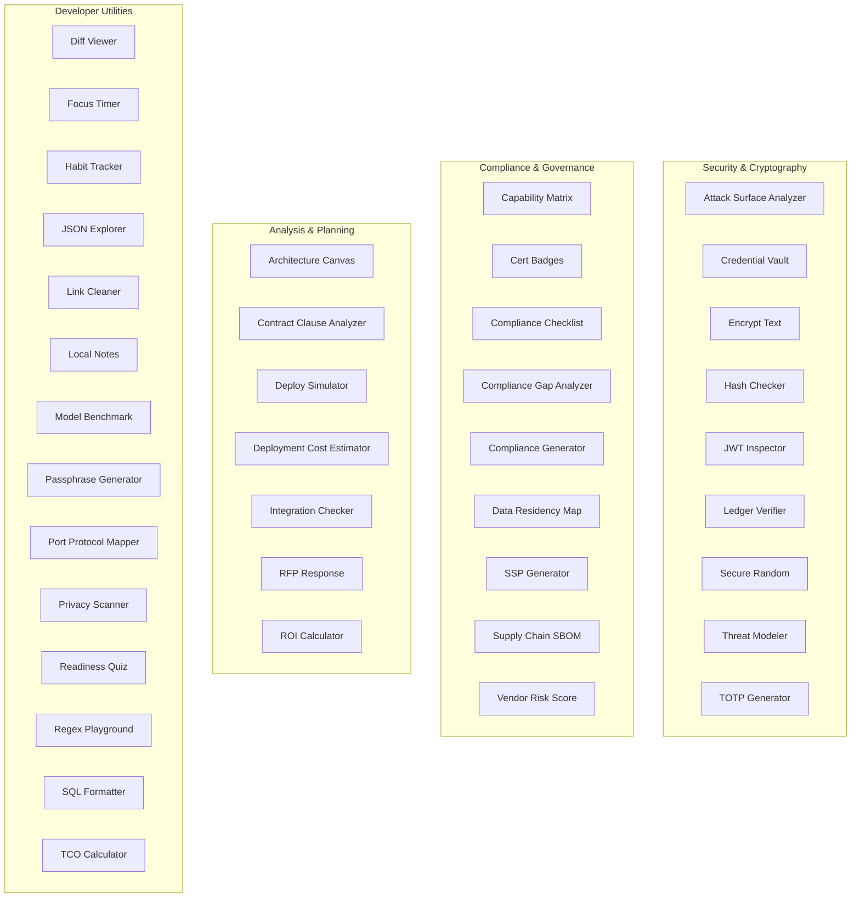

# 12 — API-OSS Developer Tools

40 developer utility tools for security, compliance, cryptography, and infrastructure analysis. Each tool is a self-contained web application with documentation.

## Tools with Documentation

| Tool | Docs | Description |
|------|------|-------------|
| [Architecture Canvas](./architecture-canvas/) | 5 | System architecture modeling tool |
| [Attack Surface](./attack-surface/) | 5 | Attack surface analysis and visualization |
| [Capability Matrix](./capability-matrix/) | 5 | Capability mapping and gap analysis |
| [Cert Badges](./cert-badges/) | 5 | Certification badge generator |
| [Compliance Checklist](./compliance-checklist/) | 5 | Compliance requirement tracking |
| [Compliance Gap Analyzer](./compliance-gap-analyzer/) | 5 | Compliance gap identification |
| [Compliance Generator](./compliance-generator/) | 5 | Compliance document generation |
| [Data Residency Map](./data-residency-map/) | 5 | Data residency visualization |
| [Deploy Simulator](./deploy-simulator/) | 5 | Deployment scenario simulation |
| [Deployment Cost Estimator](./deployment-cost-estimator/) | 5 | Infrastructure cost estimation |
| [Integration Checker](./integration-checker/) | 5 | System integration verification |
| [Ledger Verifier](./ledger-verifier/) | 5 | Cryptographic ledger verification |
| [Model Benchmark](./model-benchmark/) | 5 | AI model benchmarking tool |
| [Port Protocol Mapper](./port-protocol-mapper/) | 5 | Network port mapping utility |
| [Readiness Quiz](./readiness-quiz/) | 5 | Organizational readiness assessment |
| [Regex Playground](./regex-playground/) | 5 | Regular expression testing tool |
| [RFP Response](./rfp-response/) | 5 | RFP response generation |
| [SSP Generator](./ssp-generator/) | 5 | System security plan generator |
| [Supply Chain SBOM](./supply-chain-sbom/) | 5 | Software bill of materials analysis |
| [TCO Calculator](./tco-calculator/) | 5 | Total cost of ownership calculator |
| [Threat Model](./threat-model/) | 5 | Threat modeling tool |
| [Contract Clause Analyzer](./contract-clause-analyzer/) | 5 | Contract clause analysis and risk assessment |
| [Credential Vault](./credential-vault/) | 5 | Secure credential storage and management |
| [Data Local Score](./data-local-score/) | 5 | Data localization scoring and sovereignty assessment |
| [Diff Viewer](./diff-viewer/) | 5 | File and text comparison |
| [Encrypt Text](./encrypt-text/) | 5 | Text encryption and decryption |
| [Focus Timer](./focus-timer/) | 5 | Productivity focus timer |
| [Habit Tracker](./habit-tracker/) | 5 | Daily habit tracking and streak monitoring |
| [Hash Checker](./hash-checker/) | 5 | Cryptographic hash generation and verification |
| [JSON Explorer](./json-explorer/) | 5 | JSON data structure exploration and visualization |
| [JWT Inspector](./jwt-inspector/) | 5 | JWT token inspection and analysis |
| [Link Cleaner](./link-cleaner/) | 5 | URL sanitization and tracking parameter removal |
| [Local Notes](./local-notes/) | 5 | Local note-taking with markdown support |
| [Passphrase Generator](./passphrase-generator/) | 5 | Secure passphrase generation |
| [Privacy Scanner](./privacy-scanner/) | 5 | Privacy compliance scanning |
| [ROI Calculator](./roi-calculator/) | 5 | Return on investment calculator |
| [Secure Random](./secure-random/) | 5 | Cryptographically secure random generation |
| [SQL Formatter](./sql-formatter/) | 5 | SQL query formatting and linting |
| [TOTP Generator](./totp-generator/) | 5 | Time-based one-time password generator |
| [Vendor Risk Score](./vendor-risk-score/) | 5 | Vendor risk assessment and scoring |
