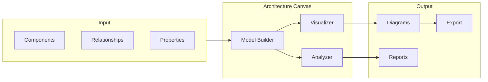

# Architecture Canvas

System architecture modeling and visualization tool.

[Documentation](./docs/README.md) | [FAQ](./docs/FAQ.md) | [Quickstart](./docs/QUICKSTART.md) | [Tutorial](./docs/TUTORIAL.md)
