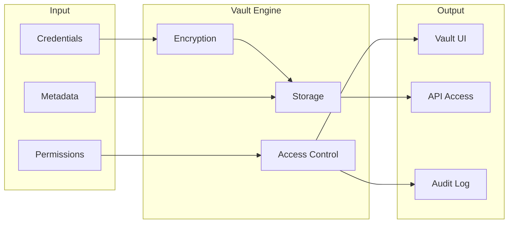

# Credential Vault

Secure credential storage and management tool.

```mermaid
flowchart LR
    subgraph Input["Input"]
        C[Credentials]
        P[Permissions]
        M[Metadata]
    end
    subgraph Vault["Vault Engine"]
        E[Encryption]
        S[Storage]
        A[Access Control]
    end
    subgraph Output["Output"]
        V[Vault UI]
        API[API Access]
        L[Audit Log]
    end
    C --> E --> S
    P --> A --> V
    M --> S
    S --> API
    A --> L
```

[Documentation](./docs/README.md) | [FAQ](./docs/FAQ.md) | [Quickstart](./docs/QUICKSTART.md) | [Tutorial](./docs/TUTORIAL.md)
