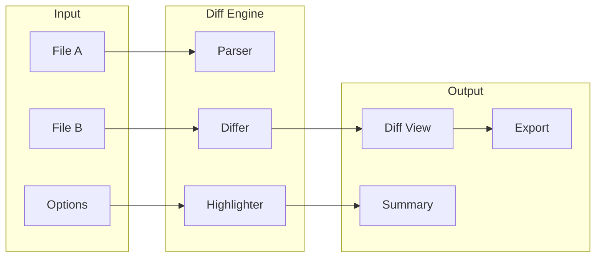

# Diff Viewer

File and text comparison viewer tool.

```mermaid
flowchart LR
    subgraph Input["Input"]
        A[File A]
        B[File B]
        O[Options]
    end
    subgraph Engine["Diff Engine"]
        P[Parser]
        D[Differ]
        H[Highlighter]
    end
    subgraph Output["Output"]
        DV[Diff View]
        S[Summary]
        E[Export]
    end
    A --> P
    B --> D --> DV
    O --> H --> S
    DV --> E
```

[Documentation](./docs/README.md) | [FAQ](./docs/FAQ.md) | [Quickstart](./docs/QUICKSTART.md) | [Tutorial](./docs/TUTORIAL.md)
