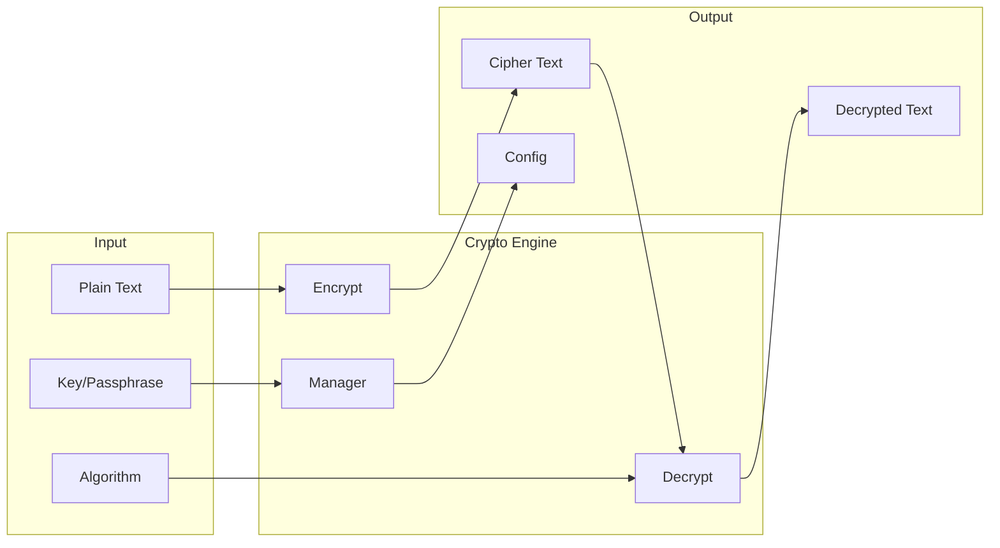

# Encrypt Text

Text encryption and decryption utility tool.

```mermaid
flowchart LR
    subgraph Input["Input"]
        T[Plain Text]
        K[Key/Passphrase]
        A[Algorithm]
    end
    subgraph Engine["Crypto Engine"]
        E[Encrypt]
        D[Decrypt]
        M[Manager]
    end
    subgraph Output["Output"]
        CT[Cipher Text]
        PT[Decrypted Text]
        C[Config]
    end
    T --> E --> CT
    K --> M
    A --> D --> PT
    CT --> D
    M --> C
```

[Documentation](./docs/README.md) | [FAQ](./docs/FAQ.md) | [Quickstart](./docs/QUICKSTART.md) | [Tutorial](./docs/TUTORIAL.md)
