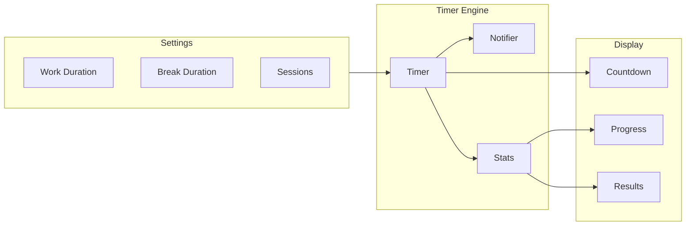

# Focus Timer

Productivity focus timer using Pomodoro technique.

```mermaid
flowchart LR
    subgraph Settings["Settings"]
        W[Work Duration]
        B[Break Duration]
        S[Sessions]
    end
    subgraph Timer["Timer Engine"]
        T[Timer]
        N[Notifier]
        S2[Stats]
    end
    subgraph Display["Display"]
        C[Countdown]
        P[Progress]
        R[Results]
    end
    Settings --> T --> C
    T --> N
    T --> S2 --> R
    S2 --> P
```

[Documentation](./docs/README.md) | [FAQ](./docs/FAQ.md) | [Quickstart](./docs/QUICKSTART.md) | [Tutorial](./docs/TUTORIAL.md)
