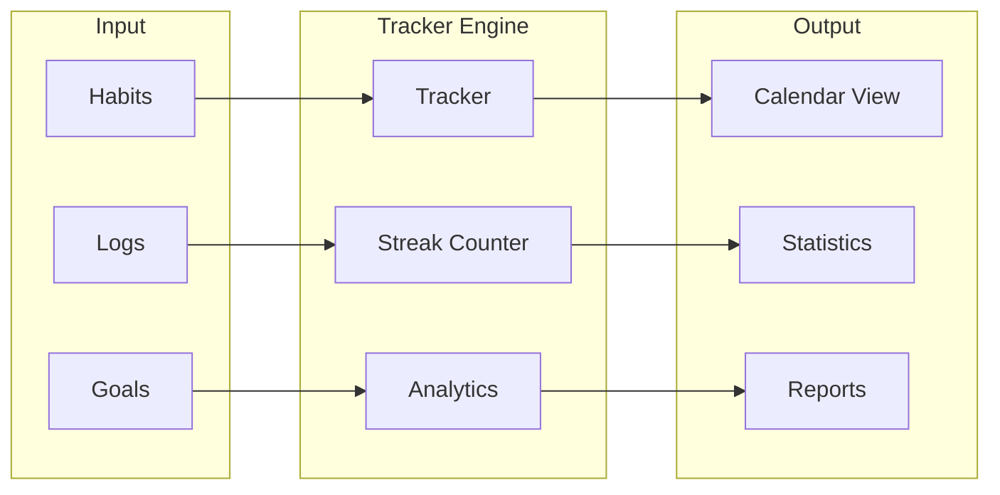

# Habit Tracker

Daily habit tracking and streak monitoring tool.

```mermaid
flowchart LR
    subgraph Input["Input"]
        H[Habits]
        L[Logs]
        G[Goals]
    end
    subgraph Engine["Tracker Engine"]
        T[Tracker]
        S[Streak Counter]
        A[Analytics]
    end
    subgraph Output["Output"]
        CA[Calendar View]
        ST[Statistics]
        RE[Reports]
    end
    H --> T --> CA
    L --> S --> ST
    G --> A --> RE
```

[Documentation](./docs/README.md) | [FAQ](./docs/FAQ.md) | [Quickstart](./docs/QUICKSTART.md) | [Tutorial](./docs/TUTORIAL.md)
