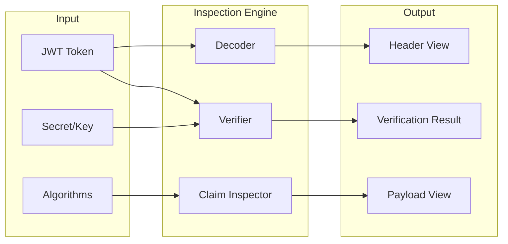

# JWT Inspector

JWT token inspection, debugging, and analysis tool.

```mermaid
flowchart LR
    subgraph Input["Input"]
        T[JWT Token]
        S[Secret/Key]
        A[Algorithms]
    end
    subgraph Engine["Inspection Engine"]
        D[Decoder]
        V[Verifier]
        C[Claim Inspector]
    end
    subgraph Output["Output"]
        H[Header View]
        P[Payload View]
        VR[Verification Result]
    end
    T --> D --> H
    T --> V --> VR
    S --> V
    A --> C --> P
```

[Documentation](./docs/README.md) | [FAQ](./docs/FAQ.md) | [Quickstart](./docs/QUICKSTART.md) | [Tutorial](./docs/TUTORIAL.md)
