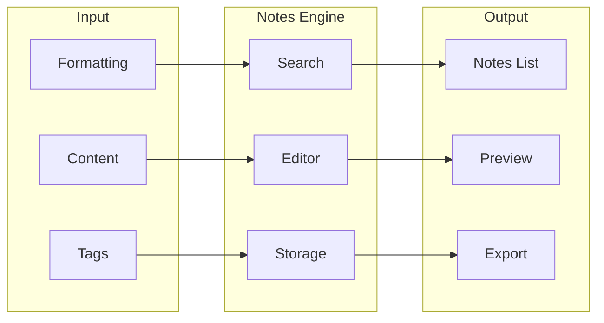

# Local Notes

Local note-taking application with markdown support.

```mermaid
flowchart LR
    subgraph Input["Input"]
        C[Content]
        T[Tags]
        F[Formatting]
    end
    subgraph Engine["Notes Engine"]
        E[Editor]
        S[Storage]
        S2[Search]
    end
    subgraph Output["Output"]
        N[Notes List]
        P[Preview]
        E2[Export]
    end
    C --> E --> P
    T --> S
    F --> S2 --> N
    S --> E2
```

[Documentation](./docs/README.md) | [FAQ](./docs/FAQ.md) | [Quickstart](./docs/QUICKSTART.md) | [Tutorial](./docs/TUTORIAL.md)
