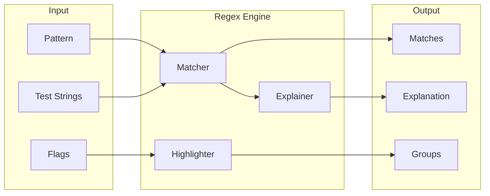

# Regex Playground

Regular expression testing and debugging playground.

```mermaid
flowchart LR
    subgraph Input["Input"]
        P[Pattern]
        T[Test Strings]
        F[Flags]
    end
    subgraph Engine["Regex Engine"]
        M[Matcher]
        H[Highlighter]
        E[Explainer]
    end
    subgraph Output["Output"]
        R[Matches]
        G[Groups]
        X[Explanation]
    end
    P --> M
    T --> M --> R
    F --> H --> G
    M --> E --> X
```

[Quickstart](./QUICKSTART.md) | [Tutorial](./TUTORIAL.md)
