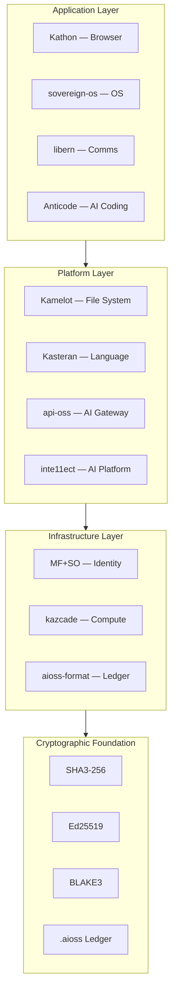
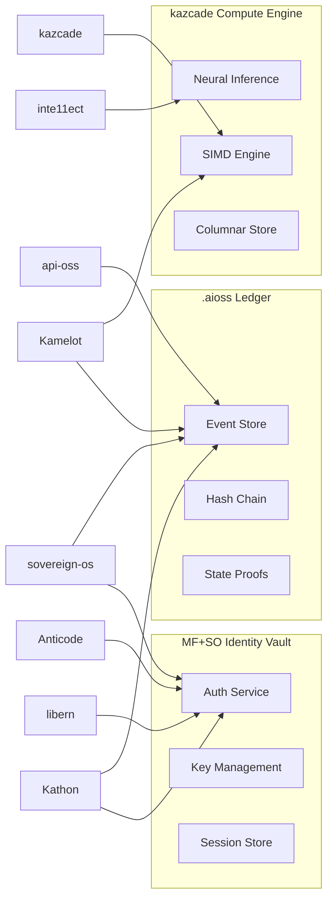

# Architecture

## 4+1 Architectural View Model

The Anticloud ecosystem is documented using the 4+1 architectural view model, providing multiple perspectives for different stakeholders.

---

## 1. Logical View — System Decomposition

### Ecosystem Layers



### Responsibility Distribution

| Layer | Responsibility | Key Projects |
|-------|---------------|--------------|
| Applications | User-facing experiences | Kathon, sovereign-os, libern, Anticode |
| Platform | Capabilities & services | Kamelot, Kasteran, api-oss, inte11ect |
| Infrastructure | Foundation & storage | MF+SO, kazcade, aioss-format |
| Cryptographic | Trust & verification | Shared across all |

---

## 2. Process View — Communication & Coordination

### Inter-Process Communication



### Protocol Summary

| Protocol | Transport | Security | Projects |
|----------|-----------|----------|----------|
| CRDT Sync | WebRTC / TCP | Ed25519 sigs + SHA3-256 chain | Kathon, Kamelot, libern |
| Ledger Write | Local IPC | Memory-mapped .aioss | All platform projects |
| Auth Request | gRPC / HTTP | JWT + Ed25519 | MF+SO to all |
| Compute RPC | Shared Memory | .acol columnar format | kazcade consumers |

---

## 3. Development View — Module Organization

### Repository Structure

```
anticloud/
├── 01-kathon/             ← Cryptographic Browser (Rust/TypeScript/Tauri)
│   ├── README.md          ← Architecture, features, doc index
│   └── docs/              ← 21 research papers and guides
├── 02-kamelot/            ← Vector File System (Rust/WGPU)
│   └── docs/              ← 99 documents
├── ...
├── 12-api-oss-tools/      ← 40 Developer Tools
│   ├── attack-surface/
│   ├── credential-vault/
│   └── ... (38 more)
├── .github/               ← CI/CD, templates, health files
├── website/               ← Docusaurus documentation portal
├── links/                 ← Published article references
├── SECURITY.md            ← Vulnerability disclosure
├── CONTRIBUTING.md        ← Contribution workflow
├── GOVERNANCE.md          ← Decision framework
└── ROADMAP.md             ← Timeline and milestones
```

### Documentation Standards

| Artifact | Standard | Format |
|----------|----------|--------|
| Project overview | README.md | Markdown + Mermaid |
| Architecture | docs/README.md | Markdown + Mermaid flowcharts |
| Quickstart | docs/QUICKSTART.md | 5-minute setup guide |
| Tutorial | docs/TUTORIAL.md | Step-by-step walkthrough |
| FAQ | docs/FAQ.md | Question-answer format |
| Research papers | docs/*.md | Full academic paper format |

---

## 4. Physical View — Deployment Architecture

### Deployment Targets

| Target | Projects | Requirements |
|--------|----------|--------------|
| Desktop (Tauri) | Kathon, inte11ect | Rust + WebView2/WPE |
| Bare metal / VM | sovereign-os | Arch Linux, TPM 2.0 |
| CLI / Terminal | Anticode, kazcade, tools | Rust runtime |
| Embedded / WASM | Kasteran (WASM backend) | WebAssembly runtime |
| P2P Network | Kathon, Kamelot, libern | WebRTC-capable network |

### Hardware Requirements

| Component | Minimum | Recommended |
|-----------|---------|-------------|
| CPU | x86_64, 4 cores, AVX2 | x86_64/aarch64, 8+ cores, AVX-512 |
| RAM | 8 GB | 32+ GB |
| Storage | 50 GB SSD | 256+ GB NVMe |
| GPU | Integrated | WGPU-compatible (Vulkan/Metal/DX12) |
| TPM | TPM 2.0 (for sovereign-os) | Discrete TPM |

---

## 5. Scenarios — Key User Journeys

### Scenario A: Sovereign Developer Workstation

1. Boot **sovereign-os** with TPM attestation
2. Authenticate via **MF+SO** identity vault
3. Write **Kasteran** code with formal verification
4. Store files in **Kamelot** vector file system
5. Debug with **Anticode** local AI assistant
6. Audit all actions via **.aioss** ledger

### Scenario B: AI-Powered Research Platform

1. Deploy **api-oss** AI gateway with multi-agent councils
2. Configure **inte11ect** modules for domain-specific analysis
3. Use **kazcade** for CPU-only inference on sensitive data
4. Document findings in **Kathon** spatial workspace
5. Publish via **libern** P2P to collaborators
6. Verify integrity with **.aioss** state proofs

### Scenario C: Compliance Documentation Pipeline

1. Map controls with **Capability Matrix** tool
2. Identify gaps with **Compliance Gap Analyzer**
3. Generate evidence with **SSP Generator**
4. Track requirements with **Compliance Checklist**
5. Report with **Vendor Risk Score** for partners
6. Verify all with **Ledger Verifier** against .aioss chain

---

## Architectural Principles

1. **Cryptographic provenance** — Every artifact is hash-chained back to its origin
2. **No black boxes** — All AI decisions are auditable and explainable
3. **Offline-first** — All systems work without internet dependency
4. **Zero silicon dependency** — CPU-only compute (no GPU requirement)
5. **Privacy by design** — Data localization, encryption at rest and in transit
6. **Post-quantum ready** — All crypto primitives have PQ migration paths

```
.====================================================================.
!  Made in the UAE, Dubai #DubaiIt #Dubai #Dxb #SovereignAI          !
!  Made in The Emirates #Dubai_it                                    !
!                                                                    !
!  Lois-Kleinner Alpasan - The Anticloud 2026-                       !
!                                                                    !
!  0-1.gg ! GitHub ! LinkedIn ! DEV ! GH Pages                       !
!  HuggingFace ! Blog ! Tumblr ! Fandom ! Bluesky ! Mastodon          !
!  Zenodo ! Harvard Dataverse ! Internet Archive ! ORCID ! Figshare   !
!                                                                    !
!  Sovereign AI ! Local-First ! Privacy ! Zero Trust ! No Datacenter !
!  Air-Gapped ! Open Source ! Rust ! Hash Chain ! Single Binary      !
!  Offline LLM ! Crypto Ledger ! P2P ! Federated                     !
'===================================================================='
```

Lois-Kleinner Alpasan, 22, has served executive roles spanning technology, operations, finance, and product across 20+ organizations. His cross-functional work combines architecture, business, and AI strategy.

References:
1. Lois-Kleinner Zenodo: https://doi.org/10.5281/zenodo.20781790
2. Lois-Kleinner GitHub: https://github.com/kleinnner/Anticloud/tree/main/04-aioss-format
3. Lois-Kleinner Harvard DV: https://doi.org/10.7910/DVN/KFK12Y
4. Lois-Kleinner Internet Arc: https://archive.org/details/aioss-format
5. Lois-Kleinner ORCID: https://orcid.org/0009-0009-2233-6107
6. Lois-Kleinner DEV.to: https://dev.to/kleinner
7. Lois-Kleinner LinkedIn: https://linkedin.com/in/kleinner
8. Lois-Kleinner HuggingFace: https://huggingface.co/Anticloud
9. Lois-Kleinner Tumblr: https://anticloud.tumblr.com
10. Lois-Kleinner Mastodon: https://mastodon.social/@kleinner
11. Lois-Kleinner Bluesky: https://bsky.app/profile/kleinner.bsky.social
12. 0-1.gg: https://0-1.gg
13. Lois-Kleinner Figshare: https://figshare.com/authors/Lois-Kleinner_Alpasan/20849885
