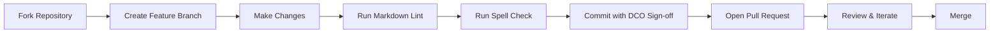

# Contributing to Anticloud

Thank you for your interest in contributing to the Anticloud ecosystem. This repository contains research documentation, specifications, and architectural papers for 50+ sovereign technology projects.

---

## Types of Contributions

| Type | Description | Process |
|------|-------------|---------|
| **Documentation fixes** | Typos, broken links, formatting | Direct PR |
| **Content additions** | New research papers, tutorials, guides | Issue → PR |
| **Specification proposals** | New protocols, formats, or architecture | Governance RFC |
| **Tool documentation** | Improvements to 40 tool doc sets | Direct PR |
| **Translations** | Localization of documentation | Issue → PR |

---

## Before You Start

- Read the [README](./README.md) for ecosystem overview
- Review [GOVERNANCE.md](./GOVERNANCE.md) for decision-making framework
- Check [ROADMAP.md](./ROADMAP.md) for current priorities
- Search existing [Issues](https://github.com/kleinnner/Anticloud/issues) and [Discussions](https://github.com/kleinnner/Anticloud/discussions) before opening new ones

---

## Contribution Workflow

### 1. Discussion Phase (for significant changes)

Open a GitHub Discussion to propose major changes before investing time in implementation.

### 2. Issue Tracking

For bugs, feature requests, and documentation gaps, open an issue using the appropriate template.

### 3. Development Process



### 4. Pull Request Requirements

- **Title:** Concise summary of the change
- **Description:** What, why, and how
- **Related issues:** Link to relevant issues
- **Documentation:** Update or add documentation as needed
- **DCO sign-off:** All commits must include `Signed-off-by: Your Name <your.email@example.com>`

### 5. Review Process

- Maintainers review within 5 business days
- All review comments must be addressed before merge
- Two maintainer approvals required for specification changes
- One maintainer approval sufficient for documentation fixes

---

## Documentation Style Guide

### Markdown Standards

- Use ATX headings (`##` not `---` underlines)
- Fenced code blocks with language tags
- Relative links for internal references
- One sentence per line for git-friendly diffs
- Mermaid for diagrams (flowcharts, mindmaps, sequence diagrams)

### File Conventions

| File | Convention |
|------|------------|
| `README.md` | Project overview, architecture diagram, document index |
| `docs/README.md` | Detailed documentation landing page |
| `docs/QUICKSTART.md` | 5-minute setup and first steps |
| `docs/TUTORIAL.md` | Step-by-step walkthrough |
| `docs/FAQ.md` | Frequently asked questions |

### Mermaid Guidelines

- Use `flowchart` (not `graph`) for flow diagrams
- Use `mindmap` for domain/topic maps
- Use `sequenceDiagram` for protocols
- Keep diagrams under 50 nodes
- Test rendering in GitHub before submitting

---

## Developer Tools Documentation

Each of the 40 tools in `12-api-oss-tools/` follows a strict template:

```
tool-name/
├── README.md          ← Tool overview, architecture mermaid, links
└── docs/
    ├── README.md      ← Detailed documentation
    ├── QUICKSTART.md  ← Quick start guide
    ├── TUTORIAL.md    ← Step-by-step tutorial
    └── FAQ.md         ← Frequently asked questions
```

---

## License

By contributing, you agree that your contributions will be licensed under the [existing license](./LICENSE) of this repository. All contributions are documentation and research content.

---

## Questions?

Open a [Discussion](https://github.com/kleinnner/Anticloud/discussions) or email `kleinner@0-1.gg`.
