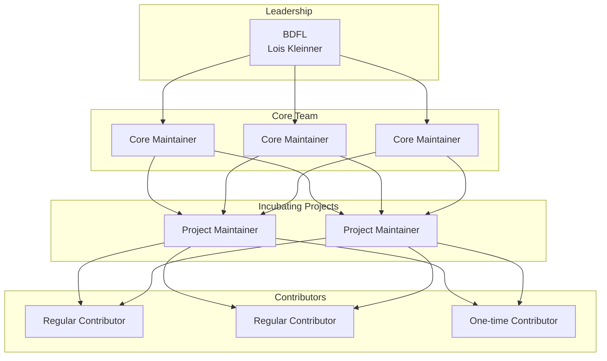

# Governance

## Overview

The Anticloud ecosystem is governed as a **BDFL (Benevolent Dictator for Life)** project with a graduated maintainership ladder. This document defines the decision-making framework, roles, responsibilities, and processes.

## Governance Model



## Roles

### BDFL (Benevolent Dictator for Life)

- Final decision authority on all matters
- Appoints and removes Core Team members
- Sets strategic direction
- Veto power over any decision
- **Current BDFL:** Lois Kleinner

### Core Team

- Day-to-day governance of the ecosystem
- Review and merge specification changes
- Onboard new projects and maintainers
- Enforce code of conduct
- Minimum 3 members

### Project Maintainer

- Responsible for one or more projects in the ecosystem
- Review project-specific documentation changes
- Maintain project roadmap
- Report to Core Team

### Regular Contributor

- Consistent, quality contributions over 3+ months
- Invited by Core Team
- Vote in project-level decisions

### One-time Contributor

- Anyone submitting a pull request, issue, or discussion
- No formal responsibilities

## Decision-Making

| Decision Type | Process | Approval |
|---------------|---------|----------|
| Documentation fixes | Direct PR merge | 1 maintainer |
| Content additions | Issue → PR | 1 maintainer |
| Specification changes | Governance RFC | 2 Core members + BDFL |
| New projects | Governance RFC | Core Team consensus |
| Governance changes | Governance RFC | BDFL approval |
| Code of conduct violations | Core Team review | Core Team majority |

## Governance RFC Process

For significant changes to specifications, architecture, or governance:

1. **Pre-RFC** — Discuss in GitHub Discussions
2. **RFC** — Formal proposal in a PR with `/rfc` label
3. **Review** — Minimum 14-day comment period
4. **Decision** — Core Team vote + BDFL approval
5. **Merge** — Accepted RFCs are merged and enter the roadmap

## Project Lifecycle

```
Experimental → Incubating → Graduated → Core → Archived
```

| Stage | Requirements | Governance |
|-------|-------------|------------|
| **Experimental** | Initial research, 5+ docs, clear README | Project creator |
| **Incubating** | 20+ docs, working prototype, Mermaid architecture diagram | Project maintainer |
| **Graduated** | 50+ docs, community contributions, 3-month stability | Core Team oversight |
| **Core** | Critical infrastructure, 100+ docs, production-ready | Core Team + BDFL |
| **Archived** | No longer maintained, read-only | Core Team decision |

## Voting

- Standard decisions: simple majority
- Governance changes: 2/3 Core Team + BDFL approval
- BDFL succession: BDFL appointment or Core Team unanimous + community vote

## Communication

- **GitHub Issues** — Bug reports and feature requests
- **GitHub Discussions** — Community conversations and RFC pre-discussion
- **Email** — `kleinner@0-1.gg` for sensitive matters

## Amendments

This governance document may be amended by Governance RFC as defined above. All amendments must be documented in [CHANGELOG.md](./CHANGELOG.md).
