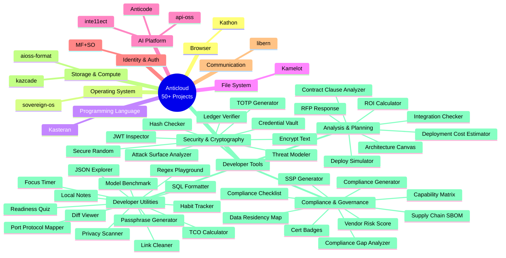
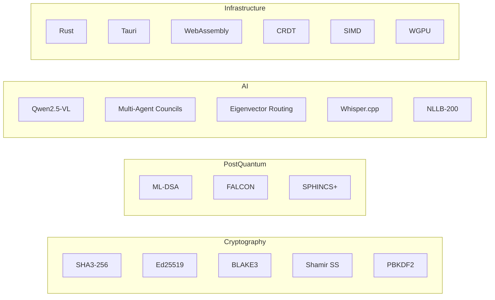

# ☁️ Anticloud

**Sovereign Technology Research — A Unified Ecosystem of 50+ Privacy-First, Cryptographically-Verified, AI-Native Projects**

[](#)
[](#)
[](#)
[](#)
[](#)
[](#)
[](./LICENSE)
[](./GOVERNANCE.md)
[](https://dataverse.harvard.edu/dataverse/anticloud)
[](https://zenodo.org/search?q=anticloud)
[](https://huggingface.co/Anticloud)
[](https://orcid.org/0009-0009-2233-6107)
[](https://archive.org/details/aioss-format)
[](https://figshare.com/authors/Lois-Kleinner_Alpasan/20849885)
[](https://independent.academia.edu/kleinner)
[](https://anticloud.telepedia.net)
[](https://anticloud.fandom.com)

> Whitepapers, specifications, tutorials, and architectural documentation for a complete sovereign technology stack spanning browsers, operating systems, programming languages, AI platforms, cryptographic formats, file systems, communication engines, and 40 developer tools.

---

## 📊 Published Research Data

Six peer-reviewed benchmark datasets published on Harvard Dataverse. Each includes raw measurements, statistical distributions, methodology, and reproducibility packages.

| Dataset | Project | DOI |
|---------|---------|-----|
| SHA3-256 Hash Chain & Ed25519 Crypto Benchmarks | aioss-format | [](https://doi.org/10.7910/DVN/FSHFZF) |
| SIMD AVX2 GEMM, Vector Ops & MLP Benchmarks | kazcade | [](https://doi.org/10.7910/DVN/YMJKOG) |
| Cross-Project Crypto Consistency Validation | libern / MF+SO / Kathon / Kasteran | [](https://doi.org/10.7910/DVN/GDLO0L) |
| Compiler Pipeline & VM Performance | Kasteran | [](https://doi.org/10.7910/DVN/KFK12Y) |
| Browser Desktop Application Benchmarks | Kathon | [](https://doi.org/10.7910/DVN/3VDF75) |
| Cryptographic Primitive Test Vectors | MF+SO | [](https://doi.org/10.7910/DVN/GKUDHE) |

---

## Domain Map



---

## Shared Cryptographic Foundation

All projects in the Anticloud ecosystem share a common cryptographic layer built on SHA3-256 hash chains, Ed25519 digital signatures, and the .aioss tamper-evident ledger format. This creates a coherent, verifiable foundation across every component.

```mermaid
flowchart TD
    subgraph Core["Shared Cryptographic Layer"]
        A[SHA3-256 Hash Chain]
        B[Ed25519 Digital Signatures]
        C[.aioss Tamper-Evident Ledger]
    end

    subgraph Platforms["Platform Projects"]
        K1[01 Kathon<br/>Cryptographic Browser]
        K2[02 Kamelot<br/>Vector File System]
        K3[03 Kasteran<br/>Programming Language]
        A1[04 aioss-format<br/>Ledger Format]
        S1[05 sovereign-os<br/>Operating System]
        A2[06 api-oss<br/>AI Gateway]
        M1[07 MF+SO<br/>Auth Vault]
        L1[08 libern<br/>P2P Comms]
        K4[09 kazcade<br/>Compute Engine]
        A3[10 Anticode<br/>AI Coding Engine]
        I1[11 inte11ect<br/>AI Platform]
    end

    subgraph Tools["40 Developer Tools"]
        T1[Security & Crypto]
        T2[Compliance & Governance]
        T3[Analysis & Planning]
        T4[Developer Utilities]
    end

    A --- K1 & K2 & K3 & A1 & S1 & A2 & M1 & L1 & K4 & A3 & I1
    B --- K1 & K2 & K3 & A1 & S1 & A2 & M1 & L1 & K4 & A3 & I1
    C --- K1 & K2 & K3 & A1 & S1 & A2 & M1 & L1 & K4 & A3 & I1
    C --- T1 & T2 & T3 & T4
```



---

## Platform Projects

| # | Project | Docs | Description |
|---|---------|------|-------------|
| 01 | **[Kathon](./01-kathon/)** | 21 | Cryptographic browser with vision-LLM ad blocking (94.3% precision, DOM-independent), CRDT P2P sync, spatial workspace, anti-enshittification engine, per-tab VPN, autonomous agent execution, universal live dubbing |
| 02 | **[Kamelot](./02-kamelot/)** | 99 | Semantic vector file system replacing directory trees with 1536-dim dense embedding search (91% recall at rank 10 vs 28% filename), GPU-accelerated wgpu/Vello UI at 240 FPS, BLAKE3 hash-chain integrity, P2P mesh sync |
| 03 | **[Kasteran](./03-kasteran/)** | 166 | Systems language with rune-based symbolic syntax (Urbit Hoon + APL inspired), linear capability types, self-hosted compiler with Cranelift JIT / WASM / C backends, formal verification pipeline, autodiff engine, SAT solver, LSP server |
| 04 | **[aioss-format](./04-aioss-format/)** | 35 | Dual-format (binary + JSON) cryptographic ledger format with SHA3-256 hash chaining, Ed25519 state proofs, memory-mapped IO, SQLite event store, post-quantum migration (ML-DSA/FALCON/SPHINCS+), compliance mapping for SOC2/FedRAMP/GDPR/HIPAA |
| 05 | **[sovereign-os](./05-sovereign-os/)** | 173 | Arch Linux-based sovereign OS with .aioss ledger daemon, custom toolchain (zerocli + runes), TPM attestation, measured boot, 20 GNOME shell extensions, 25 tutorials covering ISO build to production deployment |
| 06 | **[api-oss](./06-api-oss/)** | 446 | AI gateway with multi-agent deliberation councils (Risk/Legal/Strategist with Borda count, quadratic voting), contradiction detection engine, 162 feature docs across 5 release phases, no-black-box AI transparency, WASM sandbox, 30 research papers |
| 07 | **[MF+SO](./07-mfso/)** | 83 | Multi-Factor Sovereign Sign-On identity vault with Shamir secret sharing over GF(256), BIP39 entropy analysis, Ed25519 vs ECDSA comparative analysis, side-channel resistance in constant-time Rust, TPM/Secure Enclave/StrongBox hardware-backed keys |
| 08 | **[libern](./08-libern/)** | 126 | P2P communication engine with CRDT convergence for offline-first messaging, voice, whiteboarding, and screen sharing. Ed25519-signed hash chains, local AI summarization/moderator, 3D sandbox world (wgpu), enterprise AI auditability framework with 6 core requirements |
| 09 | **[kazcade](./09-kazcade/)** | 158 | CPU-only columnar compute engine with SIMD-accelerated linear algebra (AVX-512, VPDPBUSD), quantized neural inference (INT4: 4.7x speedup), software rasterizer (340 MB/s at 1080p), zero-copy mmap/io_uring architecture, `.acol` columnar format |
| 10 | **[Anticode](./10-anticode/)** | 65 | Terminal-native AI coding engine running fully local LLMs (Qwen2.5 1.5B Q4), agent system with MCP protocol, permission manager, cryptographic audit trail for all AI actions, TUI console, plugin system, 4-bit quantized 7B models matching cloud quality |
| 11 | **[inte11ect](./11-inte11ect/)** | 122 | Modular AI platform with 72 modules, Eigenvector Routing (spectral decomposition replacing MoE gating), GOD-11 deterministic orchestrator, domain-specific isolated AI personas, RAG pipeline, Tauri desktop app with React frontend |

---

## Developer Tools (40 Tools)

### Security & Cryptography

| Tool | Docs | Description |
|------|------|-------------|
| [Attack Surface Analyzer](./12-api-oss-tools/attack-surface/) | 5 | Attack surface analysis and visualization |
| [Credential Vault](./12-api-oss-tools/credential-vault/) | 5 | Secure credential storage |
| [Encrypt Text](./12-api-oss-tools/encrypt-text/) | 5 | Text encryption utility |
| [Hash Checker](./12-api-oss-tools/hash-checker/) | 5 | Cryptographic hash verification |
| [JWT Inspector](./12-api-oss-tools/jwt-inspector/) | 5 | JWT token inspection and debugging |
| [Ledger Verifier](./12-api-oss-tools/ledger-verifier/) | 5 | Cryptographic ledger verification |
| [Secure Random](./12-api-oss-tools/secure-random/) | 5 | Cryptographically secure random generation |
| [Threat Model](./12-api-oss-tools/threat-model/) | 5 | Threat modeling and risk analysis |
| [TOTP Generator](./12-api-oss-tools/totp-generator/) | 5 | Time-based one-time password generator |

### Compliance & Governance

| Tool | Docs | Description |
|------|------|-------------|
| [Capability Matrix](./12-api-oss-tools/capability-matrix/) | 5 | Capability mapping and gap analysis |
| [Cert Badges](./12-api-oss-tools/cert-badges/) | 5 | Certification badge generator |
| [Compliance Checklist](./12-api-oss-tools/compliance-checklist/) | 5 | Compliance requirement tracking |
| [Compliance Gap Analyzer](./12-api-oss-tools/compliance-gap-analyzer/) | 5 | Compliance gap identification |
| [Compliance Generator](./12-api-oss-tools/compliance-generator/) | 5 | Compliance document generation |
| [Data Residency Map](./12-api-oss-tools/data-residency-map/) | 5 | Data residency visualization |
| [SSP Generator](./12-api-oss-tools/ssp-generator/) | 5 | System security plan generator |
| [Supply Chain SBOM](./12-api-oss-tools/supply-chain-sbom/) | 5 | Software bill of materials analysis |
| [Vendor Risk Score](./12-api-oss-tools/vendor-risk-score/) | 5 | Vendor risk assessment tool |

### Analysis & Planning

| Tool | Docs | Description |
|------|------|-------------|
| [Architecture Canvas](./12-api-oss-tools/architecture-canvas/) | 5 | System architecture modeling |
| [Contract Clause Analyzer](./12-api-oss-tools/contract-clause-analyzer/) | 5 | Contract clause analysis |
| [Deploy Simulator](./12-api-oss-tools/deploy-simulator/) | 5 | Deployment scenario simulation |
| [Deployment Cost Estimator](./12-api-oss-tools/deployment-cost-estimator/) | 5 | Infrastructure cost estimation |
| [Integration Checker](./12-api-oss-tools/integration-checker/) | 5 | System integration verification |
| [RFP Response](./12-api-oss-tools/rfp-response/) | 5 | RFP response generation |
| [ROI Calculator](./12-api-oss-tools/roi-calculator/) | 5 | Return on investment calculator |
| [TCO Calculator](./12-api-oss-tools/tco-calculator/) | 5 | Total cost of ownership calculator |

### Developer Utilities

| Tool | Docs | Description |
|------|------|-------------|
| [Data Local Score](./12-api-oss-tools/data-local-score/) | 5 | Data localization scoring |
| [Diff Viewer](./12-api-oss-tools/diff-viewer/) | 5 | File comparison viewer |
| [Focus Timer](./12-api-oss-tools/focus-timer/) | 5 | Productivity focus timer |
| [Habit Tracker](./12-api-oss-tools/habit-tracker/) | 5 | Habit tracking tool |
| [JSON Explorer](./12-api-oss-tools/json-explorer/) | 5 | JSON structure explorer |
| [Link Cleaner](./12-api-oss-tools/link-cleaner/) | 5 | URL sanitization tool |
| [Local Notes](./12-api-oss-tools/local-notes/) | 5 | Local note-taking app |
| [Model Benchmark](./12-api-oss-tools/model-benchmark/) | 5 | AI model benchmarking |
| [Passphrase Generator](./12-api-oss-tools/passphrase-generator/) | 5 | Secure passphrase generation |
| [Port Protocol Mapper](./12-api-oss-tools/port-protocol-mapper/) | 5 | Network port mapping utility |
| [Privacy Scanner](./12-api-oss-tools/privacy-scanner/) | 5 | Privacy compliance scanner |
| [Readiness Quiz](./12-api-oss-tools/readiness-quiz/) | 5 | Organizational readiness assessment |
| [Regex Playground](./12-api-oss-tools/regex-playground/) | 1 | Regular expression testing |
| [SQL Formatter](./12-api-oss-tools/sql-formatter/) | 5 | SQL query formatting |

---

## Key Technologies



---

## Technology Stack by Domain

| Domain | Languages | Runtimes | Hardware |
|--------|-----------|----------|----------|
| Cryptography | Rust, TypeScript | Tauri, Node.js | TPM 2.0, Secure Enclave, StrongBox |
| AI/ML | Rust, Python | llama.cpp, ONNX | CPU (AVX-512, NEON), GPU (WGPU) |
| Systems Programming | Rust | Custom VM, Cranelift JIT | x86_64, WASM |
| Web/Frontend | TypeScript, React | Tauri, Vite, Capacitor | Cross-platform |
| Infrastructure | Rust, TypeScript | systemd, Docker | x86_64, aarch64 |

---

## Getting Started

| Interest | Start Here | Docs |
|----------|------------|------|
| AI infrastructure & multi-agent systems | [api-oss](./06-api-oss/) | 446 |
| Programming language design & compilers | [Kasteran](./03-kasteran/) | 166 |
| Browser innovation & privacy-preserving web | [Kathon](./01-kathon/) | 21 |
| Cryptographic storage & tamper-evident ledgers | [aioss-format](./04-aioss-format/) | 35 |
| Next-generation file systems | [Kamelot](./02-kamelot/) | 99 |
| Sovereign operating systems | [sovereign-os](./05-sovereign-os/) | 173 |
| Identity & authentication | [MF+SO](./07-mfso/) | 83 |
| P2P communication & offline-first | [libern](./08-libern/) | 126 |
| High-performance compute & columnar engines | [kazcade](./09-kazcade/) | 158 |
| Local AI coding assistants | [Anticode](./10-anticode/) | 65 |
| Modular AI architectures | [inte11ect](./11-inte11ect/) | 122 |
| Developer utilities | [api-oss-tools](./12-api-oss-tools/) | 102 |

---

## Repository Structure

```
anticloud/
├── 01-kathon/             ← 21 docs — Cryptographic Browser
├── 02-kamelot/            ← 99 docs — Vector File System
├── 03-kasteran/           ← 166 docs — Programming Language
├── 04-aioss-format/       ← 35 docs — Ledger Format
├── 05-sovereign-os/       ← 173 docs — Operating System
├── 06-api-oss/            ← 446 docs — AI Platform
├── 07-mfso/               ← 83 docs — Identity & Auth
├── 08-libern/             ← 126 docs — P2P Communication
├── 09-kazcade/            ← 158 docs — Compute Engine
├── 10-anticode/           ← 65 docs — AI Coding Engine
├── 11-inte11ect/          ← 122 docs — Modular AI
└── 12-api-oss-tools/      ← 102 docs — 40 Developer Tools
```

Each project folder contains its own README with an architecture diagram, documentation index, and links to all available papers and guides.

---

## 🏢 For Enterprise

| Resource | Description | Link |
|----------|-------------|------|
| **Compliance Matrix** | SOC 2, GDPR, HIPAA, FedRAMP, PCI DSS mappings across all projects | [View Matrix](https://github.com/kleinnner/Anticloud/blob/main/COMPLIANCE-MATRIX.md) |
| **Adoption Model** | Phased adoption framework for enterprise deployment | [View Model](https://github.com/kleinnner/Anticloud/blob/main/ADOPTION.md) |
| **Security Policy** | Vulnerability disclosure, supported versions, PGP key | [Security](https://github.com/kleinnner/Anticloud/blob/main/SECURITY.md) |
| **Architecture** | 4+1 architectural view model for the ecosystem | [Architecture](https://github.com/kleinnner/Anticloud/blob/main/ARCHITECTURE.md) |
| **Governance** | BDFL model with maintainership ladder | [Governance](GOVERNANCE.md) |
| **Support** | Community support, enterprise SLAs, consulting | [Support](SUPPORT.md) |

All projects are **local-first, zero-trust, and air-gap capable** — deploy on-premises, in air-gapped environments, or on commodity hardware with no cloud dependency.

---

## License

Research documentation © 2026 Lois-Kleinner & 0-1.gg. All rights reserved.

This repository contains research documentation only. No source code is included.

```
.====================================================================.
!  Made in the UAE, Dubai #DubaiIt #Dubai #Dxb #SovereignAI          !
!  Made in The Emirates #Dubai_it                                    !
!                                                                    !
!  Lois-Kleinner Alpasan - The Anticloud 2026-                       !
!                                                                    !
!  As seen on:                                                       !
!  Harvard Dataverse ! Zenodo/CERN ! Academia.edu ! HuggingFace      !
!  anticloud.telepedia.net ! anticloud.fandom.com                    !
!                                                                    !
!  0-1.gg ! GitHub ! LinkedIn ! DEV ! GH Pages                       !
!  HuggingFace ! Blog ! Bluesky ! Mastodon                           !
!  Internet Archive ! ORCID ! Figshare                               !
!                                                                    !
!  Sovereign AI ! Local-First ! Privacy ! Zero Trust ! No Datacenter !
!  Air-Gapped ! Open Source ! Rust ! Hash Chain ! Single Binary      !
!  Offline LLM ! Crypto Ledger ! P2P ! Federated                     !
'===================================================================='
```

Lois-Kleinner Alpasan, 22, has served executive roles spanning technology, operations, finance, and product across 20+ organizations. His cross-functional work combines architecture, business, and AI strategy.

References:
1. Lois-Kleinner Zenodo: https://doi.org/10.5281/zenodo.20781790
2. Lois-Kleinner GitHub: https://github.com/kleinnner/Anticloud/tree/main/04-aioss-format
3. Lois-Kleinner Harvard DV: https://doi.org/10.7910/DVN/KFK12Y
4. Lois-Kleinner Internet Arc: https://archive.org/details/aioss-format
5. Lois-Kleinner ORCID: https://orcid.org/0009-0009-2233-6107
6. Lois-Kleinner DEV.to: https://dev.to/kleinner
7. Lois-Kleinner LinkedIn: https://linkedin.com/in/kleinner
8. Lois-Kleinner HuggingFace: https://huggingface.co/Anticloud
9. Lois-Kleinner Tumblr: https://anticloud.tumblr.com
10. Lois-Kleinner Mastodon: https://mastodon.social/@kleinner
11. Lois-Kleinner Bluesky: https://bsky.app/profile/kleinner.bsky.social
12. 0-1.gg: https://0-1.gg
13. Lois-Kleinner Figshare: https://figshare.com/authors/Lois-Kleinner_Alpasan/20849885
14. Lois-Kleinner Academia: https://independent.academia.edu/kleinner
15. Lois-Kleinner Telepedia: https://anticloud.telepedia.net
16. Lois-Kleinner Fandom: https://anticloud.fandom.com