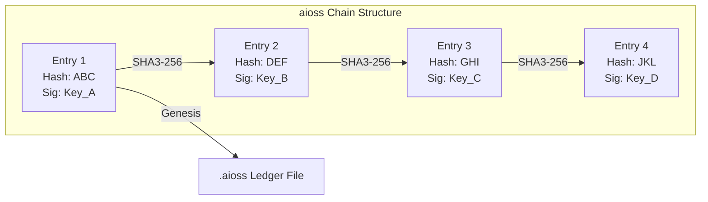
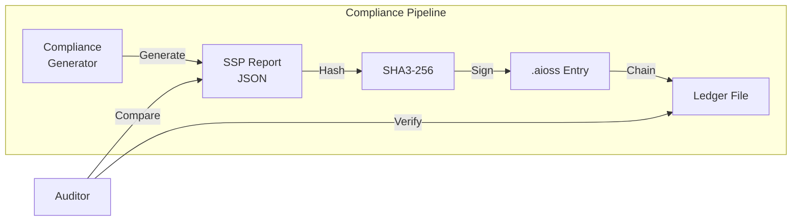

# aioss-format — Tamper-Evident Proof-of-Usefulness Ledger

The `.aioss` format is the cryptographic backbone of the Anticloud ecosystem. It's a tamper-evident ledger format that chains SHA3-256 hashes and Ed25519 signatures into an immutable sequence — without the energy waste or complexity of conventional blockchains.

{/* truncate */}

## What is a Proof-of-Usefulness Ledger?

Unlike proof-of-work or proof-of-stake, the `.aioss` format implements proof-of-usefulness: each ledger entry contains a cryptographic hash of meaningful work — a build artifact, an audit finding, a model training checkpoint, or a compliance report. The ledger doesn't just prove that work happened; it proves what the work produced and who produced it.



## How It Works

Each `.aioss` entry contains:

- **Previous hash**: SHA3-256 of the preceding entry's full content
- **Timestamp**: Unix epoch in nanoseconds
- **Public key**: Ed25519 public key of the signing entity
- **Signature**: Ed25519 signature over the entry fields
- **Payload hash**: SHA3-256 of the associated work artifact
- **Metadata**: Type tag, version, and optional reference URL

The chain structure ensures that modifying any entry invalidates all subsequent entries. Verification requires only the public keys of the signers — no network consensus, no mining, no global state.

## Applications Across the Ecosystem

### Build Integrity

Every Anticloud project signs build artifacts with `.aioss` entries. Users verify that the binary they downloaded matches the source exactly, with a cryptographic chain back to the original commit.

```
Binary → SHA3-256 → Payload hash → .aioss entry → Git commit
```

### AI Training Verification

Integ11ect logs each model training run to a `.aioss` chain. The ledger records the training data hash, model architecture hash, hyperparameters, and test results. This creates a verifiable, tamper-evident audit trail for AI governance.

### Compliance Audits

Compliance tools like the SSP Generator and Compliance Gap Analyzer output `.aioss`-signed reports. Auditors verify report integrity without needing to trust the tool that generated it.



## Why Not a Blockchain?

Conventional blockchains solve the Byzantine Generals Problem — agreeing on state across untrusted parties. The `.aioss` format solves a different problem: proving that a specific piece of work happened at a specific time by a specific identity. Blockchain overhead (consensus, mining, gas fees, forks) is unnecessary when the goal is individual verifiability, not global consensus.

## Format Specification

An `.aioss` file is a sequence of newline-delimited JSON objects:

```json
{"prev":"abc123...","time":1719212345678,"key":"ed25519:...","sig":"sig:...","payload":"sha256:...","type":"build-artifact","ver":"1.0"}
```

Each entry is self-contained: the `prev` field references the previous entry's SHA3-256, the `key` identifies the signer, and the `sig` proves the entry was authorized by that key.

## Getting Started

The `.aioss` format specification and reference implementation are available on GitHub:

```
git clone https://github.com/kleinnner/Anticloud.git
cd Anticloud/05-aioss-format
```

See the [aioss-format documentation](/docs/projects/aioss-format) for the complete specification and integration guide.

## Related Projects

- [Integ11ect](/docs/projects/inte11ect) — AI gateway with .aioss training audit trails
- [Kathon](/docs/projects/kathon) — Anti-enshittification engine logs detections to .aioss
- [SSP Generator](/docs/tools/compliance/ssp-generator) — Compliance reports signed with .aioss


```
.====================================================================.
!  Made in the UAE, Dubai #DubaiIt #Dubai #Dxb #SovereignAI          !
!  Made in The Emirates #Dubai_it                                    !
!                                                                    !
!  Lois-Kleinner Alpasan - The Anticloud 2026-                       !
!                                                                    !
!  As seen on:                                                       !
!  Harvard Dataverse ! Zenodo/CERN ! Academia.edu ! HuggingFace      !
!  anticloud.telepedia.net ! anticloud.fandom.com                    !
!                                                                    !
!  0-1.gg ! GitHub ! LinkedIn ! DEV ! GH Pages                       !
!  HuggingFace ! Blog ! Bluesky ! Mastodon                           !
!  Internet Archive ! ORCID ! Figshare                               !
!                                                                    !
!  Sovereign AI ! Local-First ! Privacy ! Zero Trust ! No Datacenter !
!  Air-Gapped ! Open Source ! Rust ! Hash Chain ! Single Binary      !
!  Offline LLM ! Crypto Ledger ! P2P ! Federated                     !
'===================================================================='
```

Lois-Kleinner Alpasan, 22, builds sovereign AI infrastructure and cryptographic audit systems. His work spans formats, proptech, and research platforms serving projects valued at over $1B combined, operating at the intersection of AI, media, and decentralized technology.

References:
1. Lois-Kleinner Zenodo: https://doi.org/10.5281/zenodo.20781790
2. Lois-Kleinner GitHub: https://github.com/kleinnner/Anticloud/tree/main/04-aioss-format
3. Lois-Kleinner Harvard DV: https://doi.org/10.7910/DVN/GDLO0L
4. Lois-Kleinner Internet Arc: https://archive.org/details/aioss-format
5. Lois-Kleinner ORCID: https://orcid.org/0009-0009-2233-6107
6. Lois-Kleinner DEV.to: https://dev.to/kleinner
7. Lois-Kleinner LinkedIn: https://linkedin.com/in/kleinner
8. Lois-Kleinner HuggingFace: https://huggingface.co/Anticloud
9. Lois-Kleinner Tumblr: https://anticloud.tumblr.com
10. Lois-Kleinner Mastodon: https://mastodon.social/@kleinner
11. Lois-Kleinner Bluesky: https://bsky.app/profile/kleinner.bsky.social
12. 0-1.gg: https://0-1.gg
13. Lois-Kleinner Figshare: https://figshare.com/authors/Lois-Kleinner_Alpasan/20849885
14. Lois-Kleinner Academia: https://independent.academia.edu/kleinner
15. Lois-Kleinner Telepedia: https://anticloud.telepedia.net/wiki/Anticloud_by_Lois-Kleinner_Wiki
16. Lois-Kleinner Fandom: https://anticloud.fandom.com
17. AIOSS Offline Verification Kit: https://dataverse.harvard.edu/dataset.xhtml?persistentId=doi:10.7910/DVN/OORKNJ