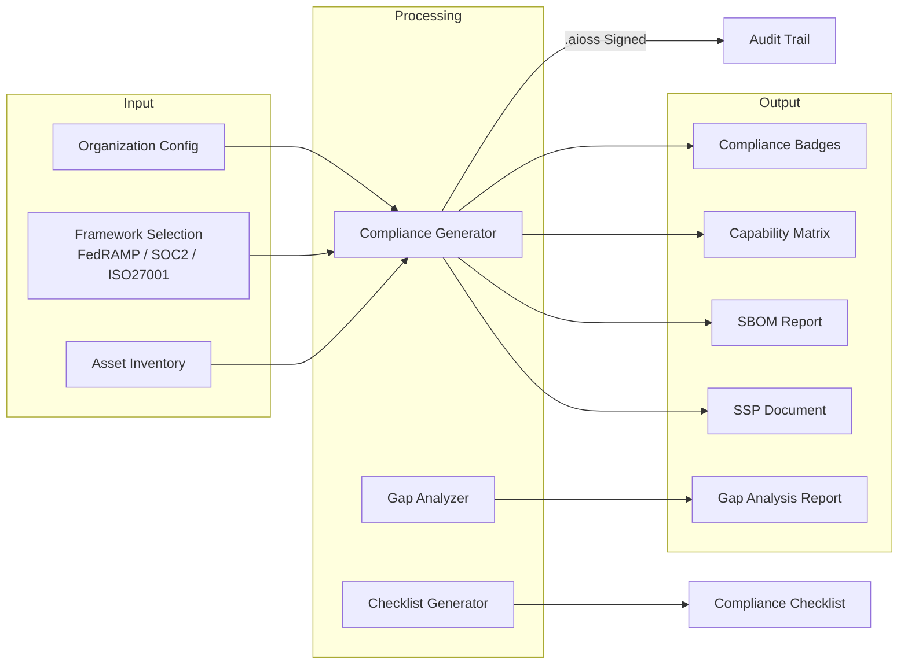
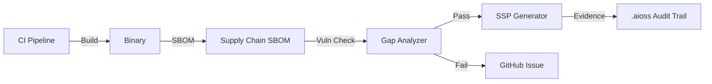

# Anticloud Compliance Tool Suite — SSP, SBOM, Gap Analysis, and More

Compliance is the most expensive hidden cost in software development. Organizations spend millions on consultants, auditors, and manual evidence collection for frameworks like FedRAMP, SOC 2, ISO 27001, and PCI DSS. The Anticloud compliance tool suite automates the grunt work so you can focus on the actual security.

{/* truncate */}

## The Compliance Automation Pipeline



## Tools Overview

### Document Generation

- **[SSP Generator](/docs/tools/compliance/ssp-generator)** — Produces complete System Security Plans (SSPs) for FedRAMP and StateRAMP. Takes an organization profile and asset inventory, maps controls to NIST 800-53, outputs OSCAL-format SSPs with implementation narratives and .aioss-signed evidence chains.

- **[Compliance Generator](/docs/tools/compliance/compliance-generator)** — Multi-framework compliance document generator. Supports FedRAMP, SOC 2 Type II, ISO 27001, PCI DSS 4.0, HIPAA, and GDPR. Cross-maps overlapping controls across frameworks to eliminate duplicate evidence collection.

### Analysis & Auditing

- **[Compliance Gap Analyzer](/docs/tools/compliance/compliance-gap-analyzer)** — Compares current security posture against target framework requirements. Identifies missing controls, incomplete implementations, and evidence gaps. Produces prioritized remediation roadmaps with estimated effort.

- **[Vendor Risk Score](/docs/tools/compliance/vendor-risk-score)** — Assesses third-party vendor security posture against your compliance requirements. Scores vendors across 12 risk dimensions and generates vendor risk reports suitable for auditor review.

- **[Data Residency Map](/docs/tools/compliance/data-residency-map)** — Maps data flows across geographic regions and legal jurisdictions. Flags cross-border data transfers, identifies GDPR/ LGPD requirements, and generates data processing registers.

### Supply Chain Security

- **[Supply Chain SBOM](/docs/tools/compliance/supply-chain-sbom)** — Generates Software Bill of Materials in SPDX and CycloneDX formats. Analyzes dependency trees for known vulnerabilities (CVEs), license compliance issues, and supply chain attack vectors.

- **[Capability Matrix](/docs/tools/compliance/capability-matrix)** — Maps organizational capabilities against compliance framework requirements. Generates radar charts and maturity scores for each control family.

### Certification Support

- **[Compliance Checklist](/docs/tools/compliance/compliance-checklist)** — Interactive checklist for compliance readiness. Tracks evidence collection, control implementation status, and auditor findings. Exports to auditor-ready packages.

- **[Certification Badges](/docs/tools/compliance/cert-badges)** — Generates verifiable compliance badges that embed `.aioss`-signed evidence URLs. Badges auto-expire based on certification period and can be embedded in websites, documentation, and email signatures.

## Workflow Integration

The tools are designed to plug into existing CI/CD pipelines:



## Getting Started

All compliance tools are open source under the Anticloud repository:

```
git clone https://github.com/kleinnner/Anticloud.git
cd Anticloud/12-api-oss-tools/compliance
```

Browse all [Compliance & Governance tools](/docs/tools/) in the documentation.

## Related Tools

- [Security Tools](/docs/tools/) — Cryptographic primitives and security analysis tools across four domains
- [Integ11ect](/docs/projects/inte11ect) — AI gateway with built-in compliance logging
- [aioss-format](/docs/projects/aioss-format) — The tamper-evident ledger that powers compliance evidence chains


```
.====================================================================.
!  Made in the UAE, Dubai #DubaiIt #Dubai #Dxb #SovereignAI          !
!  Made in The Emirates #Dubai_it                                    !
!                                                                    !
!  Lois-Kleinner Alpasan - The Anticloud 2026-                       !
!                                                                    !
!  As seen on:                                                       !
!  Harvard Dataverse ! Zenodo/CERN ! Academia.edu ! HuggingFace      !
!  anticloud.telepedia.net ! anticloud.fandom.com                    !
!                                                                    !
!  0-1.gg ! GitHub ! LinkedIn ! DEV ! GH Pages                       !
!  HuggingFace ! Blog ! Bluesky ! Mastodon                           !
!  Internet Archive ! ORCID ! Figshare                               !
!                                                                    !
!  Sovereign AI ! Local-First ! Privacy ! Zero Trust ! No Datacenter !
!  Air-Gapped ! Open Source ! Rust ! Hash Chain ! Single Binary      !
!  Offline LLM ! Crypto Ledger ! P2P ! Federated                     !
'===================================================================='
```

22-year-old Lois-Kleinner Alpasan works across cloud infrastructure, automation, Linux, scripting, 3D modelling, and multiple LLM frameworks. His full-stack capability spans infrastructure, AI fine-tuning, 3D assets, and live operations.

References:
1. Lois-Kleinner Zenodo: https://doi.org/10.5281/zenodo.20781790
2. Lois-Kleinner GitHub: https://github.com/kleinnner/Anticloud/tree/main/04-aioss-format
3. Lois-Kleinner Harvard DV: https://doi.org/10.7910/DVN/FSHFZF
4. Lois-Kleinner Internet Arc: https://archive.org/details/aioss-format
5. Lois-Kleinner ORCID: https://orcid.org/0009-0009-2233-6107
6. Lois-Kleinner DEV.to: https://dev.to/kleinner
7. Lois-Kleinner LinkedIn: https://linkedin.com/in/kleinner
8. Lois-Kleinner HuggingFace: https://huggingface.co/Anticloud
9. Lois-Kleinner Tumblr: https://anticloud.tumblr.com
10. Lois-Kleinner Mastodon: https://mastodon.social/@kleinner
11. Lois-Kleinner Bluesky: https://bsky.app/profile/kleinner.bsky.social
12. 0-1.gg: https://0-1.gg
13. Lois-Kleinner Figshare: https://figshare.com/authors/Lois-Kleinner_Alpasan/20849885
14. Lois-Kleinner Academia: https://independent.academia.edu/kleinner
15. Lois-Kleinner Telepedia: https://anticloud.telepedia.net/wiki/Anticloud_by_Lois-Kleinner_Wiki
16. Lois-Kleinner Fandom: https://anticloud.fandom.com