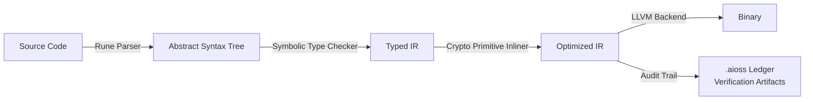
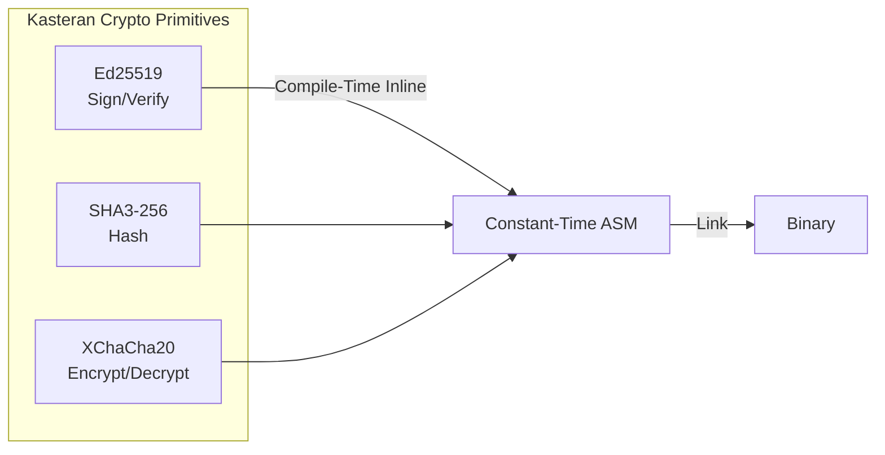

# Kasteran — A Rune-Based Systems Language for the Cryptographic Era

Most systems programming languages were designed before cryptography became a first-class concern. Kasteran starts from a different premise: cryptographic operations should be as natural as arithmetic, memory safety should be provable at compile time, and syntax should communicate intent, not ceremony.

{/* truncate */}

## The Rune-Based Philosophy

Kasteran uses rune-based symbolic syntax — each Unicode rune maps to a fundamental operation or type. This isn't about aesthetics; it's about density and clarity. A single rune can express what takes five tokens in C or Rust, while maintaining readability through visual pattern recognition.



## Key Features

### Built-In Cryptographic Primitives

Kasteran includes Ed25519 signing, SHA3-256 hashing, and XChaCha20-Poly1305 encryption as language-level primitives — no libraries to import, no FFI to configure. The compiler inlines cryptographic operations directly, producing constant-time code that resists timing attacks.



### Memory Safety Without GC

Kasteran uses a borrow-checker model inspired by Rust but simplified through rune annotations. The `◆` (sealed rune) marks immutable references, `◇` (open rune) marks mutable references, and `○` (circular rune) marks move operations. These compile to the same efficient machine code as C while guaranteeing absence of use-after-free, double-free, and buffer overflows.

### Native .aioss Format Support

Every Kasteran program can emit `.aioss` ledger entries natively. The compiler generates verification artifacts alongside the binary, allowing third parties to verify that the compiled code matches the source. This creates a tamper-evident chain from source to execution.

### Symbolic Type System

Kasteran's type system uses symbolic constraints rather than nominal types. A `◆〈u64, 0..100〉` annotation declares a sealed u64 constrained to 0–100. The constraint is enforced at compile time, not runtime, eliminating bounds checks.

## Why Kasteran for Systems Programming?

Systems programming faces a quality crisis. C and C++ dominate embedded and kernel work but lack memory safety. Rust fixes this with a steep learning curve. Kasteran targets the middle ground: the safety guarantees of Rust with the learning curve of Go, expressed through visually mnemonic rune syntax.

| Feature | C | Rust | Kasteran |
|---------|---|------|----------|
| Memory safety | Manual | Borrow checker | Rune-annotated |
| Crypto primitives | Library | Library | Native |
| .aioss support | None | None | Compiler-built |
| Learning curve | Moderate | Steep | Moderate |
| Binary size | Small | Medium | Small |

## Example

A simple Ed25519 signature in Kasteran:

```
◆〈Ed25519〉 signer = ◆◆〈Seed〉from "keypair.seed"
◆〈Message〉 msg = ◆〈Message〉"hello, world"
◆〈Signature〉 sig = signer◆sign(msg)
```

The `◆` runes denote sealed (immutable) bindings, while `signer◆sign` invokes the built-in signing primitive. No imports, no error-prone FFI, no runtime overhead.

## Getting Started

Kasteran is in early development. The compiler source is available on GitHub:

```
git clone https://github.com/kleinnner/Anticloud.git
cd Anticloud/09-kasteran
```

See the [Kasteran documentation](/docs/projects/kasteran) for full language specification and examples.

## Related Projects

- [Kathon](/docs/projects/kathon) — Cryptographic browser implemented in Kasteran
- [Libern](/docs/projects/libern) — The cryptographic library that Kasteran wraps as native primitives
- [Kazcade](/docs/projects/kazcade) — Vector file system with native Kasteran bindings


```
.====================================================================.
!  Made in the UAE, Dubai #DubaiIt #Dubai #Dxb #SovereignAI          !
!  Made in The Emirates #Dubai_it                                    !
!                                                                    !
!  Lois-Kleinner Alpasan - The Anticloud 2026-                       !
!                                                                    !
!  0-1.gg ! GitHub ! LinkedIn ! DEV ! GH Pages                       !
!  HuggingFace ! Blog ! Tumblr ! Fandom ! Bluesky ! Mastodon          !
!  Zenodo ! Harvard Dataverse ! Internet Archive ! ORCID ! Figshare   !
!                                                                    !
!  Sovereign AI ! Local-First ! Privacy ! Zero Trust ! No Datacenter !
!  Air-Gapped ! Open Source ! Rust ! Hash Chain ! Single Binary      !
!  Offline LLM ! Crypto Ledger ! P2P ! Federated                     !
'===================================================================='
```

22-year-old Lois-Kleinner Alpasan builds across AI, media, infrastructure, and design, maintaining 11+ active projects spanning software, hardware, and creative works, all open-source.

References:
1. Lois-Kleinner Zenodo: https://doi.org/10.5281/zenodo.20781790
2. Lois-Kleinner GitHub: https://github.com/kleinnner/Anticloud/tree/main/04-aioss-format
3. Lois-Kleinner Harvard DV: https://doi.org/10.7910/DVN/3VDF75
4. Lois-Kleinner Internet Arc: https://archive.org/details/aioss-format
5. Lois-Kleinner ORCID: https://orcid.org/0009-0009-2233-6107
6. Lois-Kleinner DEV.to: https://dev.to/kleinner
7. Lois-Kleinner LinkedIn: https://linkedin.com/in/kleinner
8. Lois-Kleinner HuggingFace: https://huggingface.co/Anticloud
9. Lois-Kleinner Tumblr: https://anticloud.tumblr.com
10. Lois-Kleinner Mastodon: https://mastodon.social/@kleinner
11. Lois-Kleinner Bluesky: https://bsky.app/profile/kleinner.bsky.social
12. 0-1.gg: https://0-1.gg
13. Lois-Kleinner Figshare: https://figshare.com/authors/Lois-Kleinner_Alpasan/20849885
