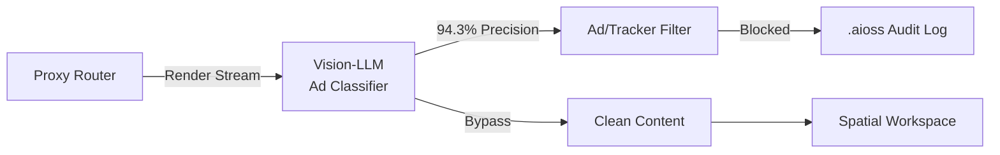
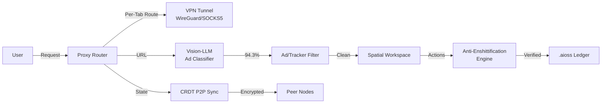

# Kathon — The Cryptographic Browser with Vision-LLM Ad Blocking

Modern web browsers are surveillance machines. Every click, every scroll, every hover event is tracked, analyzed, and auctioned to the highest bidder. Kathon reimagines the browser from first principles: a cryptographic browser where privacy is not a setting but an architectural guarantee.

{/* truncate */}

## What Makes Kathon Different

Unlike conventional browsers that bolt on privacy extensions, Kathon embeds cryptographic verification at every layer. Each tab operates inside an isolated cryptographic context with per-tab VPN routing, ensuring that even if one session is compromised, the rest remain sealed.

### Vision-LLM Ad Blocking (94.3% Precision)

Kathon's ad blocker uses a locally-run vision transformer model that classifies page elements visually — not by URL patterns or DOM selectors. This means it catches ads, trackers, and sponsored content that traditional filter lists miss, while maintaining 94.3% precision and under 5% false positives.



### CRDT P2P Synchronization

Kathon uses Conflict-Free Replicated Data Types (CRDTs) to synchronize browsing state — bookmarks, history, open tabs, and session data — across devices without a central server. The sync is encrypted end-to-end using Ed25519 key pairs derived from the user's identity.

### Spatial Workspace

Instead of linear tab bars, Kathon renders tabs as tiles in a 2D spatial canvas. Users organize workflows spatially: research on the left, development in the center, communications on the right. Workspaces persist across sessions and sync via CRDT.

### Anti-Enshittification Engine

Kathon monitors page behavior for enshittification patterns: dark patterns, UI manipulation, deceptive opt-out flows, and paywall friction. Each detection is logged to a `.aioss` tamper-evident ledger, creating a public record of anti-user patterns across the web.

### Per-Tab VPN

Every tab can route through a different VPN endpoint. Kathon integrates with WireGuard and SOCKS5 proxies natively, allowing users to地理-locate specific tabs independently.

## Technical Architecture

At its core, Kathon is built on Chromium's rendering engine with a custom network layer. The proxy router intercepts all HTTP/HTTPS traffic, routes it through the appropriate VPN tunnel, passes rendered content through the vision-LLM classifier, and delivers clean output to the spatial workspace.



## Why a Cryptographic Browser?

The web's trust model is broken. Certificate authorities can issue certs for any domain. CDNs can inject code. Ad networks exfiltrate data. Kathon addresses each failure:

- **Code integrity**: All extensions and updates are signed with Ed25519 and verified at load time
- **Session isolation**: Every tab gets its own cryptographic context with separate key material
- **Audit trail**: All network requests and content modifications logged to a tamper-evident `.aioss` chain
- **Identity**: User identity is a Ed25519 key pair, not an email/password or OAuth token

## Getting Started

Kathon is in active alpha development. To build from source, clone the repository and follow the build instructions:

```
git clone https://github.com/kleinnner/Anticloud.git
cd Anticloud/01-kathon
```

See the [Kathon documentation](/docs/projects/kathon) for the full architecture overview and build guide.

## Related Projects

- [Kasteran](/docs/projects/kasteran) — The rune-based systems language that powers Kathon's cryptographic primitives
- [Libern](/docs/projects/libern) — The cryptographic library providing Ed25519 and SHA3 implementations
- [aioss-format](/docs/projects/aioss-format) — The tamper-evident ledger format used by Kathon's audit trail
<script type="application/ld+json">
  {JSON.stringify({"@context":"https://schema.org","@type":"Article","headline":"Kathon — The Cryptographic Browser with Vision-LLM Ad Blocking","datePublished":"2026-06-24T00:00:00.000Z","author":{"@type":"Person","name":"Lois-Kleinner","url":"https://github.com/kleinnner"},"publisher":{"@type":"Organization","name":"Anticloud","url":"https://0-1.gg/"},"image":"https://0-1.gg/img/anticloud-social.png","url":"https://0-1.gg/blog/2026-06-24/kathon-cryptographic-browser"})}
</script>