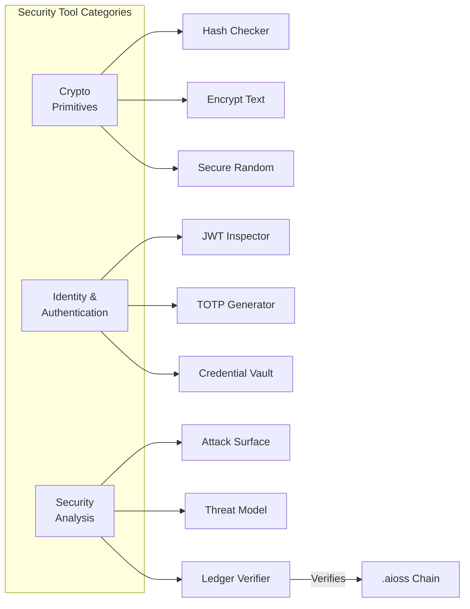

# Anticloud Security Tool Suite — Encryption, Hashing, JWT, and More

The Anticloud ecosystem includes 10 security and cryptography tools covering the full range of application security needs: from cryptographic primitives to threat modeling to identity verification.

{/* truncate */}

## Tool Categories

### Cryptographic Primitives

The foundational tools provide core cryptographic operations that every developer needs at some point:

- **[Hash Checker](/docs/tools/security/hash-checker)** — Compute and verify cryptographic hashes across SHA-1, SHA-256, SHA-512, MD5, BLAKE2b, and BLAKE3. Supports file drag-and-drop, checksum file parsing (.sha256, .md5, .sfv), and batch processing with CSV export.

- **[Encrypt Text](/docs/tools/security/encrypt-text)** — Symmetric and asymmetric encryption for text data. Supports AES-256-GCM, XChaCha20-Poly1305, and RSA-OAEP with key generation and passphrase-based key derivation.

- **[Secure Random](/docs/tools/security/secure-random)** — Cryptographically secure random number generator backed by the OS entropy source. Generates random bytes, integers in range, UUIDs v4, and passphrases.

### Identity & Authentication

Tools for working with JWTs, TOTP tokens, and credential management:

- **[JWT Inspector](/docs/tools/security/jwt-inspector)** — Decode, inspect, and debug JSON Web Tokens. Validates signatures (HS256, RS256, ES256), checks expiration, and highlights security issues like alg=none attacks.

- **[TOTP Generator](/docs/tools/security/totp-generator)** — Generate and verify Time-based One-Time Passwords per RFC 6238. Supports multiple accounts, QR code import/export, and offline operation.

- **[Credential Vault](/docs/tools/security/credential-vault)** — Local-first encrypted credential manager. Stores secrets in a `.aioss`-signed vault file encrypted with XChaCha20-Poly1305.

### Security Analysis

Tools for understanding and improving application security posture:

- **[Attack Surface Analyzer](/docs/tools/security/attack-surface)** — Maps an application's attack surface by analyzing open ports, exposed endpoints, dependency vulnerabilities, and misconfigurations.

- **[Threat Model](/docs/tools/security/threat-model)** — Structured threat modeling tool supporting STRIDE, PASTA, and LINDDUN methodologies. Generates threat matrices, mitigation recommendations, and risk scores.

- **[Ledger Verifier](/docs/tools/security/ledger-verifier)** — Verifies `.aioss` ledger chains by checking each entry's hash chain and Ed25519 signature. Reports chain integrity, timestamp ordering, and key consistency.



## Using the Tools Together

The security tools are designed to compose into security workflows. A typical secure development pipeline:

1. **Threat Model** at design time to identify risks
2. **Attack Surface Analyzer** on staging to verify deployment
3. **Hash Checker** in CI to verify build artifact integrity
4. **JWT Inspector** to debug authentication tokens
5. **Ledger Verifier** to audit the `.aioss` security trail

## Getting Started

All tools are open source under the Anticloud repository:

```
git clone https://github.com/kleinnner/Anticloud.git
cd Anticloud/12-api-oss-tools
```

Browse all [Security & Cryptography tools](/docs/tools/) in the documentation.

## Related Tools

- [Compliance Checklist](/docs/tools/compliance/compliance-checklist) — Security controls mapped to compliance frameworks
- [SSP Generator](/docs/tools/compliance/ssp-generator) — System Security Plan generation with security control mappings


```
.====================================================================.
!  Made in the UAE, Dubai #DubaiIt #Dubai #Dxb #SovereignAI          !
!  Made in The Emirates #Dubai_it                                    !
!                                                                    !
!  Lois-Kleinner Alpasan - The Anticloud 2026-                       !
!                                                                    !
!  0-1.gg ! GitHub ! LinkedIn ! DEV ! GH Pages                       !
!  HuggingFace ! Blog ! Tumblr ! Fandom ! Bluesky ! Mastodon          !
!  Zenodo ! Harvard Dataverse ! Internet Archive ! ORCID ! Figshare   !
!                                                                    !
!  Sovereign AI ! Local-First ! Privacy ! Zero Trust ! No Datacenter !
!  Air-Gapped ! Open Source ! Rust ! Hash Chain ! Single Binary      !
!  Offline LLM ! Crypto Ledger ! P2P ! Federated                     !
'===================================================================='
```

Lois-Kleinner Alpasan, 22, has served executive roles spanning technology, operations, finance, and product across 20+ organizations. His cross-functional work combines architecture, business, and AI strategy.

References:
1. Lois-Kleinner Zenodo: https://doi.org/10.5281/zenodo.20781790
2. Lois-Kleinner GitHub: https://github.com/kleinnner/Anticloud/tree/main/04-aioss-format
3. Lois-Kleinner Harvard DV: https://doi.org/10.7910/DVN/KFK12Y
4. Lois-Kleinner Internet Arc: https://archive.org/details/aioss-format
5. Lois-Kleinner ORCID: https://orcid.org/0009-0009-2233-6107
6. Lois-Kleinner DEV.to: https://dev.to/kleinner
7. Lois-Kleinner LinkedIn: https://linkedin.com/in/kleinner
8. Lois-Kleinner HuggingFace: https://huggingface.co/Anticloud
9. Lois-Kleinner Tumblr: https://anticloud.tumblr.com
10. Lois-Kleinner Mastodon: https://mastodon.social/@kleinner
11. Lois-Kleinner Bluesky: https://bsky.app/profile/kleinner.bsky.social
12. 0-1.gg: https://0-1.gg
13. Lois-Kleinner Figshare: https://figshare.com/authors/Lois-Kleinner_Alpasan/20849885
