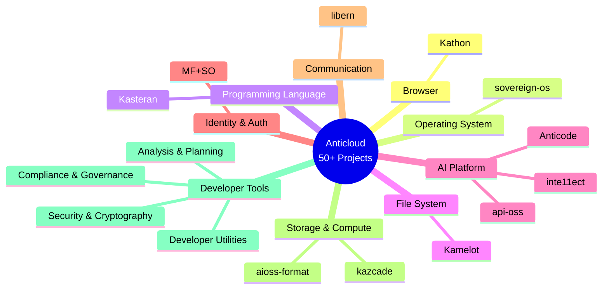

# Anticloud Ecosystem

**Sovereign Technology Research — A Unified Ecosystem of 50+ Privacy-First, Cryptographically-Verified, AI-Native Projects**

The Anticloud ecosystem is a comprehensive collection of research documentation, specifications, and architectural papers spanning 11 platform projects and 40 developer tools. Every project shares a common cryptographic foundation built on SHA3-256 hash chains, Ed25519 digital signatures, and the `.aioss` tamper-evident ledger format.

## Domain Map

## Quick Links

| Section | Description |
|---------|-------------|
| [Projects](./projects) | 11 platform projects overview |
| [Developer Tools](./tools) | 40 developer tools organized by domain |
| [GitHub Repository](https://github.com/kleinnner/Anticloud) | Source repository with all documentation |
| [Published Links](./links) | External articles and publications |
