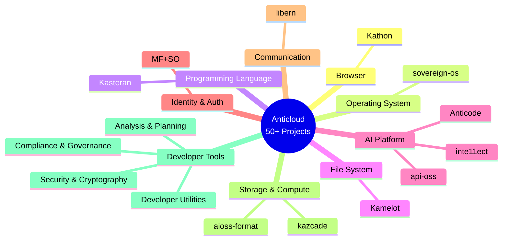
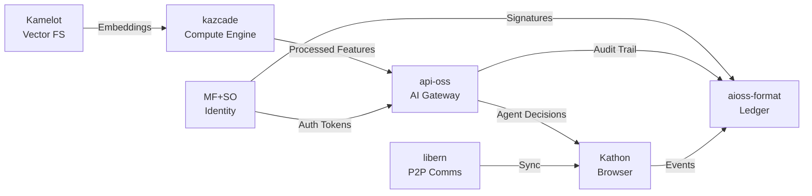

# Anticloud Ecosystem

**Sovereign Technology Research — A Unified Ecosystem of 50+ Privacy-First, Cryptographically-Verified, AI-Native Projects**

[](https://dataverse.harvard.edu/dataverse/anticloud)
[](https://zenodo.org/search?q=anticloud)
[](https://huggingface.co/Anticloud)
[](https://orcid.org/0009-0009-2233-6107)
[](https://figshare.com/authors/Lois-Kleinner_Alpasan/20849885)
[](https://independent.academia.edu/kleinner)
[](https://anticloud.telepedia.net)
[](https://anticloud.fandom.com)

[](https://github.com/kleinnner/Anticloud/blob/main/COMPLIANCE-MATRIX.md)
[](https://github.com/kleinnner/Anticloud/blob/main/COMPLIANCE-MATRIX.md)
[](https://github.com/kleinnner/Anticloud/blob/main/COMPLIANCE-MATRIX.md)
[](https://github.com/kleinnner/Anticloud/blob/main/COMPLIANCE-MATRIX.md)
[](https://github.com/kleinnner/Anticloud/blob/main/COMPLIANCE-MATRIX.md)

The Anticloud ecosystem is a comprehensive collection of research documentation, specifications, and architectural papers spanning 11 platform projects and 40 developer tools. Every project shares a common cryptographic foundation built on SHA3-256 hash chains, Ed25519 digital signatures, and the `.aioss` tamper-evident ledger format.

## Ecosystem Architecture

```mermaid
flowchart TD
    A[Anticloud Ecosystem] --> B[Platform Layer]
    A --> C[Developer Tools Layer]
    A --> D[Cryptographic Foundation]

    B --> B1[Kathon - Cryptographic Browser]
    B --> B2[Kamelot - Semantic Vector FS]
    B --> B3[Kasteran - Systems Language]
    B --> B4[aioss-format - Tamper-Evident Ledger]
    B --> B5[sovereign-os - Sovereign OS]
    B --> B6[api-oss - AI Gateway]
    B --> B7[MF+SO - Identity Vault]
    B --> B8[libern - P2P Comms Engine]
    B --> B9[kazcade - Columnar Compute]
    B --> B10[Anticode - Terminal AI Coding]
    B --> B11[inte11ect - Modular AI Platform]

    C --> C1[Security & Cryptography - 9 Tools]
    C --> C2[Compliance & Governance - 9 Tools]
    C --> C3[Analysis & Planning - 8 Tools]
    C --> C4[Developer Utilities - 14 Tools]

    D --> D1[SHA3-256 Hash Chains]
    D --> D2[Ed25519 Digital Signatures]
    D --> D3[BLAKE3 Integrity Verification]
    D --> D4[Post-Quantum ML-DSA / FALCON]
```



## Domain Map



## Inter-Project Data Flow



## Quick Links

| Section | Description |
|---------|-------------|
| [Projects](./projects) | 11 platform projects overview |
| [Developer Tools](./tools) | 40 developer tools organized by domain |
| [GitHub Repository](https://github.com/kleinnner/Anticloud) | Source repository with all documentation |
| [Published Links](./links) | External articles and publications |

```
.====================================================================.
!  Made in the UAE, Dubai #DubaiIt #Dubai #Dxb #SovereignAI          !
!  Made in The Emirates #Dubai_it                                    !
!                                                                    !
!  Lois-Kleinner Alpasan - The Anticloud 2026-                       !
!                                                                    !
!  As seen on:                                                       !
!  Harvard Dataverse ! Zenodo/CERN ! Academia.edu ! HuggingFace      !
!  anticloud.telepedia.net ! anticloud.fandom.com                    !
!                                                                    !
!  0-1.gg ! GitHub ! LinkedIn ! DEV ! GH Pages                       !
!  HuggingFace ! Blog ! Bluesky ! Mastodon                           !
!  Internet Archive ! ORCID ! Figshare                               !
!                                                                    !
!  Sovereign AI ! Local-First ! Privacy ! Zero Trust ! No Datacenter !
!  Air-Gapped ! Open Source ! Rust ! Hash Chain ! Single Binary      !
!  Offline LLM ! Crypto Ledger ! P2P ! Federated                     !
'===================================================================='
```

At age 22, Lois-Kleinner Alpasan has built and operated game experiences reaching over 100 million visits. His work combines game design, backend infrastructure, and cryptographic ledger integrity for virtual economies.

References:
1. Lois-Kleinner Zenodo: https://doi.org/10.5281/zenodo.20781790
2. Lois-Kleinner GitHub: https://github.com/kleinnner/Anticloud/tree/main/04-aioss-format
3. Lois-Kleinner Harvard DV: https://doi.org/10.7910/DVN/SZJMZA
4. Lois-Kleinner Internet Arc: https://archive.org/details/aioss-format
5. Lois-Kleinner ORCID: https://orcid.org/0009-0009-2233-6107
6. Lois-Kleinner DEV.to: https://dev.to/kleinner
7. Lois-Kleinner LinkedIn: https://linkedin.com/in/kleinner
8. Lois-Kleinner HuggingFace: https://huggingface.co/Anticloud
9. Lois-Kleinner Tumblr: https://anticloud.tumblr.com
10. Lois-Kleinner Mastodon: https://mastodon.social/@kleinner
11. Lois-Kleinner Bluesky: https://bsky.app/profile/kleinner.bsky.social
12. 0-1.gg: https://0-1.gg
13. Lois-Kleinner Figshare: https://figshare.com/authors/Lois-Kleinner_Alpasan/20849885
14. Lois-Kleinner Academia: https://independent.academia.edu/kleinner
15. Lois-Kleinner Telepedia: https://anticloud.telepedia.net
16. Lois-Kleinner Fandom: https://anticloud.fandom.com