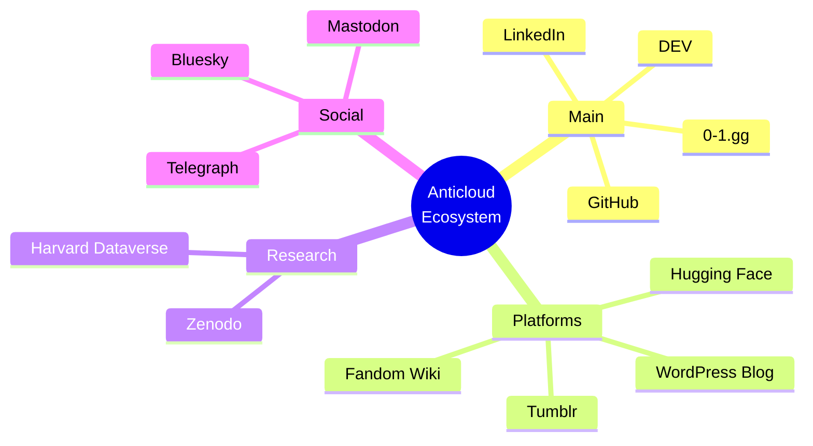

# Published Links

External articles, research papers, and publications from the Anticloud ecosystem.

## Ecosystem Map

## Main Profiles

| Platform | Link |
|----------|------|
| Main Site | https://0-1.gg |
| LinkedIn | https://linkedin.com/in/kleinner |
| GitHub | https://github.com/kleinnner/Anticloud |
| DEV | https://dev.to/kleinner |

## Platforms

| Platform | Link |
|----------|------|
| Hugging Face | https://huggingface.co/Anticloud |
| Blog (WordPress) | https://anticlouds.wordpress.com |
| Tumblr | http://anticloud.tumblr.com |
| Wiki (Fandom) | https://anticloud.fandom.com |
| Bluesky | https://bsky.app/profile/kleinner.bsky.social |
| Mastodon | https://mastodon.social/@kleinner |
| Telegraph | https://telegra.ph/kleinner |

## Research Repositories

| Platform | Link |
|----------|------|
| Zenodo | https://zenodo.org/search?q=anticloud |
| Harvard Dataverse | https://dataverse.harvard.edu/dataverse/anticloud |

## All Links

See [ALL_LINKS.md](https://github.com/kleinner/Anticloud/blob/main/ALL_LINKS.md) for the complete registry of published URLs across all platforms.
