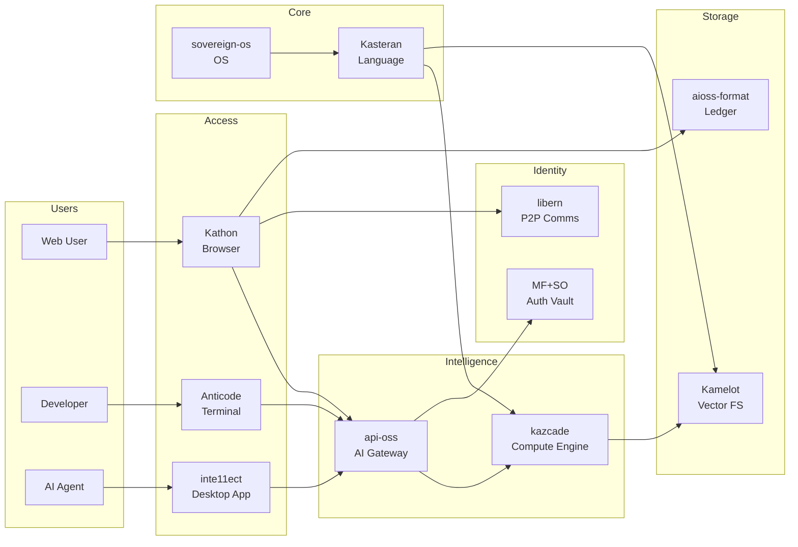

# Platform Projects

The Anticloud ecosystem consists of 11 platform projects spanning browsers, operating systems, programming languages, AI platforms, identity systems, and more.

Each project contains its own README with architecture diagrams, a docs/ directory with detailed documentation, tutorials, quickstart guides, and FAQs.

## Project Architecture Overview

## Project List

| # | Project | Docs | Description |
|---|---------|------|-------------|
| 01 | Kathon | 21 | Cryptographic browser with vision-LLM ad blocking |
| 02 | Kamelot | 99 | Semantic vector file system |
| 03 | Kasteran | 166 | Systems language with rune-based syntax |
| 04 | aioss-format | 35 | Cryptographic ledger format |
| 05 | sovereign-os | 173 | Sovereign operating system |
| 06 | api-oss | 446 | AI gateway with multi-agent councils |
| 07 | MF+SO | 83 | Multi-Factor Sovereign Sign-On |
| 08 | libern | 126 | P2P communication engine |
| 09 | kazcade | 158 | Columnar compute engine |
| 10 | Anticode | 65 | Terminal AI coding engine |
| 11 | inte11ect | 122 | Modular AI platform |

## Shared Foundation

All projects share:
- SHA3-256 hash chains for tamper-evident data structures
- Ed25519 digital signatures for identity and attestation
- .aioss ledger format for cryptographically-verified event logging
- Post-quantum readiness with ML-DSA and FALCON signatures

## Browse on GitHub

See the full documentation for each project on GitHub:
- [01-kathon](https://github.com/kleinnner/Anticloud/tree/main/01-kathon)
- [02-kamelot](https://github.com/kleinnner/Anticloud/tree/main/02-kamelot)
- [03-kasteran](https://github.com/kleinnner/Anticloud/tree/main/03-kasteran)
- [04-aioss-format](https://github.com/kleinnner/Anticloud/tree/main/04-aioss-format)
- [05-sovereign-os](https://github.com/kleinnner/Anticloud/tree/main/05-sovereign-os)
- [06-api-oss](https://github.com/kleinnner/Anticloud/tree/main/06-api-oss)
- [07-mfso](https://github.com/kleinnner/Anticloud/tree/main/07-mfso)
- [08-libern](https://github.com/kleinnner/Anticloud/tree/main/08-libern)
- [09-kazcade](https://github.com/kleinnner/Anticloud/tree/main/09-kazcade)
- [10-anticode](https://github.com/kleinnner/Anticloud/tree/main/10-anticode)
- [11-inte11ect](https://github.com/kleinnner/Anticloud/tree/main/11-inte11ect)
