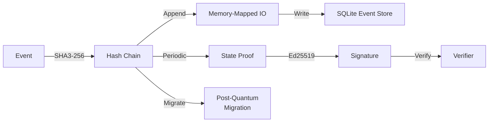

# aioss-format

Dual-Format Cryptographic Ledger with SHA3-256 hash chaining, Ed25519 state proofs, memory-mapped IO, SQLite event store, post-quantum migration support

## Ledger Architecture

## Documentation

View the full documentation for this project on GitHub:
- [Project README](https://github.com/kleinnner/Anticloud/blob/main/04-aioss-format/README.md)
- [Project Directory](https://github.com/kleinnner/Anticloud/tree/main/04-aioss-format)
