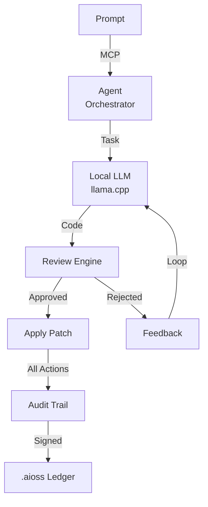

# Anticode

Terminal-Native AI Coding Engine running fully local LLMs, agent system with MCP protocol, cryptographic audit trail for all AI actions

## Agent System Flow

## Documentation

View the full documentation for this project on GitHub:
- [Project README](https://github.com/kleinnner/Anticloud/blob/main/10-anticode/README.md)
- [Project Directory](https://github.com/kleinnner/Anticloud/tree/main/10-anticode)
