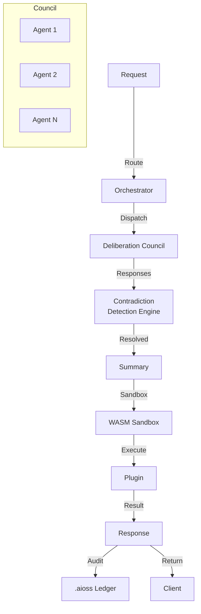

# api-oss

AI Gateway with multi-agent deliberation councils, contradiction detection engine, 162 feature docs, WASM sandbox, 30 research papers

## AI Gateway Pipeline

## Documentation

View the full documentation for this project on GitHub:
- [Project README](https://github.com/kleinnner/Anticloud/blob/main/06-api-oss/README.md)
- [Project Directory](https://github.com/kleinnner/Anticloud/tree/main/06-api-oss)
