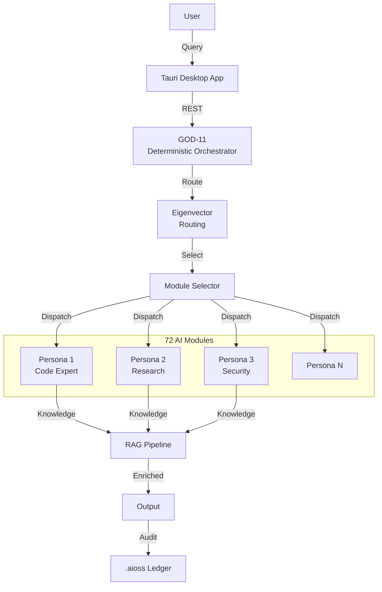

# inte11ect

Modular AI Platform with 72 modules, Eigenvector Routing, GOD-11 deterministic orchestrator, domain-specific AI personas, RAG pipeline, Tauri desktop app

## Orchestrator Architecture

## Documentation

View the full documentation for this project on GitHub:
- [Project README](https://github.com/kleinnner/Anticloud/blob/main/11-inte11ect/README.md)
- [Project Directory](https://github.com/kleinnner/Anticloud/tree/main/11-inte11ect)
