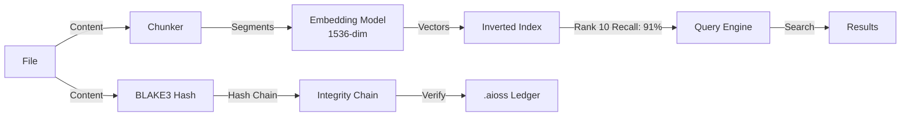

# Kamelot

Semantic Vector File System replacing directory trees with 1536-dim dense embedding search, BLAKE3 hash-chain integrity

## Architecture Flow

## Documentation

View the full documentation for this project on GitHub:
- [Project README](https://github.com/kleinnner/Anticloud/blob/main/02-kamelot/README.md)
- [Project Directory](https://github.com/kleinnner/Anticloud/tree/main/02-kamelot)
