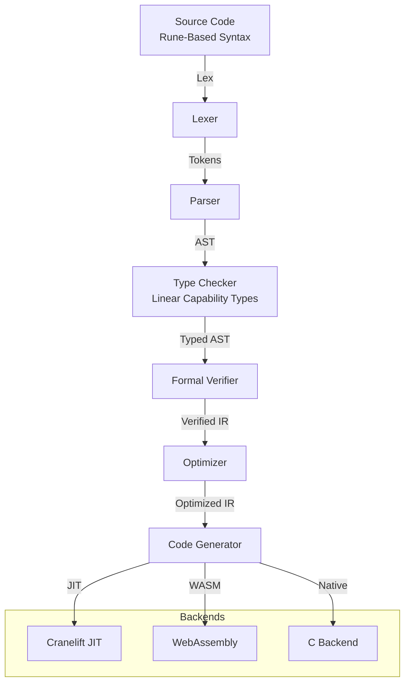

# Kasteran

Systems Language with rune-based symbolic syntax, linear capability types, self-hosted compiler with Cranelift JIT/WASM/C backends, formal verification pipeline

## Compiler Pipeline

## Documentation

View the full documentation for this project on GitHub:
- [Project README](https://github.com/kleinnner/Anticloud/blob/main/03-kasteran/README.md)
- [Project Directory](https://github.com/kleinnner/Anticloud/tree/main/03-kasteran)
