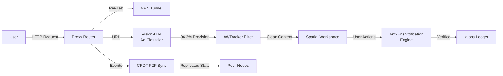

# Kathon

Cryptographic Browser with vision-LLM ad blocking, CRDT P2P sync, spatial workspace, anti-enshittification engine, per-tab VPN

## Architecture Flow

## Documentation

View the full documentation for this project on GitHub:
- [Project README](https://github.com/kleinnner/Anticloud/blob/main/01-kathon/README.md)
- [Project Directory](https://github.com/kleinnner/Anticloud/tree/main/01-kathon)
