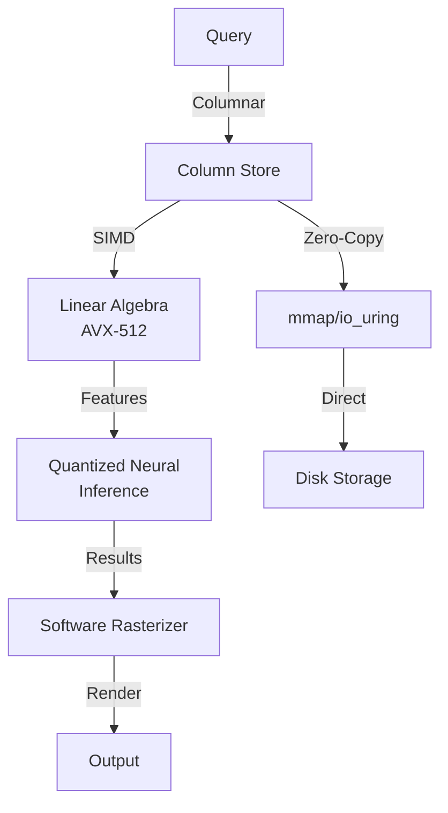

# kazcade

CPU-Only Columnar Compute Engine with SIMD-accelerated linear algebra, quantized neural inference, software rasterizer, zero-copy mmap/io_uring architecture

## Compute Pipeline

## Documentation

View the full documentation for this project on GitHub:
- [Project README](https://github.com/kleinnner/Anticloud/blob/main/09-kazcade/README.md)
- [Project Directory](https://github.com/kleinnner/Anticloud/tree/main/09-kazcade)
