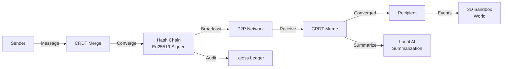

# libern

P2P Communication Engine with CRDT convergence, Ed25519-signed hash chains, local AI summarization, 3D sandbox world, enterprise AI auditability framework

## P2P Message Flow

## Documentation

View the full documentation for this project on GitHub:
- [Project README](https://github.com/kleinnner/Anticloud/blob/main/08-libern/README.md)
- [Project Directory](https://github.com/kleinnner/Anticloud/tree/main/08-libern)
