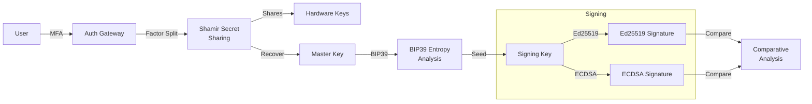

# MF+SO

Multi-Factor Sovereign Sign-On identity vault with Shamir secret sharing, BIP39 entropy analysis, Ed25519 vs ECDSA comparative analysis, hardware-backed keys

## Identity Flow

## Documentation

View the full documentation for this project on GitHub:
- [Project README](https://github.com/kleinnner/Anticloud/blob/main/07-mfso/README.md)
- [Project Directory](https://github.com/kleinnner/Anticloud/tree/main/07-mfso)
