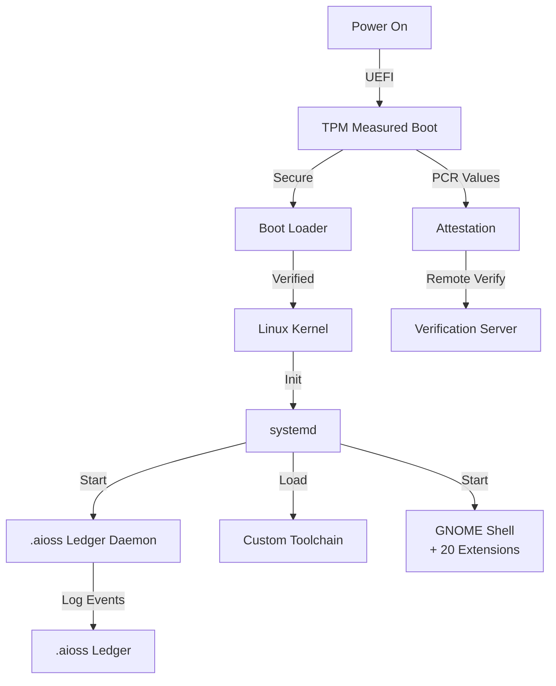

# sovereign-os

Arch Linux-based Sovereign OS with .aioss ledger daemon, custom toolchain, TPM attestation, measured boot, 20 GNOME shell extensions

## Boot Chain

## Documentation

View the full documentation for this project on GitHub:
- [Project README](https://github.com/kleinnner/Anticloud/blob/main/05-sovereign-os/README.md)
- [Project Directory](https://github.com/kleinnner/Anticloud/tree/main/05-sovereign-os)
