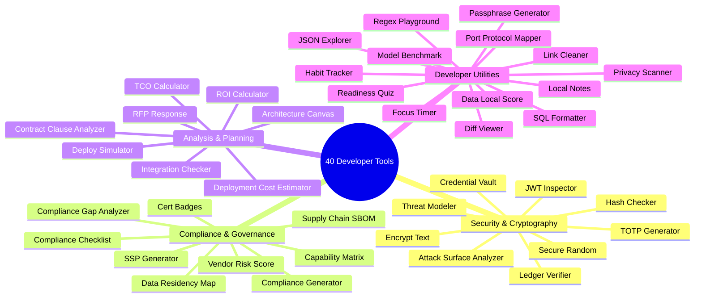
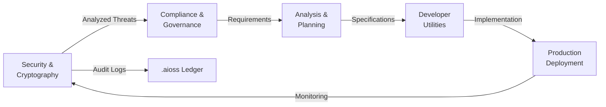

# 40 Developer Tools

The developer tools collection provides 40 utilities organized into four domains, each with full documentation (README, Quickstart, Tutorial, FAQ).

## Tool Categories

## Tool Pipeline Flow

## Security and Cryptography

| Tool | Description |
|------|-------------|
| Attack Surface Analyzer | Attack surface analysis and visualization |
| Credential Vault | Secure credential storage |
| Encrypt Text | Text encryption utility |
| Hash Checker | Cryptographic hash verification |
| JWT Inspector | JWT token inspection and debugging |
| Ledger Verifier | Cryptographic ledger verification |
| Secure Random | Cryptographically secure random generation |
| Threat Modeler | Threat modeling and risk analysis |
| TOTP Generator | Time-based one-time password generator |

## Compliance and Governance

| Tool | Description |
|------|-------------|
| Capability Matrix | Capability mapping and gap analysis |
| Cert Badges | Certification badge generator |
| Compliance Checklist | Compliance requirement tracking |
| Compliance Gap Analyzer | Compliance gap identification |
| Compliance Generator | Compliance document generation |
| Data Residency Map | Data residency visualization |
| SSP Generator | System security plan generator |
| Supply Chain SBOM | Software bill of materials analysis |
| Vendor Risk Score | Vendor risk assessment tool |

## Analysis and Planning

| Tool | Description |
|------|-------------|
| Architecture Canvas | System architecture modeling |
| Contract Clause Analyzer | Contract clause analysis |
| Deploy Simulator | Deployment scenario simulation |
| Deployment Cost Estimator | Infrastructure cost estimation |
| Integration Checker | System integration verification |
| RFP Response | RFP response generation |
| ROI Calculator | Return on investment calculator |
| TCO Calculator | Total cost of ownership calculator |

## Developer Utilities

| Tool | Description |
|------|-------------|
| Data Local Score | Data localization scoring |
| Diff Viewer | File comparison viewer |
| Focus Timer | Productivity focus timer |
| Habit Tracker | Habit tracking tool |
| JSON Explorer | JSON structure explorer |
| Link Cleaner | URL sanitization tool |
| Local Notes | Local note-taking app |
| Model Benchmark | AI model benchmarking |
| Passphrase Generator | Secure passphrase generation |
| Port Protocol Mapper | Network port mapping utility |
| Privacy Scanner | Privacy compliance scanner |
| Readiness Quiz | Organizational readiness assessment |
| Regex Playground | Regular expression testing |
| SQL Formatter | SQL query formatting |

## Browse on GitHub

See all 40 tools with full documentation on GitHub:
[12-api-oss-tools](https://github.com/kleinnner/Anticloud/tree/main/12-api-oss-tools)
