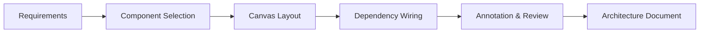

# Architecture Canvas

Architecture Canvas provides a visual workspace for designing cloud-native system architectures. It includes component libraries for major cloud providers, automated dependency mapping, and export capabilities for documentation and presentation.

## Features

- Drag-and-Drop Canvas: Build architecture diagrams with provider-specific component libraries
- Multi-Cloud Support: Components for AWS, Azure, GCP, Kubernetes, and on-premises resources
- Dependency Mapping: Automatically detect and draw connections between related components
- Annotation Tools: Add notes, data flow arrows, and trust boundary markers to diagrams
- Export Formats: Output as PNG, SVG, draw.io, or Terraform HCL templates

## Workflow

## Usage

View the full documentation on GitHub: [Tool Directory](https://github.com/kleinnner/Anticloud/tree/main/12-api-oss-tools/architecture-canvas)

## Related Tools

- [Deploy Simulator](../analysis/deploy-simulator)
- [Integration Checker](../analysis/integration-checker)
- [Threat Model](../security/threat-model)
