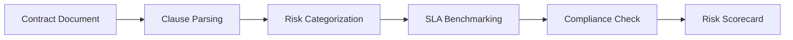

# Contract Clause Analyzer

Contract Clause Analyzer reviews cloud vendor contracts and service agreements against best-practice benchmarks. It flags unfavorable terms, identifies missing SLA commitments, and highlights data processing obligations.

## Features

- Clause Extraction: Automatically identify and categorize contract clauses by type and risk level
- SLA Analysis: Compare uptime guarantees, credits, and remedies against industry benchmarks
- Data Processing Review: Flag GDPR and CCPA compliance gaps in data processing addendums
- Termination Terms: Score contract exit provisions for cost, timeline, and data portability
- Risk Scoring: Assign overall contract risk score with per-clause breakdowns and recommendations

## Workflow

## Usage

View the full documentation on GitHub: [Tool Directory](https://github.com/kleinnner/Anticloud/tree/main/12-api-oss-tools/contract-clause-analyzer)

## Related Tools

- [Vendor Risk Score](../compliance/vendor-risk-score)
- [RFP Response](../analysis/rfp-response)
- [ROI Calculator](../analysis/roi-calculator)
