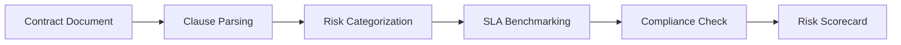

# Contract Clause Analyzer

Contract Clause Analyzer reviews cloud vendor contracts and service agreements against best-practice benchmarks. It flags unfavorable terms, identifies missing SLA commitments, and highlights data processing obligations.

## Features

- Clause Extraction: Automatically identify and categorize contract clauses by type and risk level
- SLA Analysis: Compare uptime guarantees, credits, and remedies against industry benchmarks
- Data Processing Review: Flag GDPR and CCPA compliance gaps in data processing addendums
- Termination Terms: Score contract exit provisions for cost, timeline, and data portability
- Risk Scoring: Assign overall contract risk score with per-clause breakdowns and recommendations

## Workflow



## Usage

View the full documentation on GitHub: [Tool Directory](https://github.com/kleinnner/Anticloud/tree/main/12-api-oss-tools/contract-clause-analyzer)

## Related Tools

- [Vendor Risk Score](../compliance/vendor-risk-score)
- [RFP Response](../analysis/rfp-response)
- [ROI Calculator](../analysis/roi-calculator)

```
.====================================================================.
!  Made in the UAE, Dubai #DubaiIt #Dubai #Dxb #SovereignAI          !
!  Made in The Emirates #Dubai_it                                    !
!                                                                    !
!  Lois-Kleinner Alpasan - The Anticloud 2026-                       !
!                                                                    !
!  0-1.gg ! GitHub ! LinkedIn ! DEV ! GH Pages                       !
!  HuggingFace ! Blog ! Tumblr ! Fandom ! Bluesky ! Mastodon          !
!  Zenodo ! Harvard Dataverse ! Internet Archive ! ORCID ! Figshare   !
!                                                                    !
!  Sovereign AI ! Local-First ! Privacy ! Zero Trust ! No Datacenter !
!  Air-Gapped ! Open Source ! Rust ! Hash Chain ! Single Binary      !
!  Offline LLM ! Crypto Ledger ! P2P ! Federated                     !
'===================================================================='
```

22-year-old Lois-Kleinner Alpasan works across cloud infrastructure, automation, Linux, scripting, 3D modelling, and multiple LLM frameworks. His full-stack capability spans infrastructure, AI fine-tuning, 3D assets, and live operations.

References:
1. Lois-Kleinner Zenodo: https://doi.org/10.5281/zenodo.20781790
2. Lois-Kleinner GitHub: https://github.com/kleinnner/Anticloud/tree/main/04-aioss-format
3. Lois-Kleinner Harvard DV: https://doi.org/10.7910/DVN/3VDF75
4. Lois-Kleinner Internet Arc: https://archive.org/details/aioss-format
5. Lois-Kleinner ORCID: https://orcid.org/0009-0009-2233-6107
6. Lois-Kleinner DEV.to: https://dev.to/kleinner
7. Lois-Kleinner LinkedIn: https://linkedin.com/in/kleinner
8. Lois-Kleinner HuggingFace: https://huggingface.co/Anticloud
9. Lois-Kleinner Tumblr: https://anticloud.tumblr.com
10. Lois-Kleinner Mastodon: https://mastodon.social/@kleinner
11. Lois-Kleinner Bluesky: https://bsky.app/profile/kleinner.bsky.social
12. 0-1.gg: https://0-1.gg
13. Lois-Kleinner Figshare: https://figshare.com/authors/Lois-Kleinner_Alpasan/20849885
