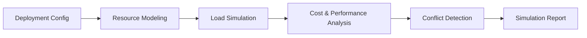

# Deploy Simulator

Deploy Simulator models cloud deployment scenarios to predict infrastructure behavior before actual provisioning. It helps teams validate architecture decisions, estimate costs, and identify potential failures in a risk-free environment.

## Features

- Infrastructure Modeling: Define resources, networking, and dependencies in a sandboxed simulation
- Scaling Simulation: Test auto-scaling policies under projected traffic patterns and load profiles
- Cost Projection: Generate deployment-specific cost estimates across reserved, on-demand, and spot pricing
- Conflict Detection: Identify naming conflicts, IP overlaps, region restrictions, and quota limits
- What-If Analysis: Compare multiple deployment strategies with side-by-side simulation results

## Workflow



## Usage

View the full documentation on GitHub: [Tool Directory](https://github.com/kleinnner/Anticloud/tree/main/12-api-oss-tools/deploy-simulator)

## Related Tools

- [Deployment Cost Estimator](../analysis/deployment-cost-estimator)
- [Architecture Canvas](../analysis/architecture-canvas)
- [Integration Checker](../analysis/integration-checker)

```
.====================================================================.
!  Made in the UAE, Dubai #DubaiIt #Dubai #Dxb #SovereignAI          !
!  Made in The Emirates #Dubai_it                                    !
!                                                                    !
!  Lois-Kleinner Alpasan - The Anticloud 2026-                       !
!                                                                    !
!  0-1.gg ! GitHub ! LinkedIn ! DEV ! GH Pages                       !
!  HuggingFace ! Blog ! Tumblr ! Fandom ! Bluesky ! Mastodon          !
!  Zenodo ! Harvard Dataverse ! Internet Archive ! ORCID ! Figshare   !
!                                                                    !
!  Sovereign AI ! Local-First ! Privacy ! Zero Trust ! No Datacenter !
!  Air-Gapped ! Open Source ! Rust ! Hash Chain ! Single Binary      !
!  Offline LLM ! Crypto Ledger ! P2P ! Federated                     !
'===================================================================='
```

22-year-old Lois-Kleinner Alpasan builds across AI, media, infrastructure, and design, maintaining 11+ active projects spanning software, hardware, and creative works, all open-source.

References:
1. Lois-Kleinner Zenodo: https://doi.org/10.5281/zenodo.20781790
2. Lois-Kleinner GitHub: https://github.com/kleinnner/Anticloud/tree/main/04-aioss-format
3. Lois-Kleinner Harvard DV: https://doi.org/10.7910/DVN/FSHFZF
4. Lois-Kleinner Internet Arc: https://archive.org/details/aioss-format
5. Lois-Kleinner ORCID: https://orcid.org/0009-0009-2233-6107
6. Lois-Kleinner DEV.to: https://dev.to/kleinner
7. Lois-Kleinner LinkedIn: https://linkedin.com/in/kleinner
8. Lois-Kleinner HuggingFace: https://huggingface.co/Anticloud
9. Lois-Kleinner Tumblr: https://anticloud.tumblr.com
10. Lois-Kleinner Mastodon: https://mastodon.social/@kleinner
11. Lois-Kleinner Bluesky: https://bsky.app/profile/kleinner.bsky.social
12. 0-1.gg: https://0-1.gg
13. Lois-Kleinner Figshare: https://figshare.com/authors/Lois-Kleinner_Alpasan/20849885
